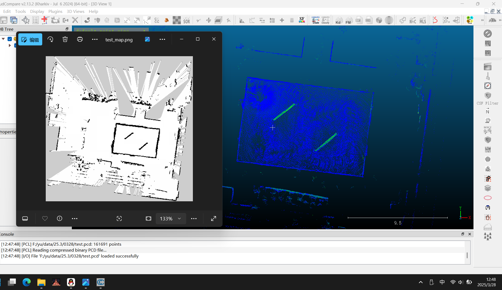
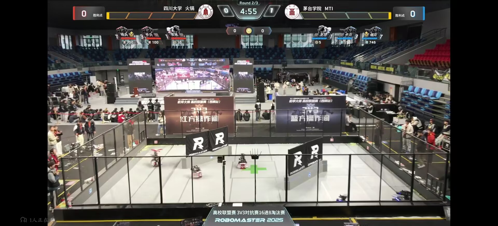

# 25赛季联盟赛血泪教训
## 整体策略
在25赛季的规则下，哨兵的重要性非常之大，第一优先级一定是调高机动性尽快把中心增益点站住，其次才是提供火力支援。以下一切调车思路都建立在这个前提下。

## 建图
今年联盟赛依旧没有单独给导航建图的时间，只有适应性训练打完后才有几分钟扫图。今年是跟西南交打的适应性，两边导航提前商量好了一起逆时针绕圈所以建出了个很完美的图（虽然其实还是很难用，具体见重定位），所以和适应性训练对手商量好真的很重要。

以及一定要准备万一建不出图的备用方案（`sentry_bringup/bringup_for_RMUL.launch.py`），边建图边导航，应急用。

以及建图时 **一定要录bag！一定要录bag！一定要录bag！！！**

## 重定位
联盟赛上能用做定位的有效点太少了，整体地图也比较小，场外人又非常多，icp的要求又非常严格，所以真的很难定到位。前几场没敢直接开重定位，录了bag回家果然蓝方一场都没定到，红方看运气，难蚌。

直接手摆其实还是有些风险，但没定到位启动不了更加致命，及时开不建图方案，来不及了一定 **善用技术暂停**

## 调车思路
依旧是所有策略建立在让哨兵站稳点的前提下 
1.拉高速度抢点 
最后提到了std0.47 max0.9，五秒到点

 **2.动态避障** 
这个是真没经验思路错了，调动态避障会导致点里有其他车的时候哨兵直接一个躲出去了，去抢到了点但直接自己给点让出去了，真的绷不住 
最后一场local_costmap里cost_scaling_factor降到了2.0，但感觉其实还是不太够，直接开碰碰车往上撞就行了，应该需要再改一改cost_scaling_factor和inflation_radius。

## 决策
开局关小陀螺提速度冲出去抢点，调整标点位置想办法让他规划出来一条最近的路径越快越好，到点了再开。

西南站强度不大，开小陀螺+平移不好瞄，但只开小陀螺都没什么人瞄的到，不是打自瞄好的强队没必要标两点间巡逻，避免动的过程中冲出去。

回来之后想到了一种测点标的准不准的办法，可以找一块很空旷的场地开不建图导航跑决策，到点了之后关停，量一下此时距离起始点的xy方向距离，对应到比赛场地上有没有在点里，应该能减小点标歪的概率。（还是想骂联盟赛地标是真少吧就是盲标啊，服了）