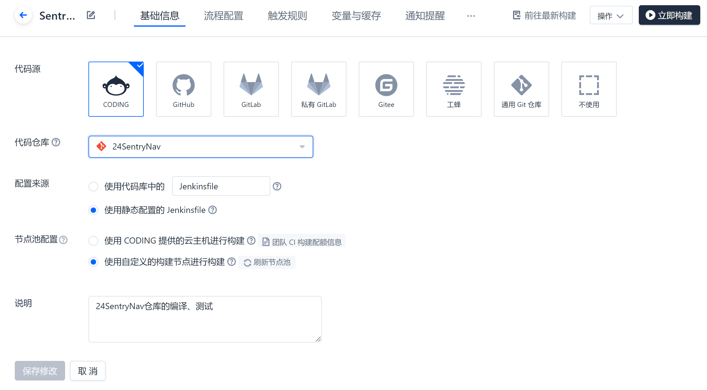
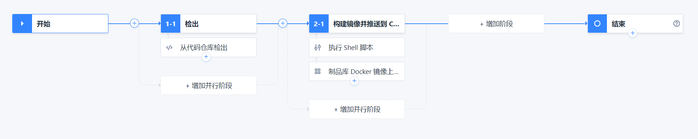
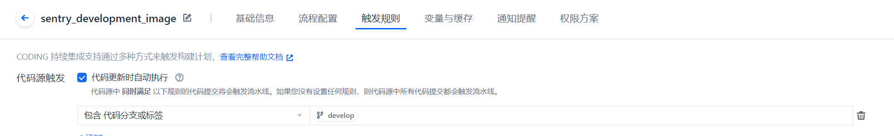
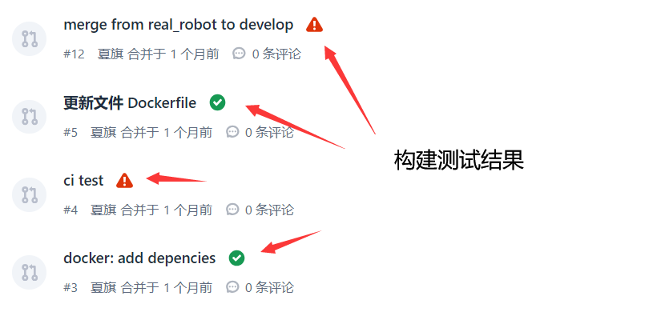
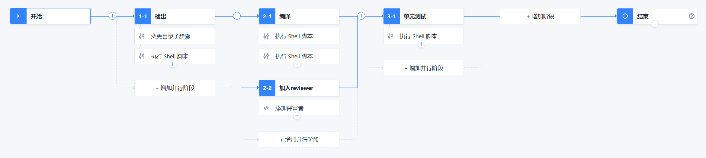
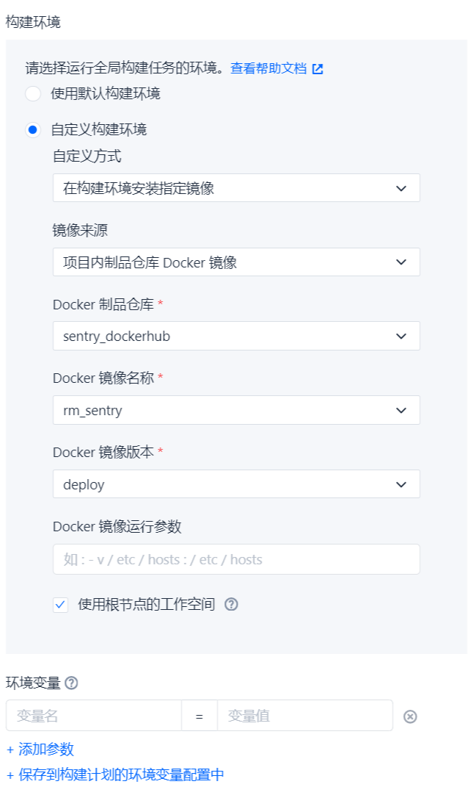
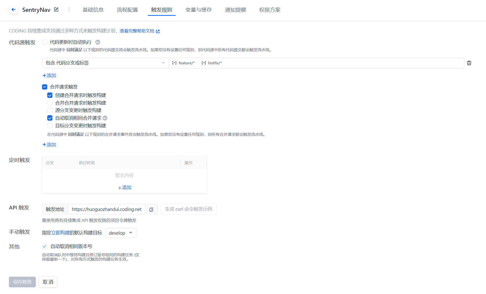

# Step by Step in detail: Continuous Integration

## 1. 配置CI节点

参阅[📑配置CI节点](../develop/CI.rst)

## 2. 配置构建计划

具体的构建配置可以在项目的持续集成 -> 构建计划 中查看

### 设置构建的对象是哪个仓库



### 构建计划

构建计划我会分为3个，一个用于开发，一个用于测试，一个用于部署

#### 开发使用的构建计划

这个构建计划构建的镜像带有各种开发工具，可视化工具，仿真环境，是给队友们开发使用的。构建对应的分支是develop分支，设置为每次develop分支有更新的时候就会触发构建，也就是有feature分支通过了MR以后。

开发使用的jenkinsfile如下，

```groovy
pipeline {
  agent any
  stages {
    stage('检出') {
      steps {
        checkout([$class: 'GitSCM',
        branches: [[name: GIT_BUILD_REF]],
        userRemoteConfigs: [[
          url: GIT_REPO_URL,
          credentialsId: CREDENTIALS_ID
        ]]])
      }
    }

    stage('构建镜像并推送到 CODING Docker 制品库') {
      steps {
        sh "docker build -t ${CODING_DOCKER_IMAGE_NAME}:${DOCKER_IMAGE_VERSION} -f ${DOCKERFILE_PATH} ${DOCKER_BUILD_CONTEXT}"
        useCustomStepPlugin(key: 'SYSTEM:artifact_docker_push', version: 'latest', params: [image:"${CODING_DOCKER_IMAGE_NAME}:${DOCKER_IMAGE_VERSION}",repo:"${DOCKER_REPO_NAME}"])
      }
    }

  }
  environment {
    CODING_DOCKER_REG_HOST = "${CCI_CURRENT_TEAM}-docker.pkg.${CCI_CURRENT_DOMAIN}"
    CODING_DOCKER_IMAGE_NAME = "${PROJECT_NAME.toLowerCase()}/${DOCKER_REPO_NAME}/${DOCKER_IMAGE_NAME}"
  }
}
```



图形化配置界面



触发规则配置


#### 测试使用的构建计划

这个构建计划是在每一次有人提MR的时候触发的，服务器会进入上面构建好的镜像，运行测试脚本。测试的结果会反馈到MR中，负责人可以查看。如果测试通过，那么代码基本就没什么问题，也可以merge了。当然没通过也是可以merge的。



合并请求的测试结果

对应的，merge完成后，开发使用的构建计划会被触发，开发使用镜像就会加入最新的功能。

测试使用的jenkinsfile如下，

```groovy
pipeline {
  agent {
    docker {
      reuseNode 'true'
      registryUrl 'https://huoguozhandui-docker.pkg.coding.net'
      registryCredentialsId "${env.DOCKER_REGISTRY_CREDENTIALS_ID}"
      image '24vision_nav/sentry_dockerhub/rm_sentry:deploy'
    }

  }
  stages {
    stage('检出') {
      steps {
        dir('src') {
          checkout(scm: [
            $class: 'GitSCM',
            branches: [[name: env.GIT_BUILD_REF]],
            userRemoteConfigs: [[
              url: env.GIT_REPO_URL,
              credentialsId: env.CREDENTIALS_ID
            ]],
            extensions: [
              [$class: 'GitLFSPull'],
              [$class: 'SubmoduleOption',
              disableSubmodules: false,
              parentCredentials: false,
              recursiveSubmodules: true,
              reference: '',
              trackingSubmodules: false]
            ]], poll: false)
          }

          sh '''if [ -f src/deps.repos ] 
then 
vcs import --force --recursive src/ --input src/deps.repos
else
echo "No deps.repos file"
fi'''
        }
      }

      stage('编译') {
        parallel {
          stage('编译') {
            steps {
              sh '. /opt/ros/humble/setup.sh && rosdep install --from-paths src --ignore-src -r -y'
              sh '. /opt/ros/humble/setup.sh && colcon build'
            }
          }

          stage('加入reviewer') {
            steps {
              codingMRReviewer(mrResourceId: env.MR_RESOURCE_ID, reviewers: 'HWiEddpevD')
            }
          }

        }
      }

      stage('单元测试') {
        steps {
          sh '. /opt/ros/humble/setup.sh && colcon test --event-handlers console_cohesion+ --return-code-on-test-failure --packages-select rm_interfaces'
        }
      }

    }
  }
```



图形化配置界面



在制品仓库中选择镜像作为构建环境



触发规则配置

#### 部署使用的构建计划

对应的分支是master分支，设置为每次master分支有更新的时候就会触发构建，是稳定发布版本，用于部署。这个镜像里应该只有最基本的功能，不应该安装仿真工具等，尽量缩小镜像的体积，增加部署的速度和运行的性能。

对应的colcon build 命令应该将build type设置为Release。

部署使用的jenkinsfile如下，

```groovy
pipeline {
  agent any
  stages {
    stage('检出') {
      steps {
        checkout([$class: 'GitSCM',
        branches: [[name: GIT_BUILD_REF]],
        userRemoteConfigs: [[
          url: GIT_REPO_URL,
          credentialsId: CREDENTIALS_ID
        ]]])
      }
    }
    stage('构建镜像并推送到 CODING Docker 制品库') {
      steps {
        sh "docker build -t ${CODING_DOCKER_IMAGE_NAME}:${DOCKER_IMAGE_VERSION} -f ${DOCKERFILE_PATH} ${DOCKER_BUILD_CONTEXT}"
        useCustomStepPlugin(key: 'SYSTEM:artifact_docker_push', version: 'latest', params: [image:"${CODING_DOCKER_IMAGE_NAME}:${DOCKER_IMAGE_VERSION}",repo:"${DOCKER_REPO_NAME}"])
      }
    }
  }
  environment {
    CODING_DOCKER_REG_HOST = "${CCI_CURRENT_TEAM}-docker.pkg.${CCI_CURRENT_DOMAIN}"
    CODING_DOCKER_IMAGE_NAME = "${PROJECT_NAME.toLowerCase()}/${DOCKER_REPO_NAME}/${DOCKER_IMAGE_NAME}"
  }
}
```