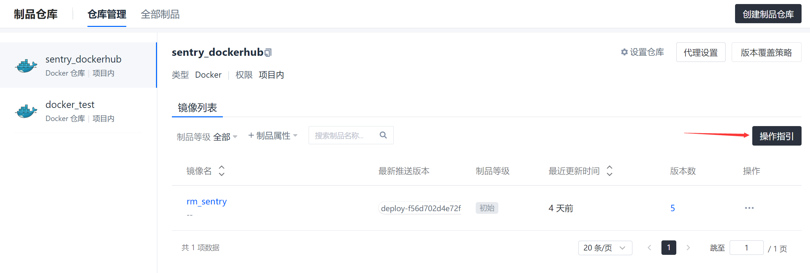
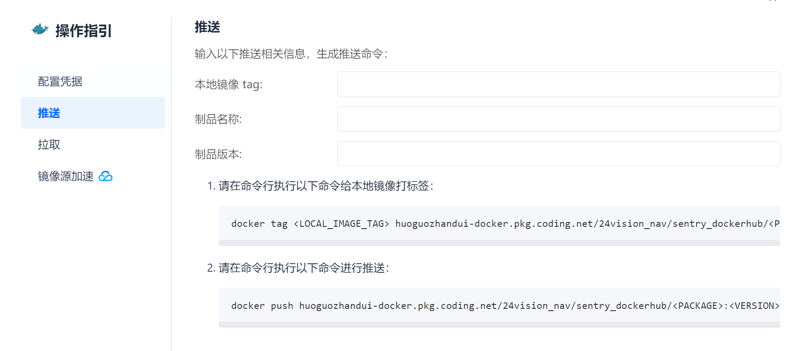
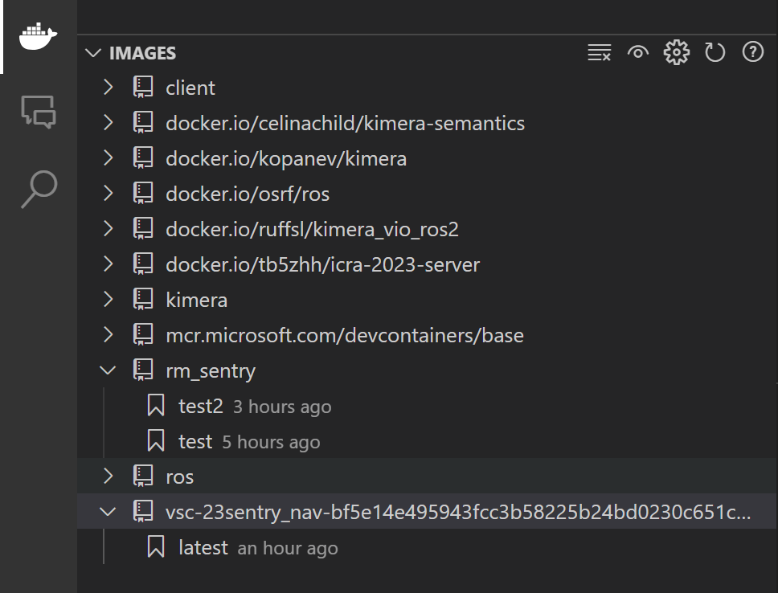

# Step by Step in detail: Prepare Docker Image

经过了原理介绍，终于！可以开始实践了


## 准备工作

1. Install Docker on your computer

   - [Docker Desktop for Windows](https://docs.docker.com/docker-for-windows/install/)
   - [Docker Desktop for Mac](https://docs.docker.com/docker-for-mac/install/)
   - [Docker Engine for Linux](https://docs.docker.com/engine/install/)

2. Install VsCode Extension

    - [Docker](https://marketplace.visualstudio.com/items?itemName=ms-azuretools.vscode-docker)
    - [DevContainer](https://marketplace.visualstudio.com/items?itemName=ms-vscode-remote.remote-containers)
    - [Remote Development](https://marketplace.visualstudio.com/items?itemName=ms-vscode-remote.vscode-remote-extensionpack)

3. Install Xming on Windows / Install XQuartz on Mac

    Used for GUI visualization

    - Download [Xming](https://sourceforge.net/projects/xming/)

## 准备开发使用的镜像

### 方法1 从Docker Hub上下载

访问DockerHub，搜索你想要的镜像，Pull下来就可以了。

如果队友已经做好镜像，那么可以在coding平台，项目-> 制品管理：制品仓库->拉取

### 方法2 自己定制镜像

当然会出现DockerHub上的镜像不满足你的需求的情况，这时候就需要自己定制镜像了。

#### 方法2.1 在基础镜像内进行配置

1. 从DockerHub上下载一个基础镜像，比如Ubuntu
2. 运行和进入容器
   镜像拉取完毕以后就可以把这个镜像运行起来，具体的运行配置可以参考这一篇文章[📑Some Useful Command for Docker](./UsefulCommand.md)

    ```bash
    docker run -v E:\robotics\orbslam2_learn:/home/orbslam2 -e DISPLAY=host.docker.internal:0.0 -dit thiagofalcao/opencv3
    ```
    
    这时候来到VsCode的Docker插件界面，可以看到已经运行的容器了，右键选择Attach Visual Studio Code，就可以进入容器了。

3. 在容器内进行配置
   
   就和在本机上配置环境一样，安装软件，配置环境变量，配置开发环境，配置ROS环境等等。

4. 保存镜像

    在配置的过程中可以随时保存镜像，后面要是配坏了，就可以直接用这个镜像重新开始。就像打游戏的时候有个存档一样。

    具体的命令如下
    
    ```bash
    docker ps -a
    # find the container id
    docker commit <container_id> <your_image_name>[:<tag>]
    ```

    这样就保存了一个镜像。

5. 上传镜像到DockerHub

    保存好最终的镜像以后，就可以上传到DockerHub上了，这样就可以在任何一台电脑上下载这个镜像了。

    具体的操作如下

    ```bash
    docker login
    docker tag <your_image_name>[:<tag>] <your_dockerhub_username>/<your_image_name>[:<tag>]
    docker push <your_dockerhub_username>/<your_image_name>[:<tag>]
    ```

    如果你的项目是在Coding上，那么可以直接在Coding的制品仓库界面有详细的介绍，如何上传镜像。

    

    

#### 方法2.2 使用Dockerfile进行配置

如果想要更加灵活的配置镜像，或者需要在服务器上进行镜像的构建，就需要使用Dockerfile了。

其实Dockerfile就是一系列的命令，这些命令会被Docker解析，然后生成一个镜像。

1. Dockerfile
   
```Dockerfile
# Base on which image
FROM ros:humble-perception-jammy

# source ros environment
RUN echo "source /opt/ros/$ROS_DISTRO/setup.bash" >> ~/.bashrc
# color your terminal
RUN echo "force_color_prompt=yes" >> ~/.bashrc

## Install dependencies
RUN apt-get update && apt-get install -y \
    # for using add-apt-repository
    software-properties-common \
    # for download 
    wget \ 
    # useful tools
    aptitude 

RUN apt-get update && apt-get install -y \
    # rviz2
    ros-$ROS_DISTRO-rviz2 \
    # Gazebo
    # ros-humble-gazebo-ros \
    # rqt
    ros-$ROS_DISTRO-rqt \
    ros-$ROS_DISTRO-rqt-common-plugins \
    # navigation2
    ros-$ROS_DISTRO-navigation2 \
    ros-$ROS_DISTRO-nav2-bringup \
    # Turtlebot3
    ros-$ROS_DISTRO-turtlebot3-gazebo \
    # octomap dependencies
    ros-humble-octomap ros-humble-octomap-msgs ros-humble-octomap-mapping \
    ros-humble-octomap-ros ros-humble-octomap-rviz-plugins ros-humble-octomap-server\
    # octomap viewer
    octovis \
    # gridmap dependencies
    # 🫠 if you are learning gridmap, you may need to install the following packages
    # ros-humble-grid-map-demos
    ros-humble-grid-map ros-humble-grid-map-cmake-helpers ros-humble-grid-map-core \
    ros-humble-grid-map-costmap-2d ros-humble-grid-map-cv ros-humble-grid-map-filters \
    ros-humble-grid-map-loader ros-humble-grid-map-msgs ros-humble-grid-map-octomap \
    ros-humble-grid-map-pcl ros-humble-grid-map-ros ros-humble-grid-map-rviz-plugin \
    ros-humble-grid-map-sdf ros-humble-grid-map-visualization 

# LIO-SAM
# Add GTSAM-PPA
RUN add-apt-repository ppa:borglab/gtsam-release-4.1
RUN apt-get install -y \
    ros-humble-perception-pcl \
    ros-humble-pcl-msgs \
    ros-humble-vision-opencv \
    ros-humble-xacro \
    libgtsam-dev libgtsam-unstable-dev 

# Download models for gazebo
RUN mkdir -p /root/.gazebo/models
WORKDIR /root/.gazebo/models
RUN wget http://file.ncnynl.com/ros/gazebo_models.txt
RUN wget -i gazebo_models.txt
# extract models
RUN ls model.tar.g* | xargs -n1 tar xzvf
# clean up
RUN rm model.tar.gz*

# Install extra dependencies with apt

# Install extra dependencies with pip

# add start script
CMD /bin/bash
```

😶‍🌫️学不会是吧，其实我是在镜像里装一个，回到dockerfile里写一条，慢慢就搓出来了。

2. Build your own Docker Image

可以在自己的机器上构建镜像，看看构建的过程是什么样的，理论上服务器上的构建过程是一样的。

```bash
# under the path that contains dockerfile

docker build -t <your_image_name>[:<tag>] .
```

For example

```bash
docker build -t rm_sentry:v1.0 .
```

构建完成后，可以在本机上运行这个镜像，看看是否符合预期。也可以像上面一样，把镜像上传到DockerHub上。


