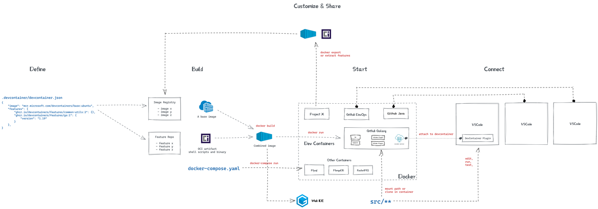

# Introduce to our WorkFlow

经过了原理的介绍，现在讲讲在开发的工作流中Docker、DevContainer、CI、CD的作用分别是什么。

## A glance at our work flow

（图源网络，侵删）

## Step by Step: A Simple Walkthrough

### 1. 准备开发使用的镜像
    
首先要准备好开发环境，之后开发的代码的构建、运行环境都是基于这个镜像的。当然之后如果有新增的依赖，也可以在这个镜像的基础上再构建。

- 从[docker hub](https://hub.docker.com/)上拉取镜像

- [自己定制镜像](./CustomImage.md#方法2-自己定制镜像)

### 2. 使用DevContainer配置开发环境[可选]
    
用于实现高度统一的开发环境

- [编写devcontainer.json](./RunDevEnv.md#6-write-your-own-devcontainerjsonoptional)

### 3. 把镜像环境和devcontainner配置推送到git仓库

这样就可以和队友共享了。
   
### 4. 开发

- 拉取开发镜像和仓库代码，[lauch工作空间](./RunDevEnv.md)

- 遵守[git flow工作流](../develop/rule.rst)，对后面的CI很重要。

### 5. 测试代码[可选]

对项目的要求比较高的时候可以考虑加入测试代码，可以保证代码的质量。暂时先不做也是可以的，对其他流程没有影响。
    
### 6. 配置测试、构建流水线

- 编写jekinsfile，告诉jenkins要做什么，比如要先拉取代码，然后构建代码，最后上传镜像到docker hub。
- [配置构建计划](./CI.md#step-by-step-in-detail-continuous-integration)，比如每天几点自动构建，或者每次有合并请求的时候自动构建。

这时遵守Git Flow工作流的重要性就体现出来了。比如可以设置测试计划在每次有合并请求的时候被触发，评审员就可以知道这个合并请求是否可以成功build；比如可以设置构建计划在每次develop分支有更新的时候被触发，这样就可以把最新开发的且经过测试的代码构建成镜像，供后面的部署使用。

### 7. 部署

- [在小电脑上进行部署](./deploy.md)
- 【学习中】配置docker-compose.yml，告诉docker要做什么，比如要运行哪些镜像，要把哪些端口映射到宿主机上，要把哪些文件夹挂载到宿主机上。

