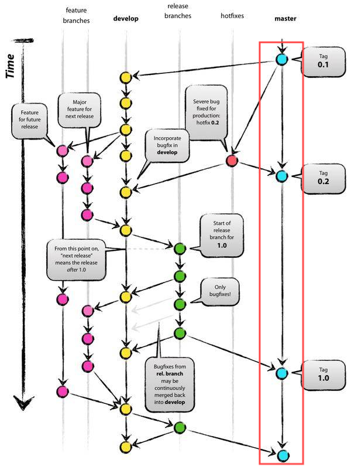

# 【GIT-1】GIT入门教程

教程定位：最最基础的git使用

## GIT是什么

一个开源的分布式版本控制系统，可以有效、高速地处理从很小到非常大的项目版本管理

明确一下几个重要概念，不用背，用久了就懂了：

**仓库（Repository）：存放代码的地方，可以理解为一个文件夹**

版本库（Version Library）：仓库中的.git文件夹，用来存放版本信息

暂存区（Stage）：临时存放修改的地方

**提交（Commit）：将修改保存到版本库中**

**推送（Push）：将本地的修改推送到远程仓库**

**拉取（Pull）：将远程仓库的修改拉取到本地**

## 为什么要使用GIT

- 🌟版本控制：可以追踪文件的变化
- 🌟代码安全：可以恢复到任意版本
- 分支管理：并行开发，实现不同功能的开发
- 团队协作：多人协作开发而不发生冲突



这张图很好地说明了多人协作开发的流程，这一小节先关注红框框起来的部分，也就是一个分支的开发。

## 如何使用GIT：【场景1】新手入门

### 1. 安装GIT

- Windows: [下载地址](https://git-scm.com/download/win)，选择对应的版本下载安装
- Mac: `brew install git`
- Linux: `sudo apt-get install git`

Windows最好将git加入到环境变量中，这样可以在命令行中使用git命令。

打开命令行，输入以下命令，如果出现版本号，则表示安装成功。
```bash
git --version # 查看git版本
```

### 2. 配置GIT

```bash
git config --global user.name "Your Name" # 设置用户名
git config --global user.email "xxx@xxx.com" # 设置邮箱
```

因为Git是分布式版本控制系统，所以需要填写用户名和邮箱作为一个标识，这个用户名和邮箱会出现在你的提交记录中，方便其他人知道是谁提交的。

注意：git config --global 参数，有了这个参数，表示你这台机器上所有的Git仓库都会使用这个配置，当然你也可以对某个仓库指定的不同的用户名和邮箱。

### 3. 创建你的第一个仓库

打开github，点击自己的头像，选择`Your repositories`，然后点击`New`创建一个新的仓库，填写仓库名，描述，选择公开或者私有，然后点击`Create repository`。

页面会自动跳转到你的仓库页面，点击`<>Code`，复制仓库的地址。

### 4. 克隆仓库

```bash
git clone https://xxxxxx.git
cd xxxxxx # 进入仓库
ls -a # 查看仓库文件，包含隐藏文件 （linux）
dir -H # 查看隐藏文件 （windows）
```

出现了一个.git的文件夹，这个是Git的版本库，Git用它来跟踪管理版本库。

### 5. 修改文件

在Readme.md文件中添加一行文字，保存。

### 6. 提交修改到暂存区

```bash
git status # 查看修改状态
```

输出：
```bash
On branch master
Your branch is up to date with 'origin/master'.

Changes not staged for commit:
  (use "git add <file>..." to update what will be committed)
  (use "git checkout -- <file>..." to discard changes in working directory)

        modified:   README.md

no changes added to commit (use "git add" and/or "git commit -a")
```

```bash
git add README.md # 添加修改到暂存区
git status # 查看修改状态
```

输出：
```bash
On branch master
Your branch is up to date with 'origin/master'.

Changes to be committed:
  (use "git reset HEAD <file>..." to unstage)

        modified:   README.md
```

### 7. 提交修改到版本库

```bash
git commit -m "add a line" # 提交修改到版本库
git status # 查看修改状态
```

输出：
```bash
On branch master
Your branch is ahead of 'origin/master' by 1 commit.
  (use "git push" to publish your local commits)

nothing to commit, working tree clean
```

### 8. 推送修改到远程仓库

```bash
git push origin master # 推送修改到远程仓库
```

输入用户名和密码，如果没有问题，会出现推送成功的提示。

### 9. 查看提交记录

```bash
git log # 查看提交记录
```

输出：
```bash
commit 1b9e4
Author: Your Name <
Date:   Fri Jul 16 16:00:00 2021 +0800

    add a line
```

### 10. 版本回退

再重复一遍5-8的操作，然后再执行以下命令：

```bash
git log # 查看提交记录，此时会有两个提交记录
```

输出：
```bash
commit 1b9e4
Author: Your Name <
Date:   Fri Jul 16 16:00:00 2021 +0800

    add another line

commit 2b9e4
Author: Your Name <
Date:   Fri Jul 16 16:00:00 2021 +0800

    add a line
```

假设我们想回退到`add a line`的版本，执行以下命令：

```bash
git reset --hard 2b9e4 # 回退到指定版本
```

再次查看提交记录：

```bash
git log # 查看提交记录
```

输出：
```bash
commit 2b9e4
Author: Your Name <
Date:   Fri Jul 16 16:00:00 2021 +0800

    add a line
```

此时，我们已经回退到了`add a line`的版本。本地的分支会落后于远程仓库，如果想要推送到远程仓库，需要使用`git push -f origin master`，强制推送。

如果想要回退到最新版本，可以使用`git reset --hard HEAD`。

**GOOD JOB！你已经完成了第一个提交!**

## 总结

本教程内容只支持你在队内完成开发工作，更多命令和概念，可以参考[菜鸟教程](https://www.runoob.com/git/git-tutorial.html)。