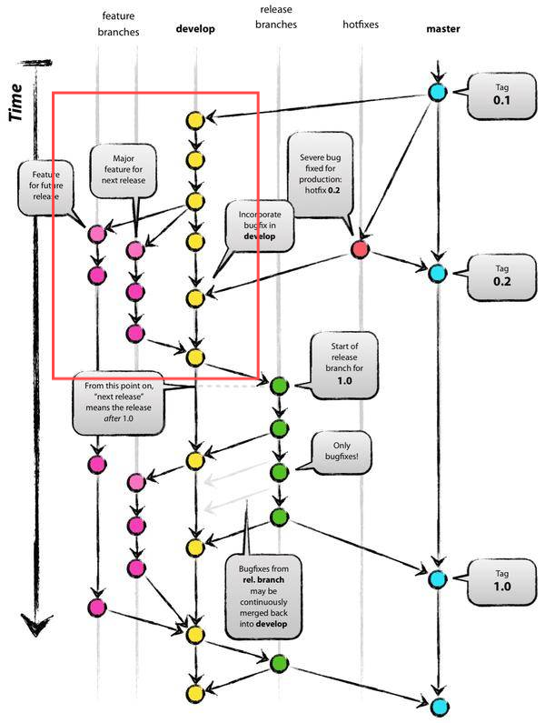
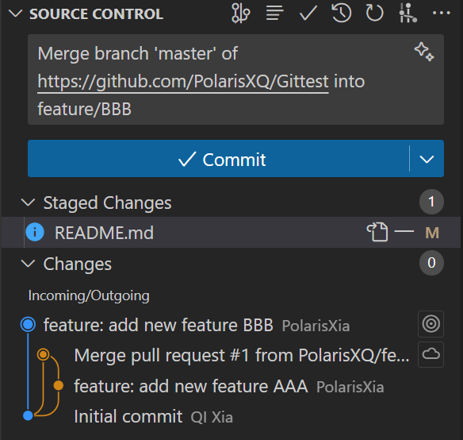

# 【GIT-2】如何正确地与你的队友协作开发

教程定位：实现多人协作开发，解决代码冲突，提高开发效率。

明确一下几个重要概念，不用背，用久了就懂了：

**- 分支（Branch）：用来实现不同功能的开发**

**- 合并（Merge）：将不同分支的代码合并到一起**


## 为什么要使用GIT

- 版本控制：可以追踪文件的变化
- 代码安全：可以恢复到任意版本
- 🌟分支管理：并行开发，实现不同功能的开发
- 🌟团队协作：多人协作开发而不发生冲突



这张图很好地说明了多人协作开发的流程，每个人都有自己的分支，开发完成后合并到主分支。

## 如何使用GIT：【场景2】多人协作开发

### 1. 小A创建了一个分支用于开发新功能AAA

```bash
git branch feature/AAA # 创建一个新的分支
git checkout feature/AAA # 切换到新的分支
```

新分支的内容是从当前分支复制过来的，所以新分支的内容和当前分支是一样的。

### 2. 修改代码

在新分支上修改readme.md，末尾添加一行文字，推送到远程仓库。

```bash
git add . # 将所有修改添加到暂存区
git commit -m "feat: add new feature AAA" # 提交到版本库
git push origin feature/AAA # 推送到远程仓库
```

### 3. 同时小B也创建了一个分支用于开发新功能BBB

此时小b并不知道小A的分支，所以小B是基于主分支创建的新分支。（这里切回主分支来模拟这个场景）

```bash
git checkout master # 切回主分支
git branch feature/BBB # 创建一个新的分支
git checkout feature/BBB # 切换到新的分支
```

### 4. 修改代码

假设小b也修改了readme.md，末尾添加一行文字，但内容不同，推送到远程仓库。

```bash
git add . # 将所有修改添加到暂存区
git commit -m "feat: add new feature BBB" # 提交到版本库
git push origin feature/BBB # 推送到远程仓库
```

### 5. 小A快人一步，先请求合并

小A在github上发起一个合并请求，请求将feature/AAA合并到master分支。

仓库页面 -> Pull requests -> New pull request -> base: master <- compare: feature/AAA -> Create pull request

仓库管理者小C收到了小A的请求，查看代码，发现没有问题，合并。

### 6. 小B请求合并

小B在github上发起一个合并请求，请求将feature/BBB合并到master分支。

仓库页面 -> Pull requests -> New pull request -> base: master <- compare: feature/BBB -> Create pull request

仓库管理者小C收到了小B的请求，查看代码，发现和小A的代码有冲突，无法直接合并。

为什么冲突呢？因为小A和小B修改了同一个地方的代码，但是写入的内容不相同，这时候git不知道应该保留哪个，所以需要人工处理。

所以呢，小C通知小B解决冲突。

### 7. 解决冲突

小B需要解决冲突，将冲突的地方修改为小A和小B的代码都有的内容，然后提交。

仓库页面 -> Pull requests -> feature/BBB -> Resolve conflicts -> Command line

依次执行以下命令：

```bash
# Step 1: Clone the repository or update your local repository with the latest changes.
git pull origin master
# Step 2: Switch to the head branch of the pull request.
git checkout feature/BBB
# Step 3: Fix the conflicts and commit the result. 
# Resolve it in your preferred editor is recommended.
# Step 4: Push the changes to your repository.
git push origin feature/BBB
```



### 8. 完成合并

小B再次请求合并，小C查看代码，发现没有问题，合并。


