# 【GIT-3】如何让你的仓库更加规范整齐

教程定位：介绍一种规范的仓库管理方式，适用于多人协作开发的场景。

规则是为了更高的效率，可以适当打破一下。

## 为什么要使用GIT

- 版本控制：可以追踪文件的变化
- 代码安全：可以恢复到任意版本
- 🌟分支管理：并行开发，实现不同功能的开发
- 🌟团队协作：多人协作开发而不发生冲突

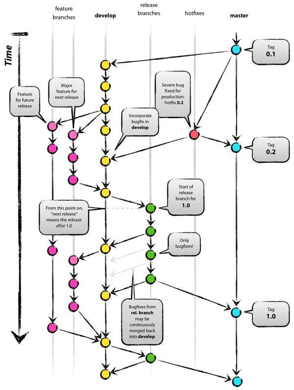

经过前两个小节，现在再来总体看这张图，应该就能理解git的作用和多人开发的流程了。

## Gitflow工作流

Gitflow工作流是一种非常流行的工作流程，它定义了一个围绕项目发布的严格分支模型。这个模型有以下几个分支：

### master

主分支，也是用于部署生产环境的分支，应确保master分支稳定性

master 分支一般由realese以及hotfix分支合并，任何时间都不能直接修改代码

### develop

develop 为开发分支，始终保持最新完成以及bug修复后的代码

一般开发的新功能时，feature分支都是基于develop分支下创建的

### feature

feature 分支是用来开发新功能的分支，一般基于develop分支创建

开发完成后，合并到develop分支

分支命名: feature/ 开头的为特性分支，命名规则: feature/user_module、 feature/cart_module

### release

release 为预上线分支，发布提测阶段，会release分支代码为基准提测

当有一组feature开发完成，首先会合并到develop分支，进入提测时，会创建release分支。如果测试过程中若存在bug需要修复，则直接由开发者在release分支修复并提交。当测试完成之后，合并release分支到master和develop分支，此时master为最新代码，用作上线。

### hotfix

线上出现紧急问题时，需要及时修复，以master分支为基线，创建hotfix分支，修复完成后，需要合并到master分支和develop分支

## commit规范

目前，社区有多种 Commit message 的写法规范。来自Angular 规范是目前使用最广的写法，比较合理和系统化。

```bash
<type>[(scope)]: <subject>
<BLANK LINE>
<body>
<BLANK LINE>
<footer>
```

**说实话，除了第一行，后面的内容都是可选的，**不过建议大家都遵循这个规范，这样可以使得提交信息更加规范化，方便后续的代码 review 和版本发布。

### 各个字段的意义

#### type

本次 commit 的类型，诸如 bugfix docs style 等

- feat: 添加新特性
- fix: 修复bug
- docs: 仅仅修改了文档
- style: 仅仅修改了空格、格式缩进、都好等等，不改变代码逻辑
- refactor: 代码重构，没有加新功能或者修复bug
- perf: 增加代码进行性能测试
- test: 增加测试用例
- chore: 改变构建流程、或者增加依赖库、工具等

#### scope

本次 commit 波及的范围

#### subject

简明扼要的阐述下本次 commit 的主旨

控制字数，这一行会显示在git log中，或是git show中，起到一个标题的作用

#### body

在主体内容中我们需要把本次 commit 详细的描述一下

#### footer

描述下与之关联的 issue 或标明 break change

### 例子

```bash
feat: add new feature AAA

add AAA to the end of the file
```

### TIPS: 对Commit分类

比如A、B文件的改动是一个feature，C文件的改动是一个bugfix，那么我们可以这样分开提交，形成两个commit

这样在review的时候，reviewer可以更加清晰的知道这两个commit的作用，也可以更加方便的review代码

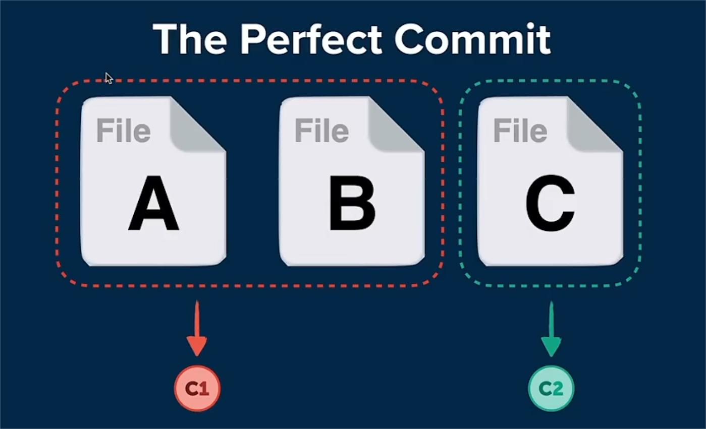

## 如何使用GIT：【场景3】符合规范的多人协作开发

### 在coding上创建分支

在coding上进行这步操作主要是为了防止拼写错误导致分支命名不符合规范

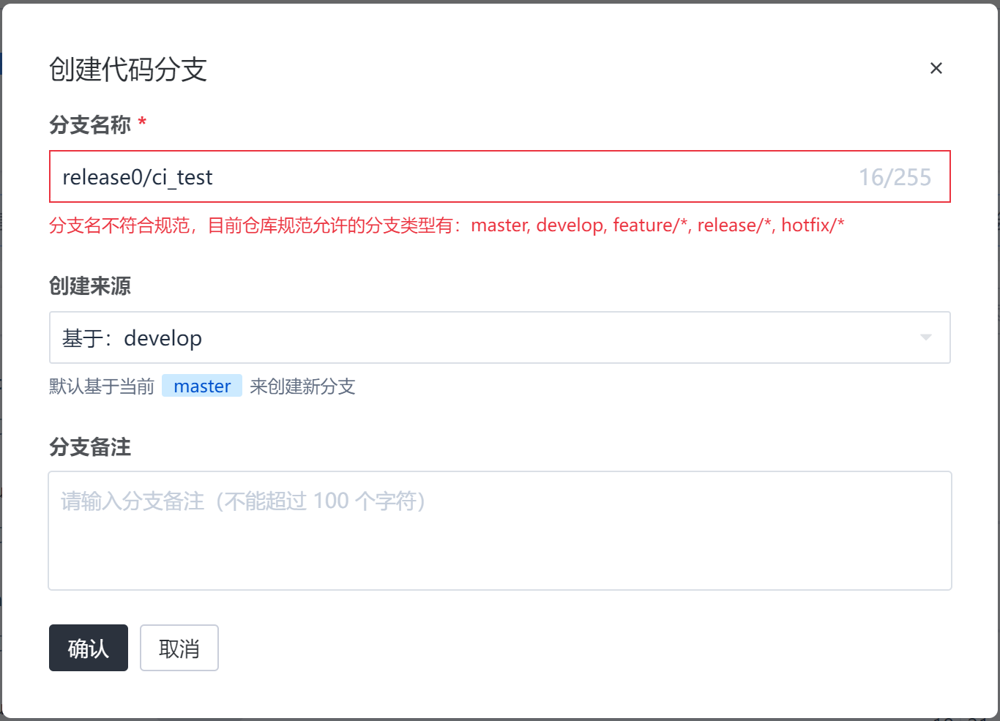

### fetch分支到本地

```bash
git fetch
```

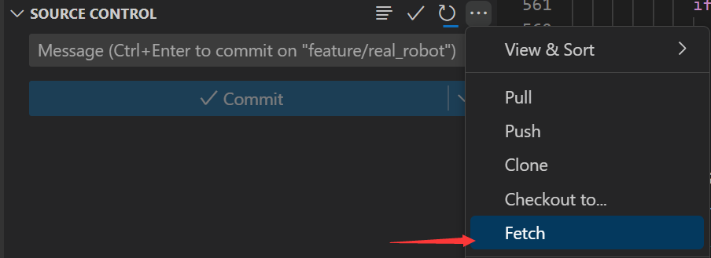

### 切换到新的分支

```bash
git checkout feature/AAA
```

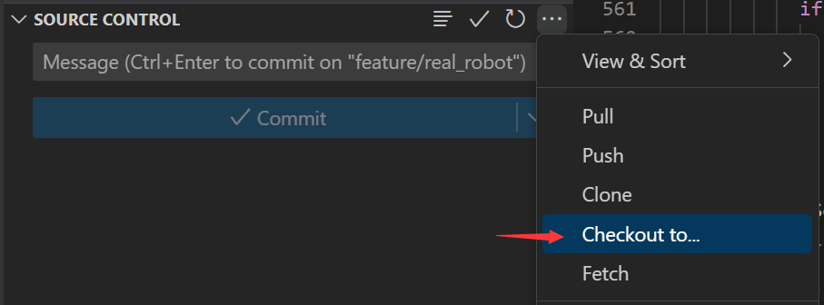

### 修改代码

遵循commit规范，提交代码

### 新功能开发完成，请求合并

合并到develop分支，也就是提pull request(merge request)

1. 在Coding上发起pull request

    - 注意合并方向规范

    

    - 填写pull request的标题和内容

    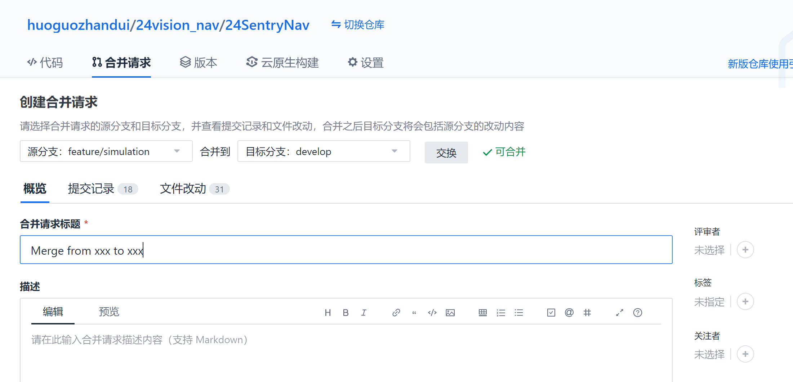

    - 合并方式选择squash

    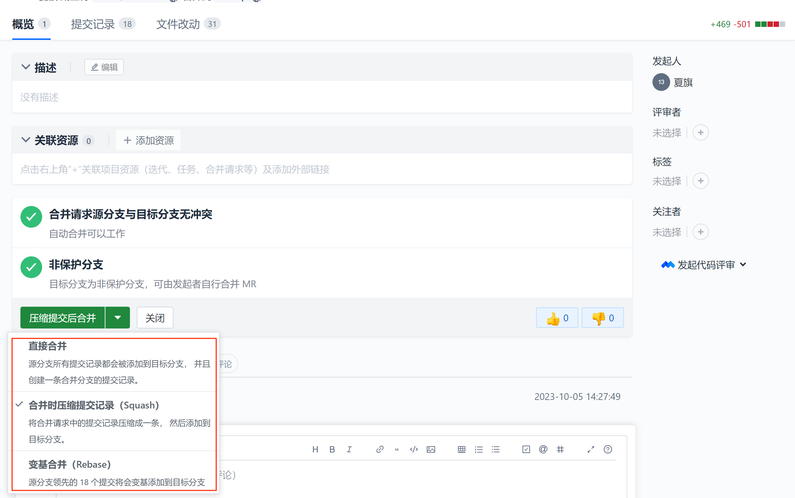

    🫠选择哪一个方式好像关系也不大

    🌟Squash 可以将多个提交合并为一个单独的提交，使项目的提交历史更加干净。

    🌟Rebase 则可以将一个分支上的提交应用到另一个分支上，使得项目历史更加线性和整洁。

    - 记得添加评审者

2. 处理冲突

    - 若没有冲突，等待评审完成即可，develop分支的内容就会更新为feature分支的内容

    - 若有冲突，需要解决冲突，再合并

    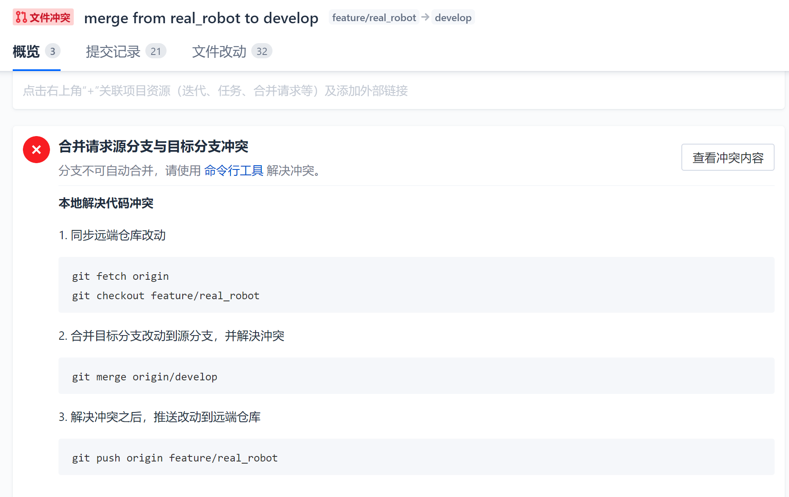

    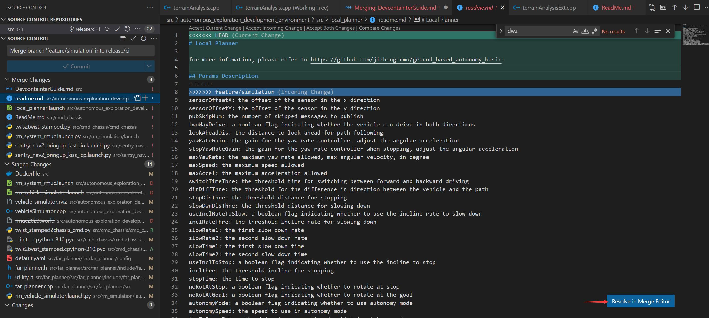
        
    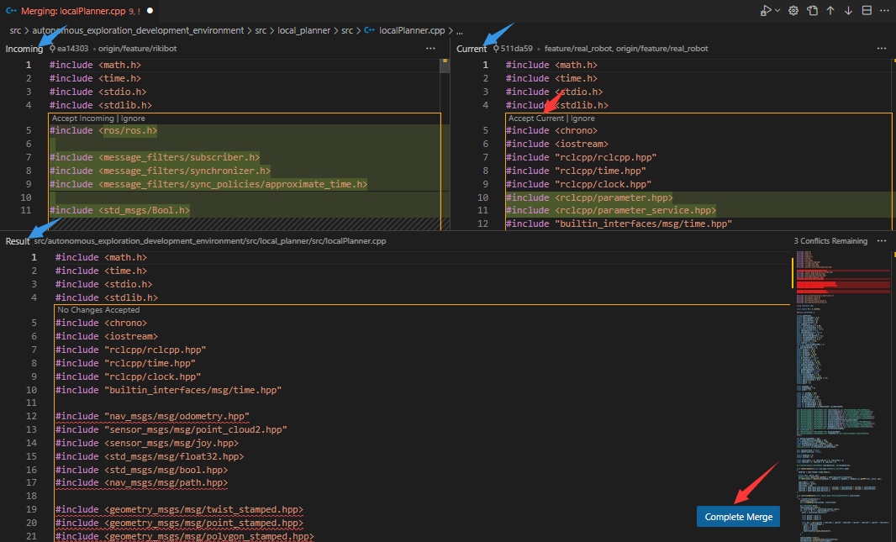

3. 提交到远程仓库

    ```bash
    git push origin feature/xxxx
    ```

4. 等待测试/评审

## 如何使用GIT：【场景4】评审人员的操作

如果你是评审人员，那么会负责review代码，如果代码没问题，需要approve这个pull request，如果有问题，需要在评论区提出问题

### 设置仓库

当然第一次需要设置仓库，配置推送规则

可以通过配置CODING仓库模板、构建计划模板，来规范团队的开发流程

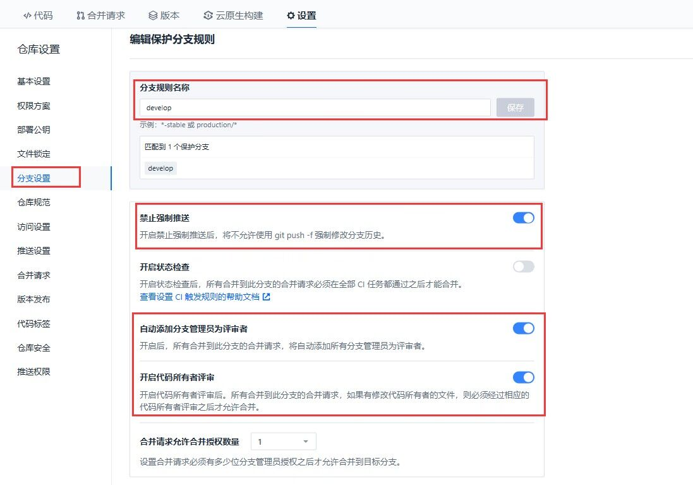

🌟**Fast-forward 合并**:当我们的新分支是基于主分支的最新提交版本时，Git可以直接将主分支指向新分支的头部，这种合并方式叫做Fast-forward合并。这种合并方式不会创建合并提交，只是简单的将主分支的指针前移。

🌟**Merge commit 合并(常用)**:当我们的新分支是基于主分支的老版本，或者在新分支和主分支上都进行了提交时，Git将会创建一个新的合并提交。这个合并提交记录了两个分支的历史最新公共祖先以来的所有提交。


### 配置自动化测试 【可选】

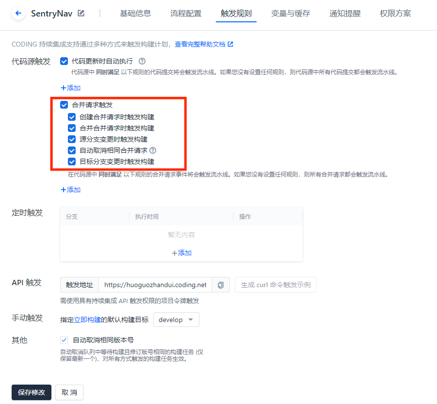

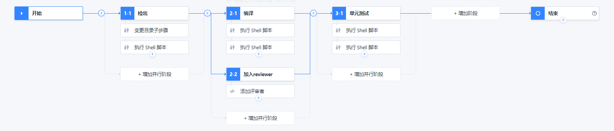

### 评审/合并

### 删除分支

## 参考

- https://blog.csdn.net/weixin_44786530/article/details/129403495

- https://www.cnblogs.com/heroljy/p/9294127.html
