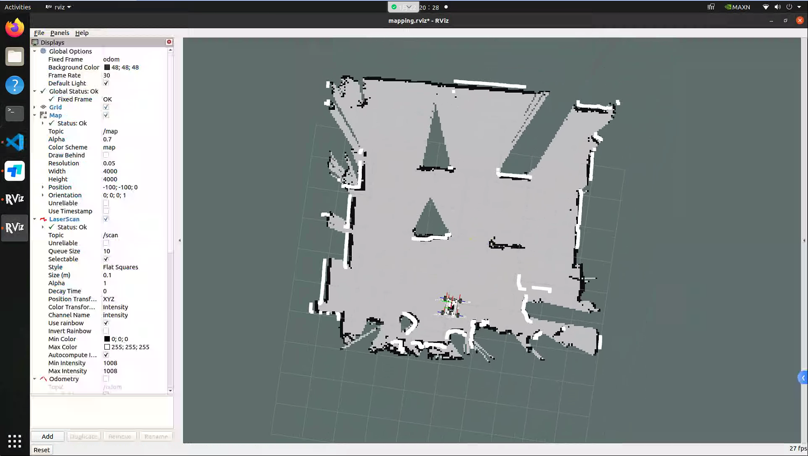

# 第一周
太神秘了arm64+ubuntu20.04
## 环境配置
### ssh
虽然最后还是懒得ssh了
```
Host alias
    HostName 192.168.31.30
    User agilex
```
### vscode
喜提vscode底层框架与沙箱机制冲突
发现`code --no-sandbox`可以解决，遂：
```
sudo vim /usr/share/applications/code.desktop
```
修改为 `Exec=/usr/share/code/code --no-sandbox %F`

### docker
#### 安装
尝试`sudo apt-get update`但报错ROS软件源的数字签名密钥过期，导入新秘钥
```
curl -s https://raw.githubusercontent.com/ros/rosdistro/master/ros.asc | sudo apt-key add -
```
然后再更新
```
sudo sed -i 's+download.docker.com+mirrors.tuna.tsinghua.edu.cn/docker-ce+' /etc/apt/sources.list.d/docker.list
sudo apt-get update
sudo apt-get install ca-certificates curl gnupg
```
添加 Docker 的官方 GPG 密钥
```
sudo install -m 0755 -d /etc/apt/keyrings
curl -fsSL https://download.docker.com/linux/ubuntu/gpg | sudo gpg --dearmor -o /etc/apt/keyrings/docker.gpg
sudo chmod a+r /etc/apt/keyrings/docker.gpg
```
写入软件源地址
```
echo "deb [arch=$(dpkg --print-architecture) signed-by=/etc/apt/keyrings/docker.gpg] https://download.docker.com/linux/ubuntu $(. /etc/os-release && echo "$VERSION_CODENAME") stable" | sudo tee /etc/apt/sources.list.d/docker.list > /dev/null
```
安装 Docker Engine
```
sudo apt-get update
sudo apt-get install docker-ce docker-ce-cli containerd.io docker-buildx-plugin docker-compose-plugin
```
将当前用户加入Docker用户组
```
sudo usermod -aG docker $USER
newgrp docker
```
#### 配置图形化转发
忘了怎么配了，要用再说（

## 熟悉遥控器
左右电源开关同时按下开关机<BR>
左侧第二个SWB切换控制模式：

- 上：导航模式，接收/cmd_vel
- 中：手控
- 下：？

右侧SWC开关切换速度档位，最上低速，最下高速

## 导航
居然没怎么配置雷达直接就ping通了

### 建图
cartographer的launch文件居然妹有了，只能跑gmapping了

浅改了一下终端配置，以后就不需要反复输`source /opt/ros/noetic/setup.bash` `
source ~/agilex_ws/devel/setup.bash`了

发布baselink2laserlink
```
roslaunch scout_bringup open_rslidar.launch
```
启用建图
```
roslaunch scout_bringup gmapping.launch
```
保存地图
```
rosrun map_server map_saver -f ~/agilex_ws/src/scout_ros/scout_description/maps/map
```
get：<BR>


验证了一下ps纯白pgm图的可行性，需要一些格式转换工具 [pgm与png在线转换](https://convertio.co/zh/pgm-png/)


### 导航
#### 内置
~~move_base竟然也是/cmd_vel，那感觉架bridge把ros2的cmd_vel转发过去应该是可行的，下一步试试~~  寄，机械旋转雷达好像有时间同步的问题，翻了半天也没找到这xacro文件哪里标注imu2lidar的变换，外参标定也有问题，转Velodyne格式的点云也可能有问题，真要做吗

- 小坑1，竟然没有重定位，竟然发布目标点之后需要点一下开始导航才开始规划，竟然goal成功了不清除目标点，很神秘吧movebase
- 小坑2，can通信，没启动can2usb，cmd_vel猛猛发车倒是一点不动，还以为我看漏了:)

发布baselink2laserlink
```
roslaunch scout_bringup open_rslidar.launch
```
启动导航
```
roslaunch scout_bringup navigation_4wd.launch
```
~~can通信~~  不再被需要了
```
rosrun scout_bringup setup_can2usb.bash
```
<BR>
 懒得每次都要配置can了，写了个开机自启的服务

```bash
agilex@agilex-desktop:~$ mkdir -p ~/scripts
agilex@agilex-desktop:~$ gedit ~/scripts/setup_can.sh
agilex@agilex-desktop:~$ chmod +x ~/scripts/setup_can.sh
agilex@agilex-desktop:~$ sudo vim /etc/systemd/system/scout_can.service
agilex@agilex-desktop:~$ sudo systemctl daemon-reload
agilex@agilex-desktop:~$ sudo systemctl enable scout_can.service
Created symlink /etc/systemd/system/multi-user.target.wants/scout_can.service → /etc/systemd/system/scout_can.service.
agilex@agilex-desktop:~$ sudo systemctl start scout_can.service
agilex@agilex-desktop:~$ ifconfig can0
can0: flags=193<UP,RUNNING,NOARP>  mtu 16
        unspec 00-00-00-00-00-00-00-00-00-00-00-00-00-00-00-00  txqueuelen 1000  (UNSPEC)
        RX packets 2999  bytes 23992 (23.9 KB)
        RX errors 0  dropped 2999  overruns 0  frame 0
        TX packets 0  bytes 0 (0.0 B)
        TX errors 0  dropped 0 overruns 0  carrier 0  collisions 0
```

再见了所有的前摇

#### 更改

纯白地图跑通了，用imu定位，接收map系下的/target_goal进行导航

```bash
roslaunch scout_bringup nav_bringup_all.launch
```


## 改仓库
emmm居然甚至还没初始化，填了我的邮箱和姓名

目前是src下面的几个子文件夹分别用git管理了，打算还是统一一个git方便一点，把子文件夹的`.git`全都改成了`.git_temp`备份，在src重新初始化了一个仓库


