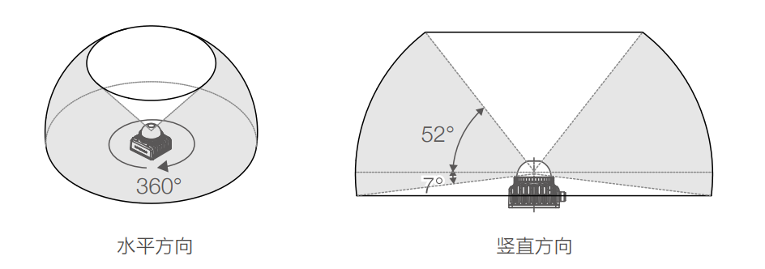
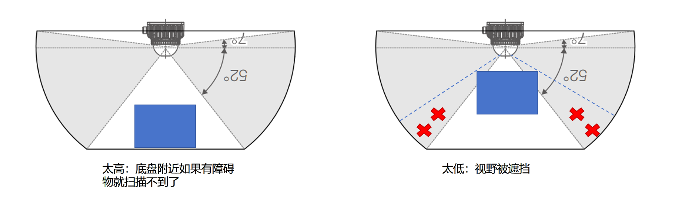
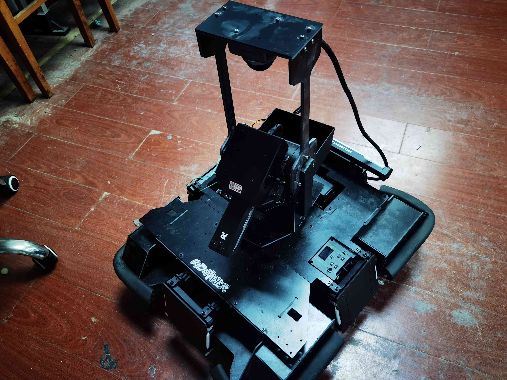
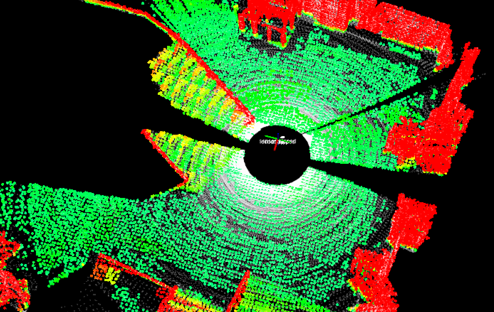

MID360的使用说明
============================

有空的时候可以去读一下说明书的内容，了解一下它的特性。

激光雷达的基本说明
############################

MID360的组成
***************************

激光雷达+内置6轴IMU+后接一分二电源\数据线

激光雷达的工作原理
***************************

基本原理就是激光测距，通过发射激光束并测量激光束的反射时间来测量目标的距离。
非常多的激光束就可以构建出一个三维的点云图，获得对周围环境的表示。

IMU的工作原理
***************************

IMU是惯性测量单元，可以测量物体的加速度和角速度。类似于人的小脑，可以感知物体的运动状态。

MID360激光雷达的装配说明
############################

MID360的特性
***************************

- 视野范围竖直最大59°，水平最大360°。
- 基本上扫描不到半球罩的下方。

装配要求
***************************

综上，对激光雷达的安装设计提出几点要求：

1. 尽量减少对激光雷达发射的激光束的遮挡
2. 尽量减少震动,（不然就像人坐在颠簸的车上，容易晕车hhh）
3. 视野范围内尽量不要有遮挡
4. 激光雷达装得太高会导致靠近底盘的部分扫描不到，有障碍物就检测不到了
5. 激光雷达装得太低会导致车体被扫描到，有时候会误判为障碍物，也会遮挡掉部分视野

目前在两边竖两根杆子把激光雷达倒挂在最顶端，效果是这样的

可以看到两边的杆子遮挡了一小部分激光雷达的视野，但是大部分的视野还是可以扫描到的。

安装细节
***************************
- 印有“livox”的一面朝向前方
- 激光雷达后方需要接一根电源+数据线，线的末端会分成两个头，一端接电源，一段接导航电脑
- 雷达保护罩：除了固定激光雷达的四个螺丝孔，还需要至少另外四个螺丝孔固定保护罩
- 尺寸

.. image:: ./pic/mid3603.png
   :width: 500

注意事项【重要！！！】
############################

.. Warning::
      
   - 精密仪器！请勿把螺丝拧到最紧！拧紧后回转半圈！
   - 不要频繁插拔航空插头！不要暴力插拔航空插头！任何感觉到大阻力的插拔动作都是错！误！的！
   - mid360航插口使用方法
      - 拆下：旋到最松，垂直着插口向外拔，再旋到最松，再垂直着插口向外拔，重复直到航插口轻松脱落
      - 拧紧:垂直着插口向里插，旋到比较紧，再垂直着插口向里插，旋到比较紧，重复直到无法向里插，拧紧航插口

   - 保存:运输请放回原盒
   - 清理:使用光学擦镜纸

参考资料和模型下载
############################

https://www.livoxtech.com/cn/mid-360/downloads

激光雷达的神奇报错
############################

有topic但是没有消息：检查防火墙
