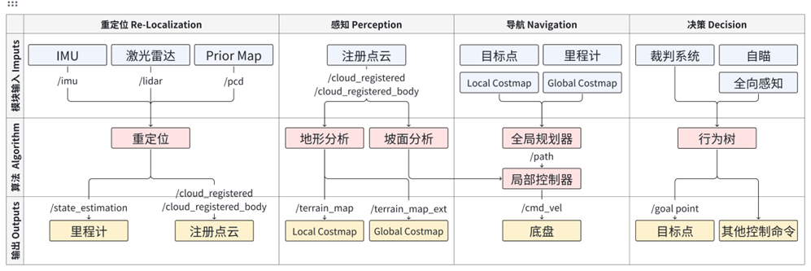
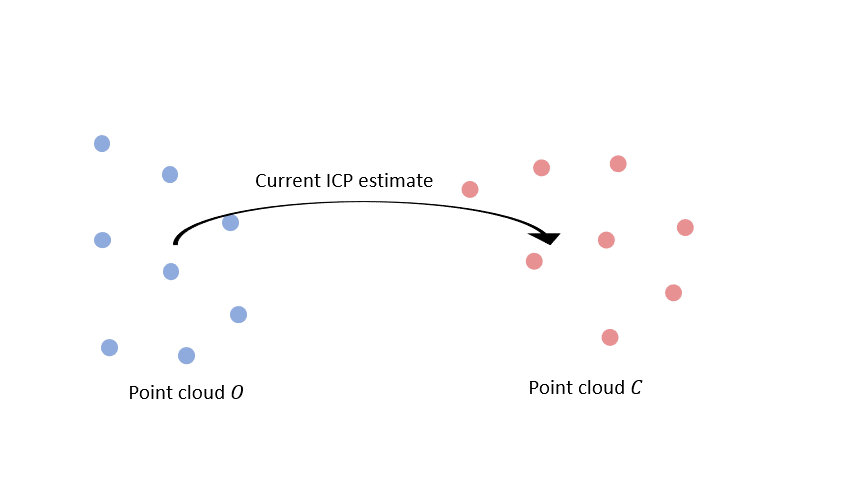
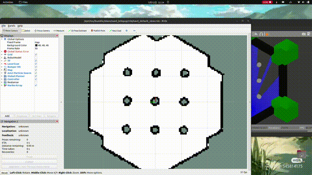
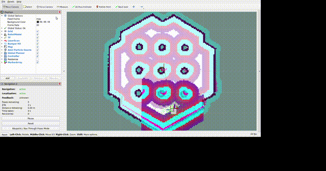
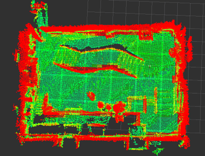
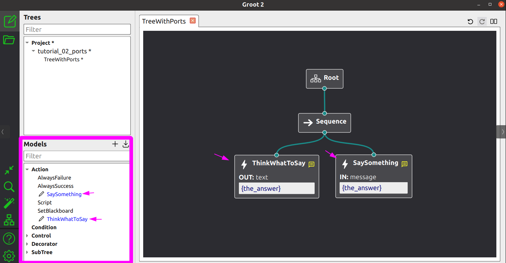

# 【Navigation】全自动机器人的导航和决策

## 系统框架

使用的是传统的模块化结构，即通过定位、感知、规划、控制来完成机器人的导航任务。



可以在理解完各个模块的作用后再回来看这张图。

## 定位

- What：在预先知道的地图中，找到机器人的位置。

- Why：后续的规划任务需要精确的定位作为输入。（Dijkstra算法和A*算法）

- How：定位的方法有很多，我们使用基于激光雷达的ICP算法，大多需要手动给一个初始值（考核题中的第一步操作），然后将当前的激光雷达数据与地图中的点云数据进行匹配，迭代找到最佳的匹配位置。

    - 预先知道的地图是通过建图算法获得的。[Fast-LIO2建图过程](https://www.bilibili.com/video/BV1z1421k73w)

    - 给定初始值进行迭代匹配<br/><br/>[视频演示ICP_Localization](https://youtu.be/joHdoiLyQHk)
    
    - 初值对匹配的影响<br/>

## 感知

- What：感知指的是机器人对于周围障碍物、地形的辨识能力。

- Why：实现对障碍物和坡面和平面的识别，后续规划时应该避开障碍物，选择平坦的路径。

- How：人类使用的是视觉、听觉、触觉等感知方式。机器人的理解能力有限，通过对点云数据的进行平滑程度的分析，实现对周围环境的感知。



红色为不可通行区域，绿色为可通行区域。


对点云地图进行障碍物的感知，将不可通行的部分投影到2D的栅格地图中，用于后续的规划。

## 规划

- What：给定起点和终点，找到一条无碰撞的最短路径。

- Why：找路

- How：最常见的就是在栅格地图中进行路径搜索，白色的区域可通行，通行代价为0，黑色的区域不可通行，通行代价为无穷大。

- 点击体验算法的运行效果 https://www.redblobgames.com/pathfinding/a-star/introduction.html

## 控制

- What：计算输出的控制量，使机器人按照规划的路径运动。

- How：控制算法层出不穷，各有优劣咯。

- 点击体验不同控制算法的效果 https://atsushisakai.github.io/PythonRobotics/modules/path_tracking/path_tracking.html

## 决策

- What：根据赛场情况和自瞄的结果，决定机器人的下一步行动。

- Why：全自动机器人是没有操作手的。

- How：使用行为树来实现决策。状态机过于简单，不好维护；人工智能过于复杂。



每一个叶子节点都是一个行为，非叶子节点是控制节点，用于控制行为之间的逻辑。

## 简单的建图、定位、规划、控制、感知、决策体验

准备工作

**FOR DOCKER USER:(HIGHLY RECOMMENDED)**

pull the image from dockerhub and run it:

```bash
docker run --gpus all -dit --ipc=host --net=host --privileged -e DISPLAY=host.docker.internal:0.0 -e NVIDIA_DRIVER_CAPABILITIES=all polarisxq/scurm:nav_tutorial

# use XLaunch to open the GUI
```

**BUILD FROM SOURCE:(NOTE THAT SOME FILE PATH MUST BE CHANGED)**

clone this repo to your workspace:

```bash
mkdir -p ~/nav_tutorial_ws/src
cd ~/nav_tutorial_ws/src
git clone
```

构建工程：

```bash
cd ~/nav_tutorial_ws
rosdep install --from-paths src --ignore-src -r -y
colcon build --symlink-install
```

启动仿真环境：

```bash
ros2 launch pb_rm_simulation rm_simulation.launch.py
```

启动建图：

```bash
ros2 launch sentry_bringup mapping.launch.py 
```

启动键盘控制：

```bash
ros2 run teleop_twist_keyboard teleop_twist_keyboard
```

保存地图：

```bash
ros2 run nav2_map_server map_saver_cli -t /projected_map -f test_map --fmt png
ros2 service call /map_save std_srvs/srv/Trigger
```

全部关闭

再次启动仿真环境：

```bash
ros2 launch pb_rm_simulation rm_simulation.launch.py
```

启动重定位和导航：

```bash
ros2 launch sentry_bringup bringup_all_in_one.launch.py
```

启动决策：
    
```bash
ros2 launch rm_decision_cpp run.launch.py
```