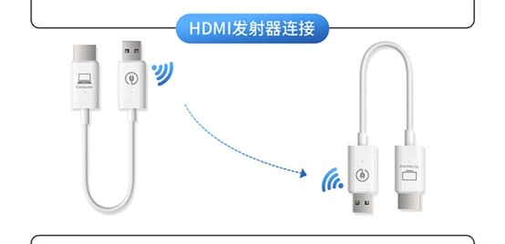
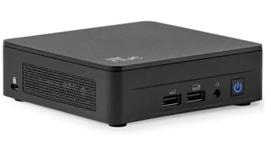
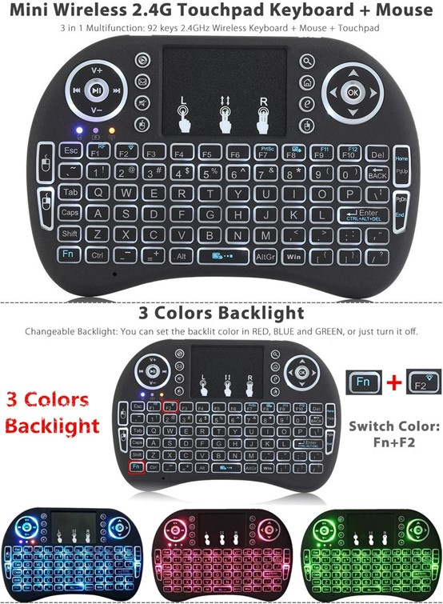
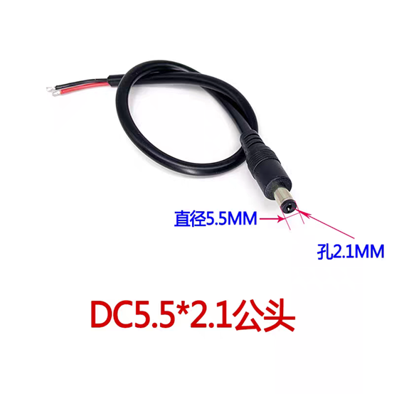
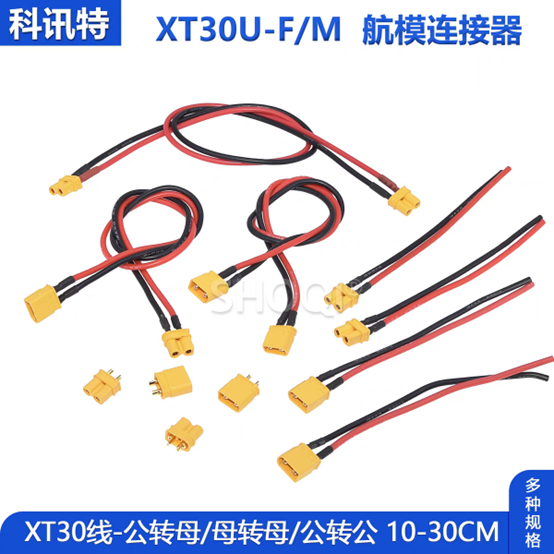
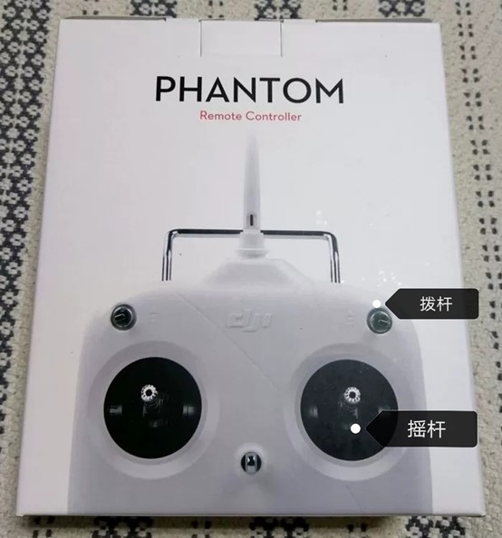

# 哨兵组装指南

LAST UPDATED: 2024-9-21

每一年都有新特性，有不清楚的地方务必问清楚！

## 工具准备

- 无线HDMI收发器，用于远程监控。一对，一个收一个发
    
- 烧饼的miniPC，黑色的NUC13一台。放进烧饼的后脑勺，接口多的那一端向后，四个脚的那一面向下(应该没记错)
    
- 无线鼠标和键盘，用于远程操控。如果有蓝牙键盘就更好，没有的话用那个迷你小键盘，接收器可能在电脑上也可能在键盘的电池仓里。用不习惯这个小键盘的话用有线键盘也可以。
    
- 装好激光雷达。找到4个尺寸和长度能旋进雷达后面4个孔的螺丝备用。先旋掉铜柱上方的螺丝，把透明的保护罩拆下来，然后把雷达的线接上，用优雅的方法接，要大力出奇迹的话说明接错了。往里压和旋紧两个动作重复到旋不动就装好了(这个接口容易坏)。然后把激光雷达装到上面那个板子上，livox字样朝前。最后把保护罩装回去。
- 电池充好电，至少两块吧。
- 拔掉minipc的电源，指dc公头和小电脑断开。
    
- 拔掉激光雷达的电源，指xt头和分电板断开(记住原来插在哪个口)。
    
- 找到遥控器，打开电源，左边拨杆播到最下(保护档)
    

## 安全性测试
 
- 确保重要器件（雷达、电脑）的供电都断开。插上电池，短按一下，长按3秒开启电池，把电池架旁边的开关拨到1，稍等一会启动完成
- 尝试一下遥控器左右拨杆的各个组合的功能(上面好像有写)和摇杆的功能，理解一下遥控器逻辑。(疯车的时候马上开到保护，小命要紧)
- 遥控器开到保护档。找到电压表，换到直流电压档。测量minipc dc端电压，表笔一头插在孔里面，接触金属片，另一头和外面的金属接触。两个表笔不要碰到一起！手不要碰到金属部分！人体导电！小命要紧！电压在19v左右就OK。测量雷达线xt头插的那个孔的电压，两个表笔两个孔，依然不要碰到一起！电压9~27v之间就可以，推荐12v(具体说明书去览沃官网下载，盒子里好像有一份纸质的)
- 电压都检查完毕后。先断电，再把小电脑电源和雷达电源插上了。切忌热插拔电源线！

## 组装

- 雷达网线，hdmi收发器标有pc端的一个，鼠标的蓝牙接收器，键盘的蓝牙接收器全部插到小电脑上
- Done！
