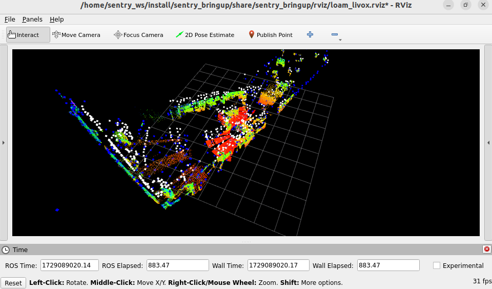

# 第七周记录
## 关于串口
实在想不起来以前的口都是怎么接的了遂重新绑的串口，目前USB的虚拟串口插在了**底部右侧的USB接口**上
<BR>
[串口绑定教程](https://scurm-knowledgebase.readthedocs.io/zh/latest/vision/deploy/serial.html)

### 10.17更新：串口测试
测试代码：24Sentry_AutoAim
<BR>
把```serial_driver``` launch一下，再回导航工作区运行```twist2chassis_cmd_node```和```twist_transformer_node```
<BR>
再运行
```shell
ros2 run teleop_twist_keyboard teleop_twist_keyboard --ros-args --remap cmd_vel:=cmd_vel_in_yaw
```
用键盘控制，能动就是通信通了， <font color="gray">测通后再考虑速度标定的问题</font>


## 关于建图
建图的时候显然这是把跟着他走的我也当成障碍物了


旗姐提供的解决方案：
<font color="gray">
- 在livox  viewer里面设置雷达的fov，让他的后半部分不工作，站在不工作的范围里面（不推荐，赛场上会有其他人）
</font>
- 把点云放到[cloud compare](https://cloudcompare-org.danielgm.net/release/)里面处理，去掉人的残影


## 关于重定位
rviz有问题，完全不显示在仿真里弹出来的那种粉粉绿绿的定位效果，可能是rviz的命令被注释掉了

解决方案：用vscode的全局搜索限制在.py文件里找rviz相关的命令，但找出来的实在是太多了，目前的思路是和仿真里面的各种launch.py对比，朴素的肉眼比对排查……

## 10.16：大致跑通了重定位

启动命令：
```shell
ros2 launch sentry_bringup relocalization.launch.py
```
建图得到的.pcd地图需要保存在```/home/sentry_ws/src/FAST_LIO_SAM/PCD/GlobalMap.pcd```中
<BR><font color="gray">
尝试修改了icp_relocalization包icp.launch.py中的路径，但完全没有什么效果，目前只能直接改地图名，这个等后续详细看代码吧
</font>

匹配时需要提供一个大致的初始值，可以在launch文件里改或用rviz里的pose estimation

效果：<BR>
