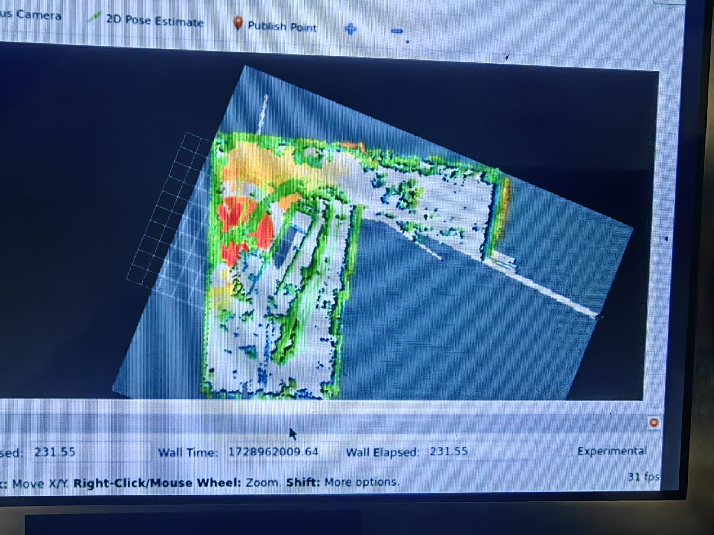

# 10.15记录
## 关于串口
和电控大概完成了串口通信，测了一下能通过串口互相发送/接收，但因为导航还没完全跑起来所以不确定是不是真的没有问题了

## 关于建图
建图的时候显然这是把跟着他走的我也当成障碍物了

旗姐提供的解决方案：
- 在livox  viewer里面设置雷达的fov，让他的后半部分不工作，站在不工作的范围里面（不推荐，赛场上会有其他人）
- 把点云防盗cloud compare里面处理，去掉人的残影

但第二种方法我现在显然完全不会，以后再学吧

## 关于重定位
rviz有问题，完全不显示在仿真里弹出来的粉粉的定位效果，可能是rviz的命令被注释掉了

解决方案：用vscode的全局搜索限制在.py文件里找rviz相关的命令，但找出来的实在是太多了，目前的思路是和仿真里面的各种launch.py对比，朴素的肉眼比对排查……