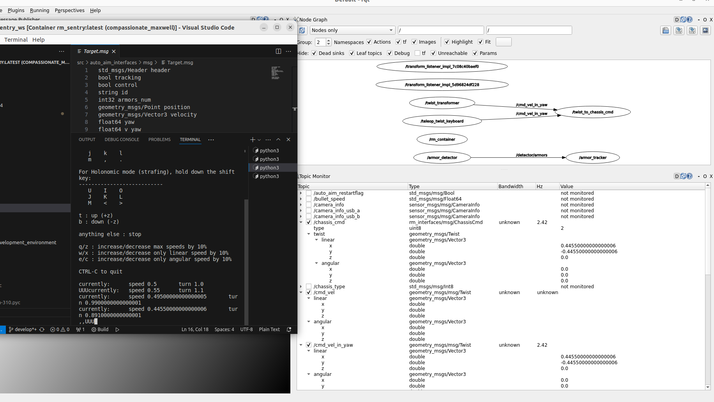

# 第八周
进度感人，换个电脑一堆问题，git也几乎等于没学纯纯巨大的依托

更新了一些public文档

## 基本上测通了和电控的通信

[cmd_vel_in_yaw]--twist_trasformer-->[cmd_vel]--twist2chassis_cmd-->[chassis_cmd]--rm_serial_driver-->[电控]

1. 看cmd_vel话题有没有输出（说明控制命令发出了）；
2. 看chassis_cmd话题有没有输出（说明控制命令类型转换成功了）；
3. 看chassis_cmd话题的接收者有没有serial driver（说明通信打开了）；
4. 看/tracker/target话题有没有输出（因为chassis_cmd必须和tracker/target一起发出电控才收得到）

``` shell
ros2 topic echo /chassis_cmd  #监听话题内容
```

``` shell
ros2 topic info [topic_name] -v  #查看话题详细信息
```

具体流程见week7，反正最终能用键盘控底盘了

