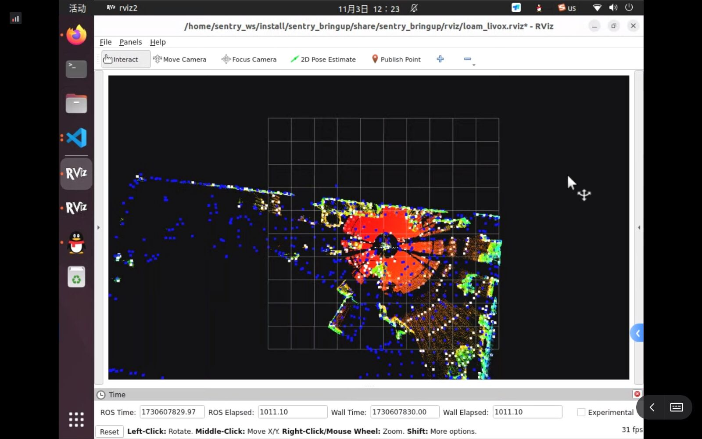
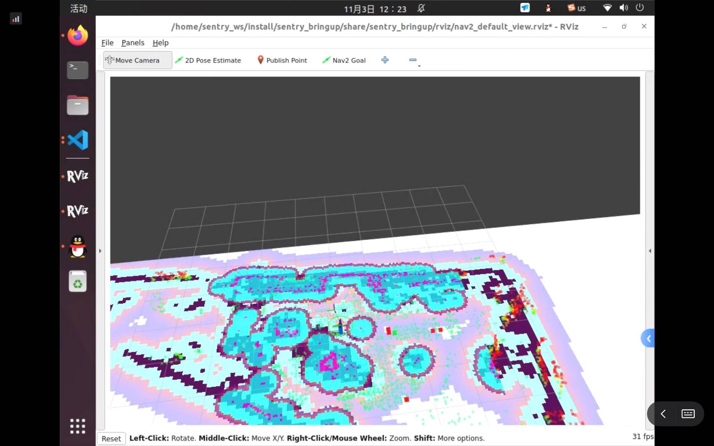

# 第九周
~~重生之我要在这个周末跑穿全流程~~
<BR>
重生之在旗姐的帮助下勉强跑穿了全流程

梳理：
1. 建图
    ```bash
    ros2 launch sentry_bringup mapping.launch.py
    ```
2. 保存地图
   - 存.png：
        ```bash
        ros2 run nav2_map_server map_saver_cli -t /projected_map -f test_map --fmt png
        ```

   - 存.pcd
       ```bash
       ros2 service call /map_save std_srvs/srv/Trigger
       ```

3. 串口通信
    <BR>本地里的工作空间24Sentry_AutoAim：
    ``` shell
    colcon build --packages-select rm_serial_driver
    ```
    ``` shell
    source install/setup.sh 
    ```
    ``` shell
    ros2 launch rm_serial_driver serial_driver.launch.py
    ```
    用rqt发布话题/tracker/target 消息类型Target

4. 重定位&路径规划
    ``` shell
    ros2 launch sentry_bringup bringuo_all_in_one.py
    ```
    
    

    地图上出现了这些蓝色紫色的层了，就说明定位已经好了
    <BR>如果还规划不了路径就去看命令行的输出，如果显示起始点/终点都是障碍物，无法规划路径就是有误识别，看建图是有噪点/把自己身上的东西认成障碍物，噪点就自己ps一下

<BR>
江安这边还是太乱了+机械赶着拆车，没最终录出来跑路径规划的视频，但串口通了能用键盘控+重定位没有问题只是障碍物误识别，其实属于是后续地图处理的问题了，整个框架算是已经跑通了

<BR>
地图处理+看具体代码实现+算法优化留给下阶段吧