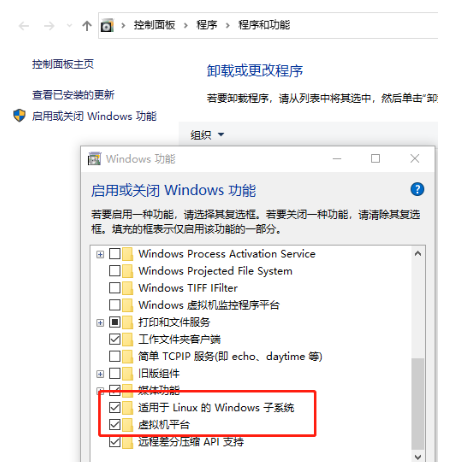
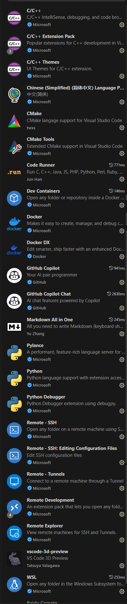
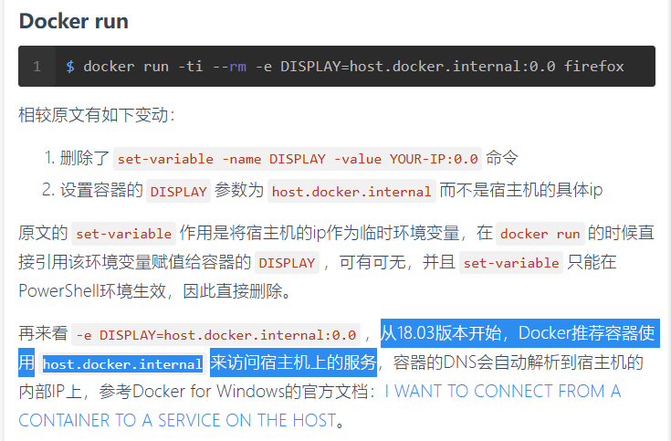

# docker安装相关

## 环境配置

### 参考：

[学姐的馈赠](https://polaris-notebook.readthedocs.io/zh-cn/latest/develop/Docker/docker.html)

[VScode-doeker官方文档](https://code.visualstudio.com/docs/devcontainers/tutorial)

[CSDN-wsl及docker安装](https://blog.csdn.net/weixin_43726471/article/details/122267300)

[CSDN-Windows安装Docker并创建Ubuntu环境](https://blog.csdn.net/laoxue123456/article/details/133526607)

### Windows下安装docker：

安装过程状况百出……没有Hv和容器选项需要自己写.bat文件下载

**250413更新**：docker默认用wsl2运行而不再需要下载HyperV了，在本人的老古董surface里安这Hv直接给我古董干没了：）我的40h星露谷存档：）））<BR>
all you need is：<BR><BR>
[参考](https://blog.csdn.net/deng_zhihao692817/article/details/129270111)<BR>
<font color="grey">不过上述是在win10下安装时发现的，在win11看了一眼系统功能似乎没有虚拟机平台这个选项，但理论上来讲应该依旧是不需要Hv的（等哪天闲心大发说不定征用一个win11再配一次看看，没更新就自己试一下吧）</font>

**250414更新**：ok基本确认了，win11也不用下Hv，在最新的docker installer安装时可以勾选是否使用wsl2替代Hv，速勾，Hv和docker的兼容简直就是史。不过这样就需要下好wsl，命令行/下载installer应该都行，忘了咋下的了，应该不难

在users\hp里要写个.wslconfig文件（似乎网络相关

下载好desktop之后可以在设置里更改镜像存储位置，默认在C盘，最好还是改一下，但不知道为什么本人死活browse不成功，更花的改法等有时间配个win11虚拟机测一下吧，配环境配的头疼不想折腾了 ~~才不是赶不及考核ddl了啊啊啊~~

**24.9.15更新：docker镜像存储位置问题：**
直接手改，复制粘贴删除一气呵成，亲测有效()<BR>
下载好desktop之后在设置里就会有一个镜像存储路径（本人是`C:\Users\hp\AppData\Local\Docker\wsl`<BR>
先尝试一下直接点browse，能改的话万事大吉但目前看来大概率不行，会显示`docker_data.vhdx`无法移动，推测原因是打开了desktop这个文件就会开始运行然后就没法移动了

1. 终止所有容器，完全关闭desktop，可以用`wsl --list -v`测试
2. 把`C:\Users\hp\AppData\Local\Docker\wsl\disk`目录下的`docker_data.vhdx`移动到你需要的路径下（如`F:\Docker\DockerDesktopWSL`）
3. 把原来的`docker_data.vhdx`删除（注意main文件夹下`ext4.vhdx`不要动，至少本人动他就会定位不到，反正这个也就138MB留着他吧还是其他.vhdx比较占空间
4. 重新启动desktop，把设置里的路径更改到F盘，再重启看启动界面的镜像和容器有没有丢失。如果在设置里更改路径的时候显示比如说什么该文件夹下DockerDesktopWSL已存在之类的，善用文件夹重命名反复移动一下，最终只要实现了把`docker_data.vhdx`塞到`DockerDesktopWSL\disk`下且设置里定位的位置是`F:\Docker\DockerDesktopWSL`就没问题

**25.4.15更新**：哎好像其实没那么麻烦，感觉原因应该是在改镜像存储位置之前就拉取过镜像了所以出现神奇的路径问题，这次重配环境在刚下好desktop之后不拉取镜像直奔着改设置去，一下子就改好了，amazing

环境测试：

    PS C:\Windows\system32> docker pull ubuntu
    Using default tag: latest
        latest: Pulling from library/ubuntu
    9c704ecd0c69: Pull complete
    Digest: sha256:2e863c44b718727c860746568e1d54afd13b2fa71b160f5cd9058fc436217b30
    Status: Downloaded newer image for ubuntu:latest
    docker.io/library/ubuntu:latest

    What's next:
        View a summary of image vulnerabilities and recommendations → docker scout quickview ubuntu
    PS C:\Windows\system32> docker run -it --name test1 ubuntu

    root@a3a2bb9fb0e1:/# ls
        bin  boot  dev  etc  home  lib  lib64  media  mnt  opt  proc  root  run  sbin  srv  sys  tmp  usr  var
    root@a3a2bb9fb0e1:/# exit
        exit

    PS C:\Windows\system32> docker ps -a
        CONTAINER ID   IMAGE     COMMAND       CREATED          STATUS                     PORTS     NAMES
        a3a2bb9fb0e1   ubuntu    "/bin/bash"   33 seconds ago   Exited (0) 3 seconds ago             test1

    PS C:\Windows\system32> docker run -it --name test1 -v I:/Docker:/data ubuntu bash

    root@28fc2e21cac7:/# ls
        bin  boot  data  dev  etc  home  lib  lib64  media  mnt  opt  proc  root  run  sbin  srv  sys  tmp  usr  var
    root@28fc2e21cac7:/# ls
        bin  boot  data  dev  etc  home  lib  lib64  media  mnt  opt  proc  root  run  sbin  srv  sys  tmp  usr  var
    root@28fc2e21cac7:/# ls /data/
        1
    root@28fc2e21cac7:/#exit
        exit

能ubuntu启动就差不多了

### VScode连接远程容器所需配置:
不确定每个插件都有用，但安都安了：<BR>



## 启动命令:

从coding拉取镜像登录用户名是邮箱
```bash
docker login huoguozhandui-docker.pkg.coding.net
```

拉取命令：
```bash
docker pull huoguozhandui-docker.pkg.coding.net/24vision_nav/sentry_dockerhub/rm_sentry:latest0408
```

### 25.3.1更新
``` bash
 docker run --name 25nav --gpus all -dit --ipc=host --net=host --privileged -e DISPLAY=host.docker.internal:0.0 -e NVIDIA_DRIVER_CAPABILITIES=all -v F:\yu:/data g-dvxc1780-docker.pkg.coding.net/25nav/docker/25nav:0301
```

在I:/rm文件夹中挂载data
```bash
    docker run -it --name rm_try --network=host --privileged -e DISPLAY=${DISPLAY} -v F:\rm:/data huoguozhandui-docker.pkg.coding.net/24vision_nav/sentry_dockerhub/rm_sentry:latest0408 bash
```

终端连接到容器：docker attach <docker_name>

退出容器：exit


## 图形化界面:

[下载vsxsrv-Xlaunch](https://blog.csdn.net/zhouzhiwengang/article/details/139729949)

[参考教程](https://blog.csdn.net/zhouzhiwengang/article/details/139729949)

    echo "export DISPLAY=192.168.18.1:0.0" >> ~/.bashrc
    source ~/.bashrc
    Xlaunch启动时display number改成0；
    ipconfig改成本机ip

### 二轮期间更新：
不用管上面这些什么bashrc，上面这些已经在镜像里改好了，只需改启动命令：--ipc=host --net=host(参照25.3.1更新)

### 25.3.2：图形化界面启动不成功解决方案

尽管在启动命令里加了`-e DISPLAY=host.docker.internal:0.0`，但容器还是无法连接到xlaunch，出现以下报错：

``` 
root@docker-desktop:/home/sentry_ws# rqt
could not connect to display :0.0
This application failed to start because no Qt platform plugin could be initialized. Reinstalling the application may fix this problem.
Available platform plugins are: eglfs, linuxfb, minimal, minimalegl, offscreen, vnc, xcb.

root@docker-desktop:/home/sentry_ws# echo $DISPLAY
:0.0
```
理论上来讲这是可以通过改dockerfile来解决的，但很菜的本人显然不会，所以手动在容器里做修改吧

``` bash
export DISPLAY=host.docker.internal:0.0
```
然后就好了，是不是非常的简单~

### 25.4.12：上面问题的解决办法
哎，帅神，感谢帅神对本栏目的大力支持，不然主播还在天天狂敲命令：） ~~又名本人实在是太菜好在隔壁工位哒哥有实力，下辈子一定要好好学好吗好的~~

- 首先是怎么解决每次启动容易都要输那一段的问题：<BR>
在`/root/.bashrc`中加一句
    ```BASH
    export DISPLAY=host.docker.internal:0.0
    ```
    ~~只能说人铸币起来是完全无法想象能猪成什么样的，明明每次启动一次容器都要敲一遍这指令，结果愣是这么久了还是被提醒了才想起可以改bashrc，难蚌~~

- 其次是为什么会出现上面的问题：<BR>
在从小电脑打包系统时，小电脑内的bashrc是这样的：
    ```BASH
    export DISPLAY=:0.0
    ```
    然而：[参考](https://www.cnblogs.com/larva-zhh/p/10531824.html)
    <BR>
    略感难蚌，所以只需要改一下bashrc再重新source就可以不用每次启动容器重新敲指令了，但更改bashrc后的系统懒得再重新打包镜像了，拉取下来之后手动吧

250416福至心灵：出考核题忽然想起来在这里补一句——以免有刚上手ubuntu的孩子不知道，改bashrc之后需要source，我真是太贴心了

### X11apps
测试图形化界面是否配置成功：
```shell
apt-get update && apt-get install -y x11-apps
```
<BR><BR>
250417话痨犯了：我文档都留成这样了要是还有人docker安装有问题的话我真的会难过的 ：）
