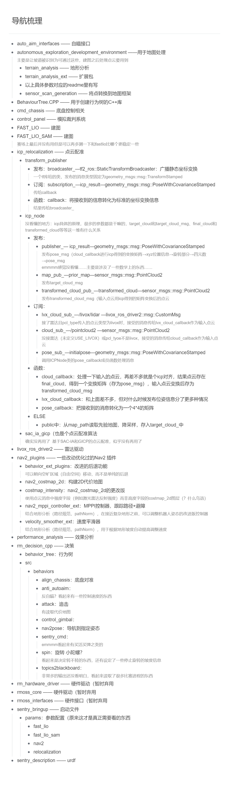
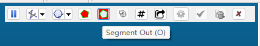
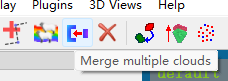

# 毕生所学

有一段时间没更新了，仅供参考！！！

todesk连不上的时候善用无线HDMI物理屏，东西用完放回原位别丢了，那个屏就放在盒子里别拆下来了

## 建图
见./照做/0117（后续所有需要的指令都可以在这里找），启动建图时需要记一下起点（重定位需要在原位），存地图（保存地图在运行存图指令的目录下）


## 地图处理
需要用到docker内外传递文件的指令，个人习惯传出来之后直接用QQ发
### 点云地图
cloudcompare
1. 菜单栏file-open，鼠标左键旋转右键平移
2. 去除过多重复点：tools-Other-Remove duplicate points，一般0.01-0.1m 保留一个点
3. 顶部工具栏一个小剪刀segment，左键选中多边形顶点，右键闭合，segement out提取出多边形<BR>
善用左侧图层可见/不可见/edit-colors-set改颜色，各种角度转一转，cut掉误识别的点
4. 把需要留存的图层ctrl+左键选中，merge合并为一个图层
5. 左键选中合并后的点云，保存
   
### 栅格地图
1. 用ps或Microsoft画图打开
2. 误识别的黑色障碍物涂白（注意是按像素点涂
3. 原尺寸保存

<BR>
处理后塞回docker

### 坡面识别
这个网页里有写过，但应该用不到，要用再说

## 和电控通信
导航+自瞄一起发给电控电控才能收到
1. 如果自瞄自启动没开，需要在本地24Sentry_AutoAim启动rm_serial_driver serial_driver.launch.py，再在docker内用rqt发/tracker/target（docker里面的rqt界面已经调好了，直接勾选就在发了
2. 在docker内启动twist2chassis_cmd和twist_transformer

## 重定位+规划
重定位需要把车放在建图起点，需要开决策就把sentry_bringup/bringup_all_in_one.launch.py中的这一句保留，不需要就注释掉

```
ld.add_action(delayed_start_decision)  # 不用自动决策的时候这个不用开
```
然后启动就行了

## 规划
应该用不到，需要再问，其实这个网页里也有写过一些

## 待办
1. 调车：/sentry_bringup/params/nav2_params.yaml中的各种参数，记得及时留一下备份+善用复制粘贴和注释，别改参数改出事了没法回退
2. 和自瞄联调：……唉，自瞄，需要看源码但看不懂，感觉会出事
3. 决策树：我也不会写：）