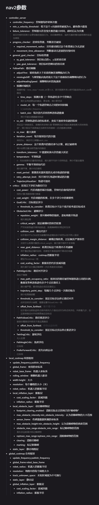

# 调参记录

## 简单理解

## 小tips
1. 调车顺序：确定一个大概的速度 -> 走直线的路径跟随 -> 转弯的路径跟随 -> 转着头走直线的跟随 -> 转着头转弯的跟随 -> 不转头动态避障 -> 转头动态避障
2. controller_frequency smooth_frequency model_dt time_step 要同步调 
   controller_frequency和smooth_frequency要一致不然smoother会压频率，dt=1/frequency，dt*step最好在3s左右 
   测下来发现step拉高动态避障会更好但会在转弯的时候猛猛抄近路，如果静态转弯跟随死活调不出来可以看是不是step给大了
3. 调速度max和std是玄学，各种排列组合能排列出相同的目测速度，感觉拉高std反应会变快但速度方向容易抖导致导航开车像喝了假酒，所以拉高max拉低std还是拉高std拉低max看希望那个得到的效果慢慢测吧
4. 动态避障调膨胀层比调collision_margin_distance好用，如果发现车躲开得太远了可以怀疑是不是inflation_radius给大了
5. 全局的inflation_radius和cost_scaling_factor调到铺满需要让车走路中间的地方（比如让台阶和墙之间、转急弯的地方），其他不太重要的地方其实不走路中间可能反而才比较合适
