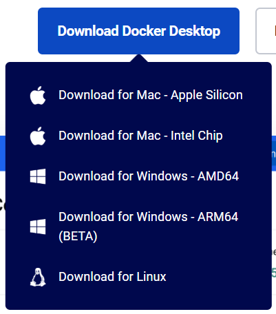

# win11安装Docker（2504胎教级重置版）
**——并手把手教你配置导航组一轮考核所需环境**

<font color="grey">由于这沙卵Hyper-V干没了本人40h的星露谷存档以至于本人一直在寻找可以绕过安装Hv来下载docker的方法，征用了队里三位环境比较干净的机械哥的win11电脑测下来，基本上照着这个流程可以稳定配好docker了，快滚啊毁掉我存档的史</font>


## 启用windows功能
1. 更新windows系统<BR><font color="grey">（个人感觉win暂停更新已经是旧习了，win11发展到现在总体上来讲是越更新越稳定，不更新反而容易出事的，开一下手动更新不要不知道什么时候忽然自动下载重启了就好</font>
2. 控制面板->程序->启用或关闭windows功能
3. 勾选`适用于Linux的Windows子系统`和`虚拟机平台`或`Virtual Machine Platform`(不同电脑这个选项不一定是中文/英文)
4. 确认，重启电脑

## 下载wsl
<font color="red">**以下操作务必在配置好科学上网的情况下进行**</font>
1. 以管理员身份运行Windows PowerShell
2. 运行以下命令禁用虚拟环境
    ```powershell
    dism /online /enable-feature /featurename:Microsoft-Windows-Subsystem-Linux /all /norestart
    dism /online /enable-feature /featurename:VirtualMachinePlatform /all /norestart
    ```
3. 下载wsl
    ```powershell
    wsl --install
    ```
    >如果出现如下图所示的报错`已禁止(403)`大概率是网络问题，检查一下科学上网有没有开好，Allow LAN开起来，Global开起来，来回换换各个节点，反复install试试。目前在各个电脑上测下来基本上只出现过这个问题，也基本上只要网络好了就会忽然能下载，总之先暂且不要到处改配置，实在是下不来了再说。<BR><BR>(图中几次install只更改过科学上网节点)

4. 更新wsl
    ```powershell
    wsl --update
    ```
5. 设置wsl版本为2
    ```powershell
    wsl --set-default-version 2
    ```
6. 重启电脑

## 下载Docker Desktop
1. [下载Docker Desktop installer](https://www.docker.com/)<BR><BR>
2. 运行并开始下载
3. continue without sign in<BR><BR>
4. skip<BR><BR>
5. 可能需要等待一会来初始化
6. 更改镜像存储路径:右上角设置->Resources->Advanced->Disk image location->选择你希望的文件夹->Browse

## 下载图形化显示软件
1. [下载VcXsrv](https://sourceforge.net/projects/vcxsrv/)
2. 运行installer
3. 运行Xlaunch，选择Next->Next->勾选`Disable access control`->Next->Finish
   
    此后每当你需要图形化显示时，确认自己电脑中运行着VcXsrv

## 测试环境
1. 测试docker
    ```shell
    docker pull ubuntu
    docker run -it --name test1 ubuntu
    docker ps -a
    ```
    能正常拉取镜像、创建容器就差不多了
2. 下载X11apps测试图形化显示：
    ```shell
    apt-get update && apt-get install -y x11-apps
    ```


## 配置VScode远程连接
1. 安装如下插件：
   - Dev Containers
   - Docker
   - Docker DX
   - Remote - SSH
   - Remote - SSH: Editing Configuration Files
   - Remote - Tunnels
   - Remote - Development
   - Remote - Explorer
   - WSL
2. 安装好后vscode左侧会显示docker的小鲸鱼，`CONTAINERS`下会显示所有的容器，右键一个运行中的容器->附加Visual Studio Code，即可在一个新窗口中连接到容器。
## 推荐用来完成考核的docker镜像

1. 拉取基础镜像
    ```bash
    docker pull ros:humble-perception-jammy
    ```

2. 创建docker容器
    ```bash
    docker run --name navtest --gpus all -dit --ipc=host --net=host --privileged -e DISPLAY=host.docker.internal:0.0 -e NVIDIA_DRIVER_CAPABILITIES=all -v F:\yu:/data ros:humble-perception-jammy
    ```

3. 安装一些前置的软件包
    ```bash
    apt-get update && apt-get install -y \
        software-properties-common \
        wget python3-pip git-lfs \
        aptitude usbutils inetutils-ping \
        ros-humble-ament-cmake \
        python3-rosdep \
        openssh-server vim libnet-ping-perl libnet-ifconfig-wrapper-perl
    ```
    ```bash
    apt-get update && apt-get install -y \
        libusb-dev unzip ros-humble-sdl2-vendor \
        ros-humble-joint-state-publisher \
        ros-humble-rviz2 \
        ros-humble-rqt ros-humble-rqt-robot-steering \
        ros-humble-rqt-common-plugins ros-humble-rqt-tf-tree
    ```
    ```bash
    pip3 install --upgrade pip
    pip3 install -i https://pypi.tuna.tsinghua.edu.cn/simple rosdepc
    ```
4. 设置图形化所需的环境变量<br>
    在/root/.bashrc的最后一行添加以下内容
    ```bash
    export DISPLAY=host.docker.internal:0.0
    ```
5. 更新配置
    ```bash
    source /root/.bashrc
    ```
    ```bash
    rosdepc init && rosdepc update &&     . /opt/ros/$ROS_DISTRO/setup.sh &&     rosdepc install -y --from-paths src --ignore-src -r -y --rosdistro $ROS_DISTRO
    ```
至此，你已得到了一个配好ros2而尚未配好nav2环境的镜像，可以继续愉快地做考核题了~
