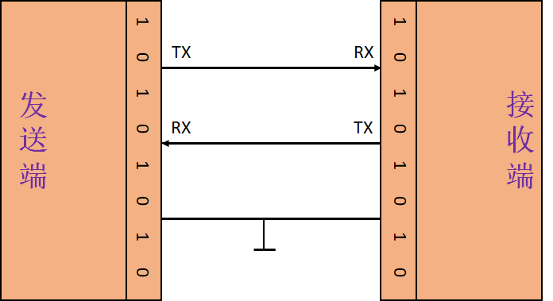
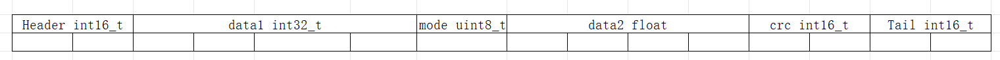
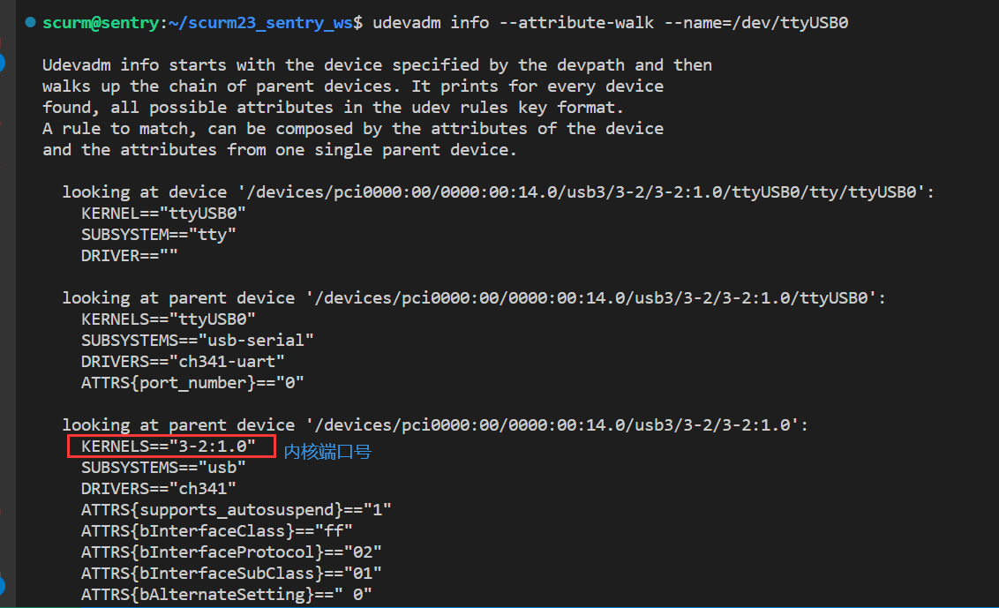

# 部署之串口通信与串口配置

## 1. 串口通信

### 1.1. 硬件接线

- **视觉端**-小电脑 USB(`Universal Serial Com`)
- **电控端**-单片机`micro-USB` or `USART`
  

### 1.2. 大概原理

#### 1.2.1. **双工-同时收发**



- 字节流发送，实际上一位一位的发送(**2 进制 0101010101**)
  - 传输过程是一位一位的二进制进行传输，传输完一个字节才会产生中断或者事件。
    - 所以从**编程角度**上看，是一整个字符进行传输的。(所以后面都需要转换为`uint8_t` <=> `char` 的数组，也就是**字节流**)
    - 从**物理信号层面**看，还是一位一位(`bit 二进制010101`)传输的。
- 参数
  - 端口名称
  - 波特率(baud) - 单位`bps(bit per second)`
    - **default** : `115200`
  - 数据流控`flow ctrl`
    - **default** : `NONE`
  - 校验位 - 奇偶校验
    - **default** : `NONE`,我们使用自己写的`CRC`校验
  - 停止位 - `stop bits`
    - **default** : `1`

#### 1.2.2. **数据存储**

数据变量在内存中用二进制存储。  
例如`int`占`32`位

```cpp
int val = 1;
//二进制   00000000 00000000 00000000 00000001
//十六进制 0x00 0x00 0x00 0x00 0x01
```

`P.S.` float 存储方式按尾数+阶数，与整型不同

---

连续数据类型，**数组和结构体**

```cpp
uint8_t arr[5] = {0x00, 0xFF, 0x00, 0x00, 0x01}; // uint8_t arr[sizeof(data)];
struct data{
    int16_t header = 0xFF;
    int8_t a = 0x00;
    int16_t crc = 0x01;
};
//在内存中两者都一样:
//二进制   00000000 11111111 00000000 00000000 00000001
//十六进制 0x00     0xFF     0x00     0x00     0x01
```

所以使用`memcpy` or `std::copy`可以直接复制内存数据来改变其数据类型，数据也不会发生变化

#### 1.2.3. 校验位

功能 : 校验数据是否正确，串口传输会出现位反转情况  
这里了解下`CRC16`校验的基本原理.

### 1.3. 通信包构成

  
其中下面的每个方格表示一位字符`char`(uint8_t),

- `Header` : 切割数据流，从数据流找到包的开头
- `data` : 数据位，一个方格表示一个`uint8_t arr[]`的一位
- `crc` : 校验位，校验包数据是否在传输过程中出错
- `Tail` : 切割数据流，从数据流找到包的结尾 **(也可忽略,仅使用 Header)**

### 1.4. 讲下代码

#### 1.4.1. 视觉

阿巴阿巴阿巴阿巴,看录像 or 后续安排正式队员整理

- `sendPacket()` 发送函数
- `receivePacket()` 接收函数

#### 1.4.2. 电控

阿巴阿巴阿巴阿巴,看录像 or 后续安排正式队员整理

#### 1.4.3. 如何修改

电控和视觉同步修改`SendPacket`和`ReceivePacket`的数据位  
阿巴阿巴阿巴阿巴,看录像 or 后续安排正式队员整理

## 2. **串口绑定**

### 2.1. **查看设备名称**

命令行

```bash
ll /dev
# 出现以下类似的就是成功识别
crw-rw---- 1 root dialout 188, 0 Aug  3 21:46 /dev/ttyUSB0
```

### 2.2. **给予串口权限**

启动串口前，如果没有设置`rule`的话，需要先给予权限

```bash
sudo chmod 777 /dev/ttyUSB0 #按照自己的设备名字对ttyUSB0进行更改
```

### 2.3. **串口名称绑定**

每回启动，系统会为串口硬件起名称，但这个会和插入顺序和系统设定有关，因此每次会跳变，从而得改代码，因此直接绑定一个别名，就 OK 了。但是某个硬件插口就固定下来了，后续插入要注意插口。一般只插入一个的话，串口会命名为`ttyUSB0`,这里以`IMU`串口绑定为例。

通过以下命令查看`ttyUSB0`的`KERNELS`硬件端口号

```
udevadm info --attribute-walk --name=/dev/ttyUSB0
```



创建`rule.d`文件

```
sudo vim /etc/udev/rules.d/77-ttyUSBLink.rules
```

编写文件,首先输入`I`进入`insert`模式,然后输入以下：

```
ACTION=="add",KERNELS=="3-2:1.0",SUBSYSTEMS=="usb", MODE:="0777", SYMLINK+="ttyIMU"
```

输入完毕后，按下`ESC`退出 insert 模式，然后输入`:wq`退出 vim 编辑器  
输入以下生效

```
sudo udevadm trigger
```

## Author 

闫创业