# 调参手册

## 编写目的

1. 读者按照说明书一步步操作就能独立调试好一辆车的视觉自瞄
2. 详细说明自瞄调试过程中可能遇到的所有问题以及解决方法

## 一、大概了解自瞄包的内容与架构

以 coding 上的[infantry_ws_strategy_newurdf](https://huoguozhandui.coding.net/p/24vision_nav/d/infantry_ws_strategy_newurdf/git)自瞄包为例

### 1. 文件树

- infantry_ws_strategy_newurdf/
  - src/
  - infantry_ws_strategy_newurdf/ ------------- 机器人仿真模型包
    - config/ -------------------- 生成的机器人关节 joint 的参数文件
    - launch/ -------------------- 单独启动机器人仿真模型包的脚本
    - meshes/
    - urdf/ -------------------- 存放机器人的仿真模型`URDF`文件
  - mindvision_camera/ ------------------ MindVision 相机包
    - config/ ------------------ 单独启动相机包时的参数文件
    - docs/
    - launch/ ------------------ 单独启动相机的脚本文件
    - mvsdk/ ------------------ MindVision 相机驱动
    - src/ ------------------ MindVision ROS 相机包源码
  - record_node/ ------------------ 相机内部录制节点可以暂时不用管
  - rm_auto_aim/ ------------------ `自瞄核心包`
    - armor_detector/ --------------------- `自瞄检测器`，从相机/image_raw 话题接收原始图像，进行图像处理分析，发布相机光心坐标系下装甲板的位姿/detector/armors
    - armor_tracker/ --------------------- `自瞄预测器`，从/detector/armors 接收检测到的装甲板位姿，进行坐标转换和卡尔曼滤波分析，发布待机打目标信息/tracker/target
    - auto_aim_bring_up/ --------------------- 自瞄核心包启动器
    - auto_aim_interfaces/ ------------------- 自瞄消息接口，可以在此包中`自定义消息结构体`
  - rm_serial_driver/ ------------------- `串口通信驱动`
    - config/
    - include/
    - launch/
    - src/
  - rm_vision/ --------------------- 自瞄系统启动包
    - rm_vision_bringup/ ------------------- 自瞄系统启动包
      - launch/ ------------------ 自瞄`全系统`启动脚本
      - config/ ------------------ 自瞄系统`全部参数`配置

### 2. 核心配置文件 node_params.yaml 参数概要说明

```yaml
/camera_node:
  ros__parameters:
    camera_info_url: package://rm_vision_bringup/config/camera_info.yaml
    fps_debug: true
    exposure_time: 600 # 曝光时间，单位为微秒
    gain: 32
    use_sensor_data_qos: true
    rgb_gain:
      b: 120
      g: 110
      r: 135

/serial_driver:
  ros__parameters:
    timestamp_offset: 0.0038 # 用于调节相机和串口通信的误差，有待进一步调试不推荐赋值
    device_name: /dev/ttySerialCom # 用于串口绑定
    baud_rate: 115200
    flow_control: none
    parity: none
    stop_bits: "1"

/armor_detector:
  ros__parameters:
    debug: true

    binary_thres: 50 # 二值化阈值，用于调节灯调识别，调节时要注意观察二值化图像

    light.min_ratio: 0.1
    armor.min_light_ratio: 0.8

    classifier_threshold: 0.01
    ignore_classes: ["negative"]

/armor_tracker:
  ros__parameters:
    # target_frame: gimbal_odom
    target_frame: gimbal_odom
    max_armor_distance: 10.0
    lock_thres: 3.0

    hit_order:
      "1": 0
      "2": 1
      "3": 3
      "4": 2
      "5": 4
      outpost: 5
      guard: 6
      base: 7
      negative: 8

    yaw_angle_thres: 25.0 # 目标装甲板自身相对于目标车正向的偏角阈值
    fire_permit_thres: 1.5 # 目标装甲板相对于自身的偏角阈值
    fire_latency: 0.035 # 发弹延迟（从向电控发送消息开始到弹丸离开摩擦轮的时间）
    min_speed: 20.0

    ekf:
      sigma2_q_xyz: 0.0040 # xyz位置和速度的预测方差
      sigma2_q_yaw: 0.001 # yaw角度以及转速的预测方差
      sigma2_q_r: 80.0 # 半径的预测方差

      r_xyz_factor: 0.0004 # xyz位置和速度的测量方差
      r_yaw: 0.0001 # yaw角度以及转速的测量方差

    tracker:
      max_match_distance: 0.8 # 用于控制SORT算法中预测和测量装甲板之间的误差
      max_match_yaw_diff: 0.8 # 用于控制SORT算法中预测和测量装甲板之间的误差，同时控制跳变处理

      tracking_thres: 3
      switch_thres: 5
      lost_time_thres: 3.0 # 跟丢阈值，单位为秒，处理前哨站时可调节

    trajectory:
      max_iter: 10
      stop_error: 0.001
      R_K_iter: 50
      init_bullet_speed: 26.5
      is_hero: false # 控制不同弹丸的阻力常量
      static_offset: # 静态补偿，一般建议设置为0
        yaw: -1.0
        pitch: -3.0

/virtual_camera:
  ros__parameters:
    camera_info_url: package://rm_vision_bringup/config/virtual_camera_info.yaml
    fps_debug: true
    exposure_time: 2000
    gain: 32
    use_sensor_data_qos: true
    rgb_gain:
      b: 120
      g: 110
      r: 135
    video_path: /media/dl/dlssd/Ubuntu/Hotpot/autoAim/24_auto_aimOutpost_newArch_ws/src/virtual_camera/hotpotOutpost8.mp4
```

### 3. 核心启动脚本 all_up.launch.py 概要说明

```python

'''
ROS2 启动脚本需重写该函数
'''
def generate_launch_description():
   '''
   获取参数文件路径
   '''
    param_path = os.path.join(get_package_share_directory(
        "rm_vision_bringup"), "config/node_params.yaml")

   '''
   解析yaml参数文件
   '''
    with open(param_path, 'r') as f:
        mvcam_params = yaml.safe_load(f)['/camera_node']['ros__parameters']
        print(mvcam_params)
    with open(param_path, 'r') as f:
        serial_params = yaml.safe_load(f)['/serial_driver']['ros__parameters']
    with open(param_path, 'r') as f:
        detector_params = yaml.safe_load(f)['/armor_detector']['ros__parameters']
    with open(param_path, 'r') as f:
        tracker_params = yaml.safe_load(f)['/armor_tracker']['ros__parameters']

    '''
    获取机器人仿真模型文件路径以及 rviz2 3D调试引擎自启动配置文件
    '''
    package_name = 'infantry_description'
    urdf_name = "infantry_description.urdf"
    pkg_share = FindPackageShare(package=package_name).find(package_name)
    urdf_model_path = os.path.join(pkg_share, f'urdf/{urdf_name}')
    rviz_config_path = os.path.join(pkg_share, f'launch/{"view_model.rviz"}')

    '''
    配置机器人状态发布节点
    '''
    robot_state_publisher_node = Node(
        package='robot_state_publisher',
        executable='robot_state_publisher',
        arguments=[urdf_model_path]
        )
    '''
    配置机器人关节状态发布节点
    '''
    joint_state_publisher_node = Node(
        package='joint_state_publisher_gui',
        executable='joint_state_publisher_gui',
        name='joint_state_publisher_gui',
        arguments=[urdf_model_path]
        )
   '''
   配置rviz2自启动节点
   '''
    rviz2_node = Node(
        package='rviz2',
        executable='rviz2',
        name='rviz2',
        output='screen',
        arguments=['-d', rviz_config_path],
        )
   '''
   创建容器
   ROS2 容器(container)概述：
   容器中的每个节点对象被称为组件(component)，容器在一个独立的进程中管理所有的组件，
   组件间的通信将采用更高效的进程内通信机制，效率更高，将所有的节点包装成组件，并放到同一个容器中，能有效提高运行效率

   参数说明：
   arguments=['--ros-args', '--log-level', 'WARN'] 可以调整ROS的日志打印级别
   '''
    rm_container = Node(
        name='rm_container',
        package='rclcpp_components',
        executable='component_container_mt',
        output='screen',
        arguments=['--ros-args', '--log-level', 'WARN']
    )

   '''
   定义容器内的组件；
   说明：
   extra_arguments=[{'use_intra_process_comms': True}] 将启用进程内通信，提高通信效率
   '''
    load_compose = LoadComposableNodes(
        target_container='rm_container',
        composable_node_descriptions=[
            ComposableNode(
                package='mindvision_camera',
                plugin='mindvision_camera::MVCameraNode',
                name='mindvision_camera',
                parameters=[mvcam_params],
                extra_arguments=[{'use_intra_process_comms': True}],
            ),
            ComposableNode(
                package='rm_serial_driver',
                plugin='rm_serial_driver::RMSerialDriver',
                name='rm_serial_driver',
                parameters=[serial_params],
            ),
            ComposableNode(
                package='armor_detector',
                plugin='rm_auto_aim::ArmorDetectorNode',
                name='armor_detector',
                parameters=[detector_params],
                extra_arguments=[{'use_intra_process_comms': True}],
            ),
            ComposableNode(
                package='armor_tracker',
                plugin='rm_auto_aim::ArmorTrackerNode',
                name='armor_tracker',
                parameters=[tracker_params],
            )
        ]
    )

    '''
    添加节点

    **********特别说明**********
    **************************
    joint_state_publisher_node 是模拟电控向机器人仿真模型发送关节旋转消息，
    若已接通串口通信，则禁止开启该节点（会和电控消息冲突）；若没有接通串口通信，则
    必须打开该节点发布transform消息
    '''
    ld = LaunchDescription()
    ld.add_action(robot_state_publisher_node)
    ld.add_action(load_compose)
    ld.add_action(rm_container)

    #########################################
    ld.add_action(joint_state_publisher_node)
    #########################################

    ld.add_action(rviz2_node)
    return ld

```

## 二、调试前的准备

本调试说明默认按照主机远程调试的方案进行说明，本说明将笔记本电脑称为 `主机`，机器人上的小电脑称为 `小电脑`

### 1. 软件下载与安装

1. ROS2-humble 的下载与安装：（待更新）
2. OpenCV 的下载与安装：（待更新）
3. foxglove 的下载与安装：
   1. 在主机上下载安装 [foxglove studio](https://foxglove.dev/download)
   2. 在小电脑上下载安装[ ros-$ROS_DISTRO-foxglove-bridge](https://docs.foxglove.dev/docs/connecting-to-data/ros-foxglove-bridge)
4. 安装 HIKVision 相机包（待更新）
5. 在小电脑上安装 MindVision 相机包

   1. 官网下载 Linux-SDK，[下载链接](https://www.mindvision.com.cn/category/software/sdk-installation-package/)，简单注册（不用填完所有注册信息）登陆后即可下载
   2. 解压进入文件夹，打开 readme.pdf 读完
   3. 以 root 身份运行 install.sh

   ```shell
   sudo su
   ./install.sh
   # 然后重启电脑
   ```

   4. 配置相机权限

   首先查看连接相机 USB 后电脑是否识别到相机

   ```shell
   lsusb
   # 出现这个则表示识别到USB相机
   # f622：idVendor d132:idProduct
   Bus 004 Device 005: ID f622:d132 MindVision SUA133GC
   ```

   把下载好的 SDK 中的 88-mvusb.rules 和 99-mvusb.rules 复制到 /etc/udev/rules.d 文件夹中，然后 `sudo gedit 88-mvusb.rules`，将以下内容复制粘贴到文件末尾

   ```shell
   KERNEL=="*", ATTRS{idVendor}=="f622", ATTRS{idProduct =="d132", MODE:="0777", SYMLINK+="mindvision"
   ```

   运行 demo/python_demo/ 路径下的 grub.py

   ```shell
   python3 grab.py
   ```

   抓取到图片的话说明相机可以用，自己工程中将 linuxsdk 中的 include 文件夹和 lib 文件夹中对应自己的平台对应的文件夹加入自己的工程，相当于 src

6. 安装相机标定软件包
   ```shell
   sudo apt install ros-$(printenv ROS_DISTRO)-camera-calibration-parsers
   sudo apt install ros-$(printenv ROS_DISTRO)-launch-testing-ament-cmake
   sudo apt install ros-$(printenv ROS_DISTRO)-camera-info-manager
   ```

### 2. 环境配置

#### 1 网络环境配置（利用 ROS 网络通信协议进行远程调试）

1.  在主机上（Ubuntu 20.04 及以上）点开设置中的 `网络` 一项：
    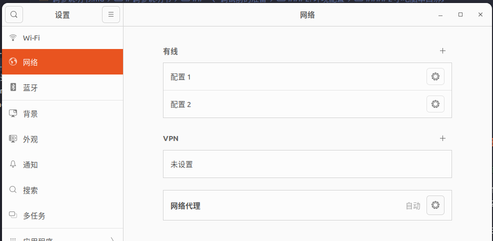

2.  点击 `有线` 一栏每项配置右侧的齿轮按钮，继续点击移除连接配置，以删除 `所有` 的有线配置

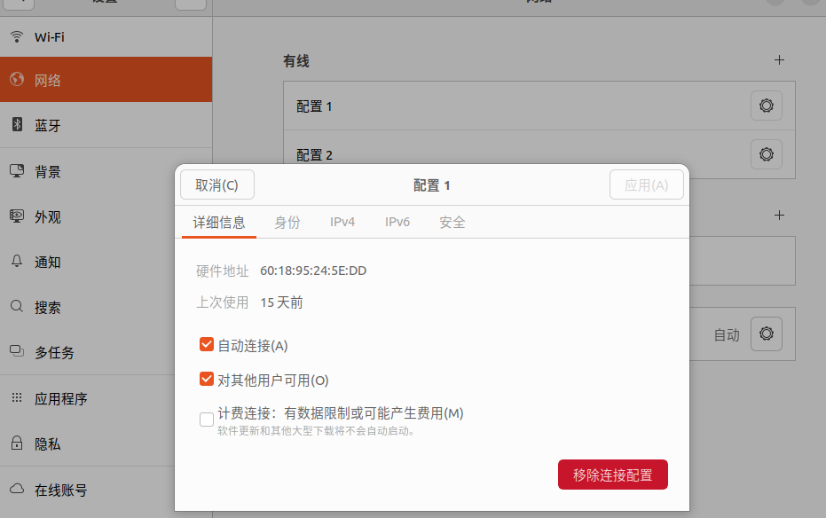

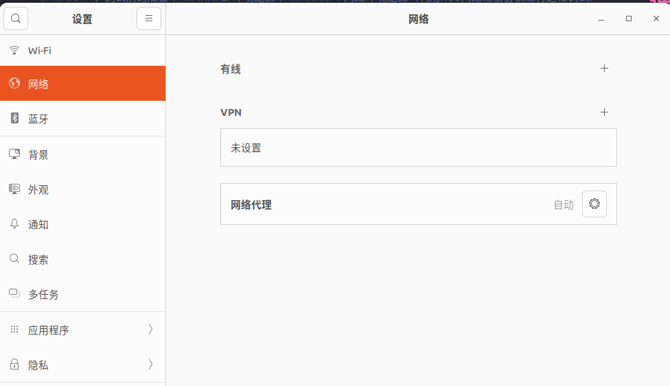

3.  点击右上角的 `+` 按钮，新建一个有线配置，配置如下：
    1. 选中 ipv4 地址
    2. 输入地址为 192.168.a.b（a、b 为任意值，但要注意，小电脑和主机的 a 一定相同，b 不能相同）
    3. 输入子网掩码为 255.255.255.0
    4. 其余配置为默认，点击右上角添加按钮，此时， `有线` 一栏应该只有一项配置信息
       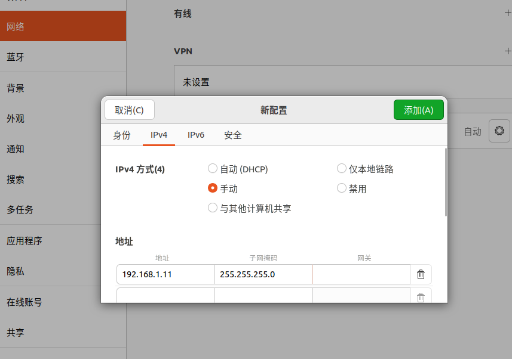
       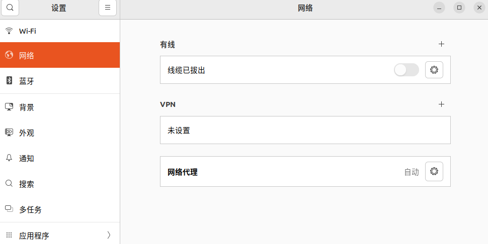
4.  小电脑和主机均须要配置网络，尤其注意 ipv4 地址的配置（a 相同，b 不同），配置完成后，可通过 [ifconfig](https://blog.csdn.net/oNelson123/article/details/109720137)命令检查网络配置信息，然后使用以下命令检查网络是否连通：

```shell
ping 192.165.a.b
```

#### 2 vscode ssh 远程连接配置

1. 在主机上的 vscode 下载拓展 Remote - SSH
2. 按下 ctrl+shift+p，在弹出的输入框中输入 ssh，点击`连接到主机`
3. 继续点击添加新的 SSH 主机，在弹出的输入框中输入`ssh 用户名@192.168.a.b` 用户名为/home 文件夹下的文件夹名称，地址为上一步配置好的网络地址
4. 选择默认更新的 ssh 文件，添加成功
5. 重新点击 `连接到主机` ，选择刚刚添加的小电脑的地址就可以啦

#### 3 小电脑串口绑定配置

串口绑定是否正确会影响到和电控端的通信，如果在调试过程中发现未接收到位姿等信息，应第一时间检查小电脑串口绑定配置是否正确。串口绑定步骤如下：

1.  查看设备名称

```shell
ll /dev
# 出现以下类似的就是成功识别到usb设备
crw-rw---- 1 root dialout 188, 0 Aug
3 21:46 /dev/ttyUSB0
```

1.  给予串口权限

```shell
sudo chmod 777 /dev/ttyUSB0 #按照自己的设备名字对ttyUSB0进行更改
```

1.  串口名称绑定

每回启动，系统会为串口硬件起名称，但这个会和插入顺序和系统设定有关，因此每次会跳变，从而得
改代码，因此直接绑定一个别名，就 OK 了。但是某个硬件插口就固定下来了，后续插入要注意插口。一
般只插入一个的话，串口会命名为 `ttyUSB0` ,这里以 `IMU` 串口绑定为例。

<br/>

通过以下命令查看 `ttyUSB0` 的 `KERNELS` 硬件端口号

```shell
udevadm info --attribute-walk --name=/dev/ttyUSB0
```

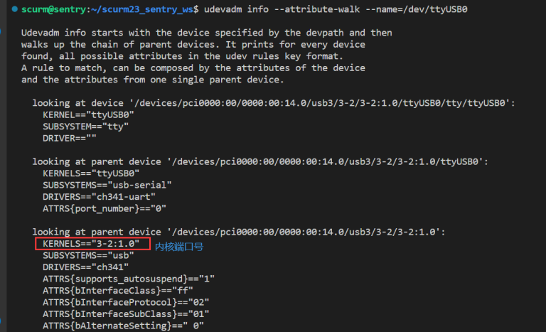

创建 rule.d 文件

```shell
sudo vim /etc/udev/rules.d/77-ttyUSBLink.rules
```

编写文件,首先输入 I 进入 insert 模式,然后输入以下：

```shell
ACTION=="add",KERNELS=="3-2:1.0",SUBSYSTEMS=="usb", MODE:="0777",
SYMLINK+="ttyIMU"
```

输入完毕后，按下 ESC 退出 insert 模式，然后输入 :wq 退出 vim 编辑器
输入以下生效

```shell
sudo udevadm trigger
```

### 3. 相机焦距光圈调节以及安装

进入自瞄包的工作空间，打开`rm_vision/rm_vision_bringup/launch/all_up.launch.py`文件，将 ld.add_action(rviz2_node)注释掉，检查`detector_node.cpp`中的`detect_color`颜色设置（若接通串口通信，则需要检查电控发送的颜色消息），将调试用的装甲板灯条颜色设置为`相同的颜色`；在工作空间下，输入以下指令启动自瞄：

```shell
. install/setup.bash
ros2 launch rm_vision_bringup all_up.launch.py
```

安装好 foxglove_bridge 后，输入以下指令启动桥接器：

```shell
ros2 launch foxglove_bridge foxglove_bridge_launch.xml
```

在主机上启动 foxglove studio，选择打开连接

选择 Foxglove WebSocket，右侧设置地址为如图所示（192.168.a.b 为前文配置好的小电脑 ip），点击 open
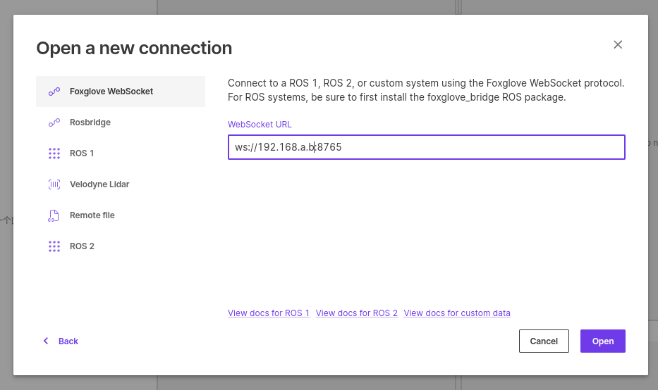
打开之后可以点击左上角的按钮添加面板，此处我们添加一个图像面板
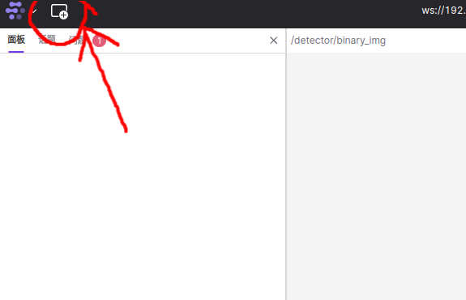
点击面板右上角的齿轮按钮，左侧会弹出一个选项菜单，在这里我们可以选择订阅到的图像话题，此处我们选择/detector/result_img 话题
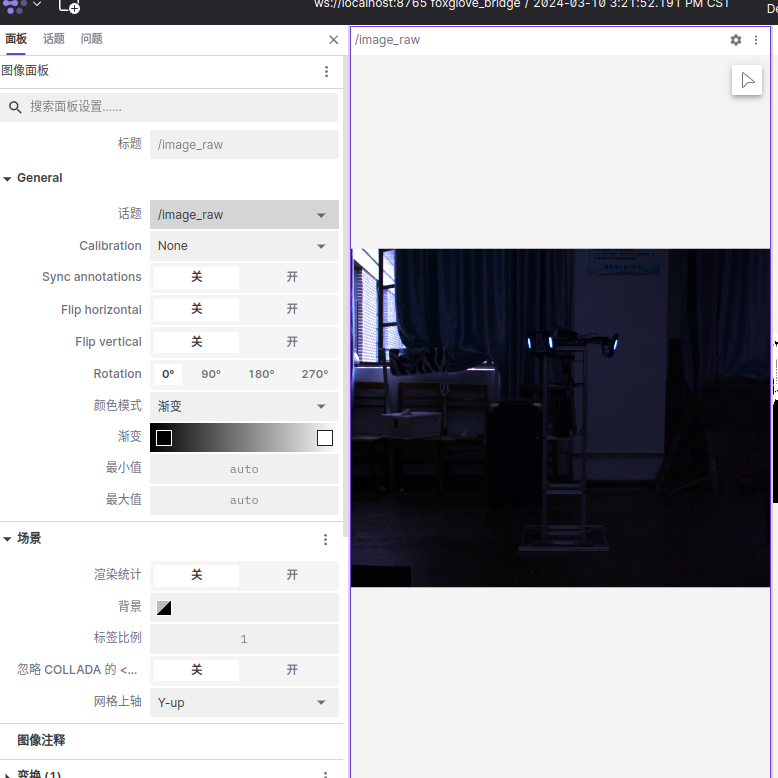
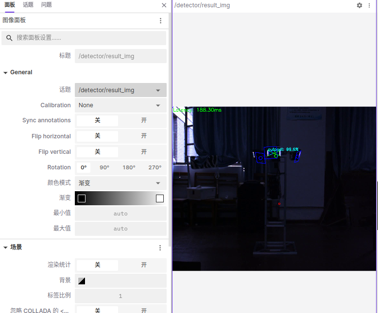
现在，我们看到了检测器发布的检测结果的图像，我们能根据该图像判断检测器是否识别到装甲板（绿色交叉线），此时就可以调节相机的焦距和曝光值，反复调整装甲板的远近，使得检测器能识别 1-5 米范围内的装甲板

<br/>
另外，在将相机安装到车上时要注意：确认相机的正反面，不要将相机装反了

### 4. 相机标定

调整好了焦距和光圈，我们就可以进行相机标定了，注意，相机标定后若再次调整了焦距和光圈，需重新进行相机标定

1. 安装相机标定软件包
   参考前文 `软件下载与安装`
2. 创建 ws 并 clone 与 build 源码
   ```shell
   mkdir calibration_ws
   cd calibration_ws/
   mkdir src
   cd src/
   git clone https://github.com/ros-perception/image_pipeline.git
   cd image_pipeline
   git checkout origin/$(printenv ROS_DISTRO)
   cd ~/calibration_ws/
   colcon build --symlink-install
   ```
3. 打印棋盘格
   棋盘格要求，8x10 列，其中每个方格尺寸为 15mm,如下图所示:
   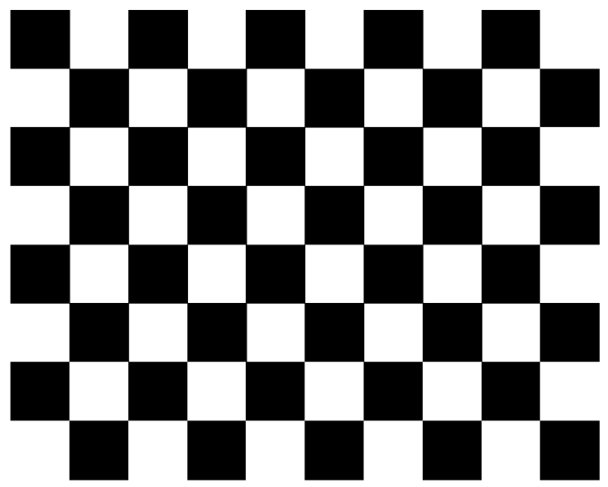
4. 启动 MindVision 相机包（相机包在自瞄包的 src 目录下，可以 `cd` 到自瞄包工作空间后直接输入下面的指令）发布图像
   ```shell
   ros2 launch mindvision_camera mv_launch.py
   ```
5. 启动标定节点 exe
   注意--size(棋盘格格子数) --square(单位棋盘格边长，单位米)参数需要和使用的标定棋盘尺寸一致，/image:后的节点名称要和相机包发布原始图像的名称相同，--remap camera:后跟的相机名称要和迈德威视相机包中设置的名称相同
   ```shell
   source install/setup.bash
   ros2 run camera_calibration cameracalibrator --size 7x9 --square 0.015 --ros-args
   --remap /image:=/image_raw --ros-args --remap camera:=/custom_camera
   ```
6. 成功启动之后显示以下
   ```shell
   Waiting for service camera/set_camera_info ...
   OK
   Waiting for service left_camera/set_camera_info ...
   OK
   Waiting for service right_camera/set_camera_info ...
   OK
   ```
7. 标定相机
   - 左右移动
   - 上下移动
   - 前后移动
   - 倾斜，分别向上、下、左和右
   - 四个进度条都变成绿色， `CALIBRATE` 按钮变成绿色即可进行点击标定，标定结束后， `SAVE`，参数文件保存在 `/tmp/calibrationdata.tar.gz`
8. 验证标定结果

运行相机包和检测器`armor_detector`，`source install/setup.bash` `ros2 topic echo /detector/armors`，如果相机光心距离装甲板的位置，即 z 大小和实际测量一致，则标定成功，见下图
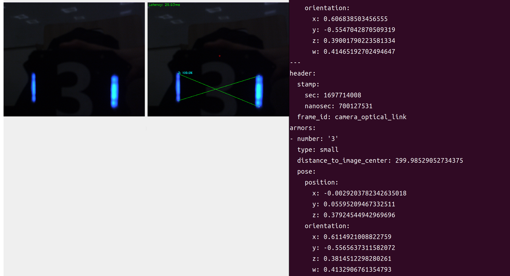

## 三、开始调试

首先，明确全部调试流程：
<br/>
调试 pnp 解算 =====> 调试灯条和数字检测 =====> 确认各项击打阈值是否正确 =====> 调试卡尔曼滤波 =====> 调试开火延迟 =====> 实战模拟调试
<br/>
接下来，对每一步的调试方法和调试目标进行详细说明

### 1. 调试 pnp 解算

#### <--- 调试方法 --->

已在 `相机标定` 一节进行说明

#### <--- 调试目标 --->

已在 `相机标定` 一节进行说明

### 2. 调试灯条和数字检测

#### <--- 调试方法 --->

灯条和数字检测主要调节的参数是相机曝光时间（exposure_time）和二值化阈值（binary_thres），调试步骤如下：

1. 按照前文步骤`相机焦距光圈调节以及安装`启动 foxglove 和自瞄包，注意自瞄包要打开调试模式（node_params.yaml 配置文件中 detector 的 debug 设置为 true）
2. 在 foxglove studio 中打开三个图像面板，分别订阅 `/detector/result_img` `/detector/number_img` 和 `/detector/binary_img` 三个话题，如图
   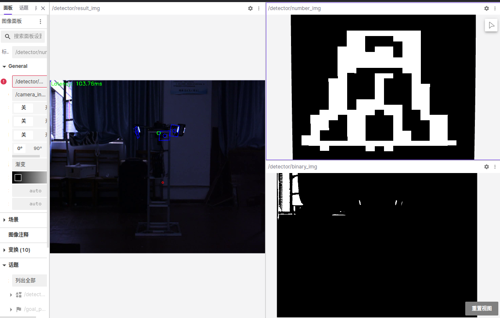
3. 打开主机终端，输入以下指令启动 rqt
   ```shell
   rqt
   ```
4. 在 rqt 界面中点击左上角 `Plugins`->`Configuration`->`Dynamic Reconfigure`打开动态调参工具，如图
   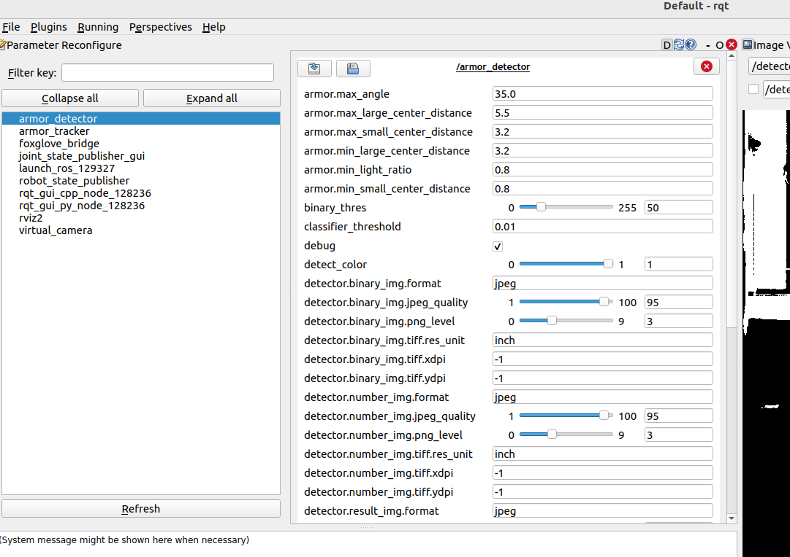
5. 最终主机上的调试界面如下：
   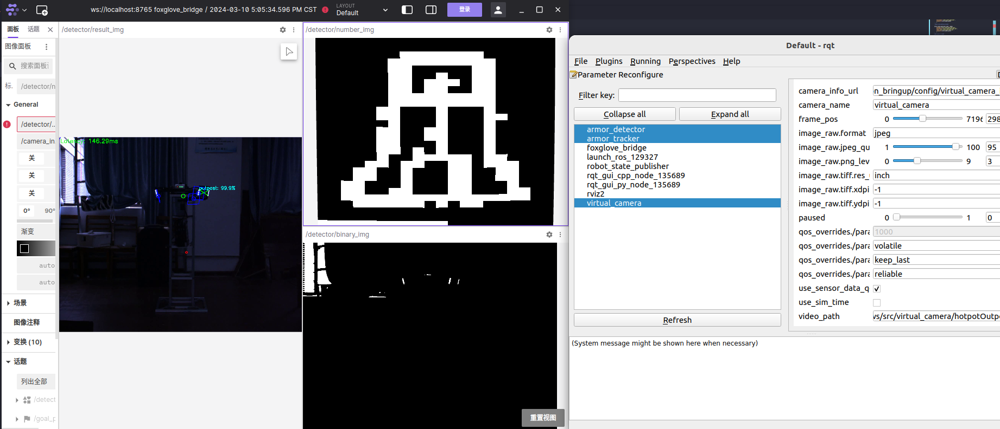
6. 在 rqt 中动态调节相机曝光和二值化阈值，能在 foxglove 中实时看到参数调节的效果；通过反复调节参数，寻找到最合适的值

#### <--- 调试目标 --->

将装甲板置于不同距离处有：

- 二值图中灯条形态完整，同时灯条附近亮斑干扰较少
- 数字图中数字形态清晰稳定，且抖动较小
- 结果图中装甲板识别稳定，装甲板静置状态下角点抖动不明显

### 3. 确认各项击打阈值是否正确

#### <--- 调试方法 --->

将日志级别设置为 WARN，之后启动自瞄，观察小陀螺状态的装甲板，检查程序输出的日志是否`正确处理跳变`和`跟踪器初始化`（有无异常初始化），同时，检查/tracker/target 话题中的`fire_permit`是否正常；若异常，则调节对应参数（详见 node_paramsyaml 参数概要说明）


<br/>
补充说明：`fire_permit` 参数由 `yaw_angle_thres` 和 `fire_permit_thres` 共同影响，详见 `tracker_node.cpp`

#### <--- 调试目标 --->

- 正确处理跳变和初始化
- fire_permit 设置合理：即当目标相对于云台偏离太大，或目标装甲板 yaw 倾斜程度太大时，不发弹；当观察小陀螺时，只有预测的装甲板位姿接近正对自己时才发弹；

### 4. 调试卡尔曼滤波

#### <--- 调试方法 --->

卡尔曼滤波调参主要是通过修改 r 和 q 矩阵来平衡预测器的稳定性和响应速度，我们采用的是匀速卡尔曼模型，默认的过程模型都是匀速模型，具体而言：

- 我们用到的卡尔曼滤波理论的核心是 `数据融合` ，即找到 `过程模型`和 `测量模型` 的结果的最优融合，过程模型的结果叫做 `预测值` ，测量模型的结果叫做 `测量值` 。
- r 矩阵：是 `测量方差` ，r 越大，对测量模型的置信度越低，对过程模型的置信度越高；而我们使用的是匀速卡尔曼模型，过程模型是匀速模型，因此 `r越大` 我们越相信物体处于匀速状态，`滤波得到的数据越稳定`，但相应地，`滤波器对数据变化的响应也越慢`
- q 矩阵：是 `预测方差` ，q 越大，对过程模型的置信度越低，对测量模型的置信度越高；和 r 对比可知，此时 `q越大` 我们越相信测量结果，而我们的测量结果往往不稳定（关键在于 pnp 不稳，误差较大），同时车辆的位置和各种速度也存在各种抖动和噪声，因此 q 越大， `滤波得到的数据抖动越大` ，但 `滤波器对数据变化的响应也越快`
- 总结一句话，卡尔曼调参的过程就是通过调整 r 和 q 矩阵来平衡整个预测器的 `稳定性` 和 `响应速度` （数据的抖动程度和数据的实时性）

下面对于实际操作方法进行说明：

1. 按照前文步骤`相机焦距光圈调节以及安装`启动 `foxglove` 和自瞄包，注意自瞄包要打开调试模式（ `node_params.yaml` 配置文件中 `detector` 的 `debug` 设置为 `true` ）
2. 按照前文步骤`调试灯条和数字检测`启动 rqt 动态调参、foxglove 的图像订阅面板和三维仿真面板，订阅/detector/result_img
3. 在主机上打开终端，输入以下命令订阅预测器发布的预测结果
   ```shell
   ros2 topic echo /tracker/target
   ```
4. 调试工作准备就绪，正式开始调试。调试卡尔曼滤波的参数时以 10 的倍数进行增减，比如 0.1、0.01、0.001，利用控制变量法分别调整 r 和 q 矩阵；

#### <--- 调试目标 --->

- 平移测试：
  - 响应速度要求：
    - 在小车进行平移时，重投影的装甲板能及时跟随目标，出现没有明显的滞后；
    - `topic echo` 得到的目标水平速度响应及时；
    - 三维仿真的速度指示箭头响应及时
  - 稳定性要求：
    - 在小车静止时， `topic echo` 得到的目标 `xyz` 数据抖动较小（0.01 范围内浮动）；
    - 小车匀速运动时， `topic echo` 得到的目标水平速度稳定且较准确（和电控端的数据进行对比，或者通过录制视频的方法测量速度）；
    - 三维仿真场景中的速度指示箭头抖动较小
- 小陀螺测试：
  - 响应速度要求
    - 和平移测试相同，主要观察 `vyaw` 转速和 `yaw` 转角的变化
  - 稳定性要求
    - 和平移测试相同，主要观察 `vyaw` 转速和 `yaw` 转角的变化

### 5. 调试开火延迟

#### <--- 调试方法 --->

在上面的调试步骤完成后，即可进行发弹测试，理想情况下，我们在进行发弹测试时不应该引入 `弹道静态补偿`，即 `yaw`和 `pitch` 的 `static_offset` 都应置为 0.
<br/>

`开火延迟` 指的是 `从向电控发送消息开始到弹丸离开摩擦轮的时间` ，这一时间将影响最终击打点的位置；目标速度一定时，开火延迟越高，最终击打位置离预测位置的距离越远。开火延迟的具体调试步骤如下：

1. 击打静止目标，检查弹道误差是否在可接受范围内；击打不同距离的静止目标，检查弹道解算模型是否正确运作；
2. 能精确命中静止目标后，开始击打运动目标，包括 `平移` 和 `小陀螺` ，如果击打落点滞后，则增加延迟，如果落点提前，则减少延迟

#### <--- 调试目标 --->

- 能较为准确地命中静止和运动（ `平移运动` 、`原地小陀螺运动` 和`平移小陀螺运动` ）的目标

### 6. 实战模拟调试

#### <--- 调试方法 --->

#### <--- 调试目标 --->

## 四、完成调试后

完成调试后，即可开始准备部署装车

### 1. 部署自瞄自启动和进程守护

#### 使用方法

<!-- 将 `scurm.service` 文件复制到 `/usr/lib/systemd/system/`

```bash
sudo cp scurm.service /usr/lib/systemd/system
``` -->

#### 配置启动环境

例如：

将所有 ROS package 放置 `/home/scurm/rm_ws/`

将自启动目录所有文件放置 `/home/scurm/rm_ws/launch/`

```bash
cp * /home/scurm/rm_ws/launch
```

在该目录下新建文件夹`logs`

```bash
cd /home/scurm/rm_ws/launch
mkdir logs
```

#### 设置启动节点

在 `/home/scurm/rm_ws/launch/launch_daemon.sh` 中设置工作目录和 ros 启动节点
在 `/home/scurm/rm_ws/launch/launch_each.sh` 中设置工作目录和 ros 启动环境

#### 设置自动启动

在 ubuntu startup application 中添加 `launch_daemon.sh`

#### 停止自启动进程

```bash
./launch_ext.sh
```

### 2. 小电脑装车检查

检查线缆是否正确连接，是否容易松动，相机安放是否正确，是否加装防护镜，小电脑安装是否稳定等

## 五、疑难 BUG

### 关于 QOS：

和 QoS 相关的头文件：[qos_profiles.hpp](https://github.com/ros2/rclcpp/blob/rolling/rclcpp/include/rclcpp/qos.hpp)
以及 [qos.hpp](https://github.com/ros2/rclcpp/blob/rolling/rclcpp/include/rclcpp/qos.hpp)
<br/>
[QoS 详细说明](https://zhuanlan.zhihu.com/p/353268703)
<br/>
[QoS 补充说明](https://zhuanlan.zhihu.com/p/504371394)
QoS 兼容性表格，其中每种服务的每项属性的设定参考前面两个头文件
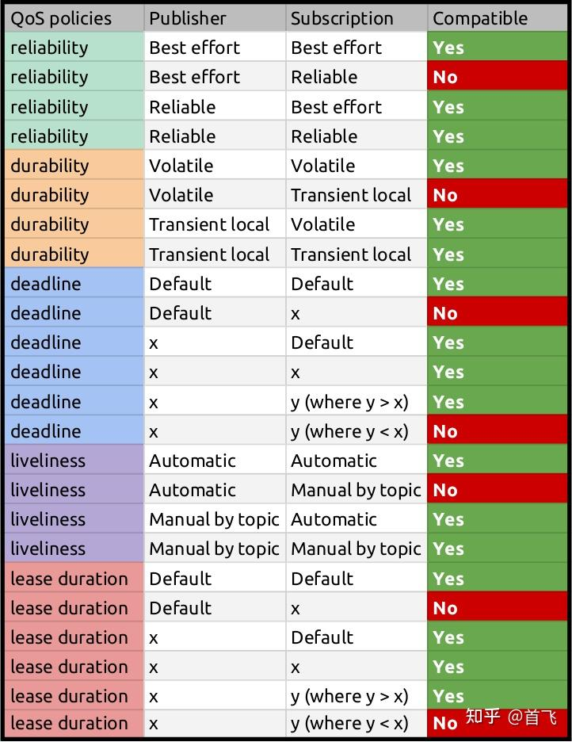

在部署时尽量使用 rmw_qos_profile_sensor_data 进行图像或传感器数据传输；测试时程序和调试工具可能会有 QoS 兼容性问题，导致调试工具无法订阅到数据，此时可以尝试修改程序发布者的 QoS 服务策略；

### 曝光方面：

1. 海康相机和迈德相机在打开可视化图像后发现，**海康发布的图像整体偏暗**，肉眼基本无法观测到装甲板上的图案，但是在远距离的情况下开启 debug 发现该图像依然是可以识别装甲板的，甚至效果优于迈德的相机，所以偏暗应该是一个正常现象，无需一直提升他的曝光值
2. 比赛现场上，受场地灯光的影响，可能导致所处环境偏亮或者偏暗，需根据实际场上调试效果修改曝光值，改善识别效果

### 串口通信方面：

1. 可能因为搬运中的一些问题，导致和小电脑通信的 C 板坏掉，此时有两种可能，第一，该 USB 线并不能进行数据的传输，而只能进行供电使用，第二 C 板的 USB 口出现硬件问题，如接口焊点处脱落等问题，此时的**检查方式**，找一根确实可以进行数据传输的 USB 线进行链接，如果使用命令`ll /dev/tty*`依然没有反映，那么排除第一种情况，一定是第二种情况，让电控的同学帮忙检查一下`

2. 之前自己遇到的问题：C 板插上电脑后可以看到单片机电源亮起，但在电脑上使用 lsusb 命令没有检测到插上了对应的 USB，询问电控组的同学，应该是那个 USB 插口只能用来供电，没办法实现传输数据的作用，更换 C 板

### URDF（这个是调试过程中的问题）

- 在碰到需要更换新的 URDF 时，常常出现的问题是跟踪器会报错提示我们没有某某某关节或者没有收到相关的信息发布，这个时候我们就需要通过 rqt 中的插件 tf-tree 观察目前发布的关节信息有哪些，一般出现问题的**原因**是机械组使用的新一版的 URDF 更改了相关关节的名字，那么我们只需要在跟踪器里找到类似的名称进行更换即可；还有的**原因**是曾经的 URDF 文件中并没有设置枪口坐标系，但是跟踪器在进行弹道解算时需要枪口坐标系，这个时候需要机械组的同学确定是否该 urdf 有错误，没有画出枪口坐标系

## 参考文档

参考文档均来自创业哥和皞泽哥的笔记

## Author 

丁利