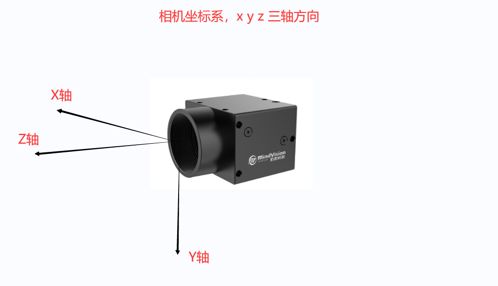
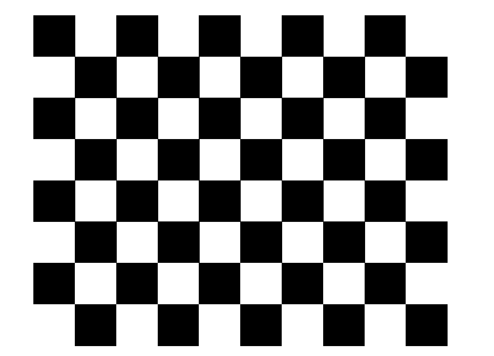

# 原理之检测器

## 总述

```
├─mindvision_camera         //mindvision相机驱动包
├─infantry_description      //步兵urdf，提供camera_optical_frame --> gimbal_odom(world frame)
│  ├─launch     // launch
│  ├─meshes     // stl模型，可在rviz可视化
│  └─urdf       // 由机械在SW上导出，后续教
├─rm_auto_aim               //自瞄pkg
│  ├─armor_detector         //检测器
│  ├─armor_tracker          //跟踪器
│  ├─auto_aim_bringup       //自瞄启动
│  ├─auto_aim_interfaces    //armor_msgs&target_msgs interface
├─rm_serial_driver          //与电控的通信包
└─rm_vision                 //自瞄总launch pkg
    └─rm_vision_bringup
        ├─config
        └─launch
```

## **`mindvision_camera`**

### 先导知识

#### **相机模型**

相机模型的原理和标定自行查阅文档和视频进行学习。推荐[北邮鲁鹏教授计算机视觉教程](https://www.bilibili.com/video/BV1nz4y197Qv?p=13&vd_source=4b919749e4033c3016c6c9503d7f3d52).  
课件笔记在`CamerModel`文件夹中

#### **相机坐标系**



#### **mindvision 配置过程**

<font color = "red"> 去年的电脑配过了，可以先用着，新装系统的话需要装驱动 </font>

**1 官网下载 linux-SDK**，[下载链接](https://www.mindvision.com.cn/wp-content/uploads/2023/08/linuxSDK_V2.1.0.37.tar.gz)  
**2** 解压进入文件夹，打开 readme.pdf 读完，照着做
**3** 运行 install.sh

```bash
sudo su
./install.sh
# 然后重启
```

**4** 配置相机权限  
首先查看是否识别到相机

```bash
lsusb

# 出现这个则表示识别到USB相机
# f622：idVendor d132:idProduct
Bus 004 Device 005: ID f622:d132 MindVision SUA133GC
```

把 88-mvusb.rules 和 99-mvusb.rules 复制到 `/etc/udev/rules.d`文件夹中，然后`sudo gedit 88-mvusb.rules`.

```
KERNEL=="*", ATTRS{idVendor}=="f622", ATTRS{idProduct}=="d132", MODE:="0777", SYMLINK+="mindvision"
```

运行`demo/python_demo/`路径下的 grub.py

```
python3 grab.py
```

抓取到图片的话说明相机可以用

自己工程中将 linuxsdk 中的 include 文件夹和 lib 文件夹中对应自己的平台对应的文件夹加入自己的工程，相当于 src

#### **相机标定**

相机标定的原理和目的自行搜索。  
ROS2 相机标定包,[参考标定教程链接](https://www.ncnynl.com/archives/202110/4707.html)  
步骤:  
**1 安装所需软件包**

```bash
sudo apt install ros-$(printenv ROS_DISTRO)-camera-calibration-parsers
sudo apt install ros-$(printenv ROS_DISTRO)-launch-testing-ament-cmake
sudo apt install ros-$(printenv ROS_DISTRO)-camera-info-manager
```

**2 创建 ws 并 clone 与 build 源码**

```bash
mkdir calibration_ws
cd calibration_ws/
mkdir src
cd src/
git clone https://github.com/ros-perception/image_pipeline.git

cd image_pipeline
git checkout origin/$(printenv ROS_DISTRO)
cd ~/calibration_ws/
colcon build --symlink-install

```

**3 打印棋盘格**  
棋盘格要求，8x10 列，其中每个方格尺寸为 15mm,如下图所示:
  
该标定棋盘格 pdf 在`./CameraModel/标定8x10-15mm.pdf`路径下，可直接打印。

**4 启动相机发布图像**
使用我们的相机图像 ros pkg-`mindvision_camera`

```bash
ros2 launch mindvision_camera mv_launch.py
```

**5 启动标定节点 exe**

```
source install/setup.bash
ros2 run camera_calibration cameracalibrator --size 7x9 --square 0.015 --ros-args --remap /image:=/image_raw --ros-args --remap camera:=/custom_camera
```

**6 成功启动之后显示以下**

```bash
Waiting for service camera/set_camera_info ...
OK
Waiting for service left_camera/set_camera_info ...
OK
Waiting for service right_camera/set_camera_info ...
OK
```

**7 标定相机**

- 左右移动
- 上下移动
- 前后移动
- 倾斜，分别向上、下、左和右
  四个进度条都变成绿色，`CALIBRATE`按钮变成绿色即可进行点击标定，标定结束后，`SAVE`

**8 参数自动保存路径**

```
/tmp/calibrationdata.tar.gz
```

### 代码说明

#### 结构

<font color = "red"> 内部有开发者的一个说明文档，直接 launch 就可以驱动相机 </font>

```
├─mindvision_camera
│  ├─config     //launch的配置文件
|  |  |——camera_info.yaml   //标定后的文件
|  |  |——camera_params.yaml //参数 exposure_time 曝光时间
│  ├─docs
│  ├─launch
│  ├─mvsdk
│  └─src
```

#### 相机的参数及作用

**TODO:新队员补充**

#### rqt 订阅图像和 rviz 订阅图像

**TODO:新队员补充**

## **`infantry_description`**

提供坐标转换，将目标从相机光心坐标系转换到世界坐标系  
启动

```bash
ros2 launch infantry_description view_model.launch.py
```

## **`armor_detector`**

### 说明

内部有详细说明

### 需要进一步学习的

- PNP 原理大概理解
