# 原理之追踪器

**TODO : 待完善**

## 1. 线性代数基础

### 1.1. 向量

一般形式:  

\begin{equation}x = 
 \begin{bmatrix}
   x_1 \\
   x_2 \\
   x_3 \\
   ... \\
   x_n \\
  \end{bmatrix}
  _{n \times 1}
\end{equation}  

向量加法 : 对应位相加  

\begin{equation}
x + y = 
 \begin{bmatrix}
   x_1 \\
   x_2 \\
   x_3 \\
   ... \\
   x_n \\
  \end{bmatrix}
  _{n \times 1} +    
 \begin{bmatrix}
   y_1 \\
   y_2 \\
   y_3 \\
   ... \\
   y_n \\
  \end{bmatrix}
  _{n \times 1} = 
 \begin{bmatrix}
   x_1 + y_1 \\
   x_2 + y_2 \\
   x_3 + y_3 \\
   ... \\
   x_n + y_n \\
  \end{bmatrix}
  _{n \times 1}
\end{equation}

### 1.2. 矩阵

#### 1.2.1. 一般形式

\begin{equation}
A_{n \times n} = 
 \begin{bmatrix}
   a_{11} & a_{12} & ... & a_{1n}\\
   a_{21} & a_{22} & ... & a_{2n}\\
   ... & ... & ... & ...\\
   a_{n1} & a_{n2} & ... & a_{nn}\\
  \end{bmatrix}
\end{equation}

#### 1.2.2. 矩阵运算

- **矩阵相加**  
  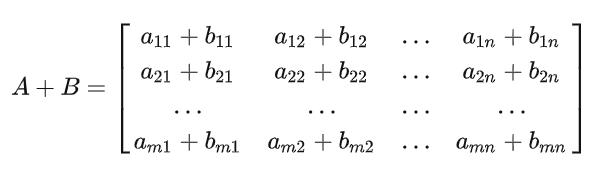
- **矩阵乘法**  
  详细的计算方式:  
  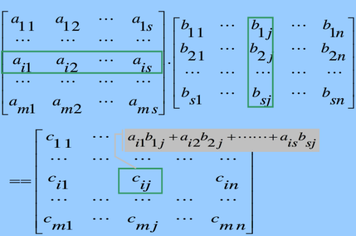  
  简笔画  
    
  例子与非方阵形式  
  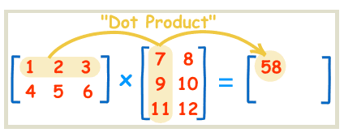  
  总结:
  <font color = "red">(矩阵相乘的前提条件:$C = AB$,其中 A 的列数 = B 的行数)</font>

### 1.3. **转置矩阵**

概念,假设$B = A^T$ $\rightarrow$ $b_{ij} = a_{ji}$  

\begin{equation}A = 
 \begin{bmatrix}
   1 & 2 & 3 \\
    4 & 5 & 6 \\
    7 & 8 & 9 \\
  \end{bmatrix}
  \stackrel{B = A^T}{\rightarrow}
  B = 
 \begin{bmatrix}
   1 & 4 & 7 \\
    2 & 5 & 8 \\
    3 & 6 & 9 \\
  \end{bmatrix}
\end{equation}

1. $(AB^T)^T = BA^T$
2. $(A+B)^T = A^T + B^T$
3. $(kA)^T = kA^T$

### 1.4. 应用

假设现在有一个匀加速直线移动的小车，我们要估计其当前状态，位置、速度和加速度。  

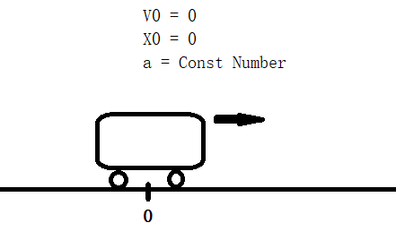  

则有以下方程——**连续时间方程**(高中学习的公式)

$x_t = v_0t + \frac{1}{2}at^2$  
$v_t = v_0t + at$  
$a = a (constNumber)$  

上述方程称为 

实际的话一般工程使用的为 **离散时间方程**  

$x_{t} = x_{t-1} + v_{t-1}\Delta_t + \frac{1}{2}a_{t-1}\Delta_t^2$  
$v_{t} = v_{t-1} + a\Delta_t$  
$a_t  = a_{t-1}$  

连续时间模型 ---> 离散时间模型，推导步骤(**仅提供$x_t$的离散化推导**)  

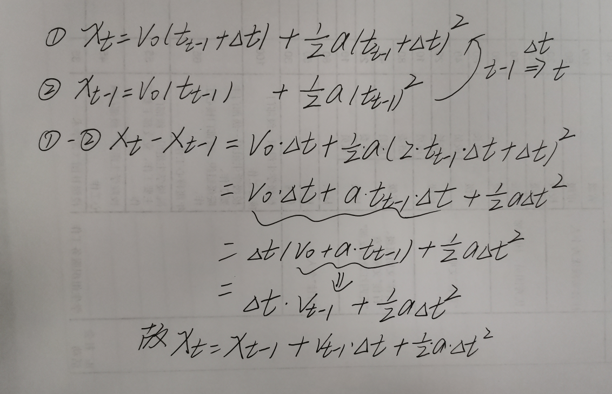

可以看到这个离散方程是一个递推的过程，从初始化的零时刻逐渐递推$0\Delta_t\rightarrow1\Delta_t\rightarrow2\Delta_t\rightarrow3\Delta_t\rightarrow4\Delta_t ... \rightarrow n\Delta{t} 也就是期望的t$。也可看出其实离散化的$\Delta_t$越小最终时刻的$n\Delta_t$就可以越逼近我们所需要的 t。所以这里和后面说到的帧率就有关系了。

系统变量:$x_t$、$v_t$、$a_t$,涉及三个方程，不简洁因此转换为向量，写为\begin{equation}
\vec{x_t} = 
 \begin{bmatrix}
   x_t \\
   v_{t} \\
   a_{t} \\
  \end{bmatrix}
  _{n \times 1}\end{equation}
  
  那么
  
\begin{equation}
{x_{t-1}} = 
 \begin{bmatrix}
   x_{t-1} \\
   v_{t-1} \\
   a_{t-1} \\
  \end{bmatrix}
  _{n \times 1}
\end{equation}

则上面的离散形式方程可写为以下形式：

\begin{equation}
\vec{x_t} = 
 \begin{bmatrix}
   x_t \\
   v_{t} \\
   a_{t} \\
  \end{bmatrix}
   = 
 \begin{bmatrix}
   1 & \Delta_t & \frac{1}{2}\Delta_t^2 \\
   0 & 1 & \Delta_t \\
   0 & 0 & 1 \\
  \end{bmatrix}
  \times 
 \begin{bmatrix}
   x_{t-1} \\
   v_{t-1} \\
   a_{t-1} \\
  \end{bmatrix}
\end{equation}

至于没理解为什么可以这么写呢，可以看下式

\begin{equation}
\begin{aligned}
x\_{t} &= 1*x*{t-1} + \Delta_t\*v*{t-1} + \frac{1}{2}\Delta*t^2\*a*{t-1} \\
v_{t} &= 0*x_{t-1} + 1*v_{t-1} + \Delta_t*a_{t-1} \\ 
a_{t} &= 0*x_{t-1} + 0*v_{t-1} + 1*a_{t-1}
\end{aligned}
\end{equation}

设矩阵

\begin{equation}
 A = 
 \begin{bmatrix}
   1 & \Delta_t & \frac{1}{2}\Delta_t^2 \\
   0 & 1 & \Delta_t \\
   0 & 0 & 1 \\
  \end{bmatrix}
\end{equation}
   
$\vec{x_t} = A * \vec{x_{t-1}}$,可见$A$的作用是将$\vec{x_{t-1}}$转移至$\vec{x_t}$,因此我们称其为状态转移矩阵，有时也会用$F$来表示。

但是上述很理想化，但实际车在进行匀加速运动时会遇到意外情况即为噪声(打滑、踩石块等等)，任凭他自己跑的话肯定精度越来越差，所以需要外界来观测并给予内部开车人反馈。这样的思想差不多就是卡尔曼滤波的了，而上述的向量-矩阵形式的方程就是我们即将说的状态空间向量法。

## 2. 高数基础

### 2.1. 多元函数

**一元函数** $y =f(x) = e^x$  
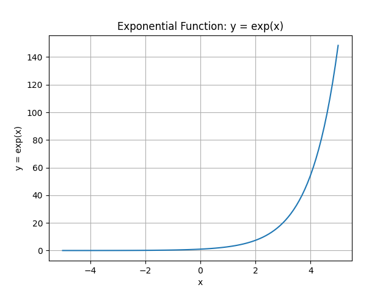  
**二元函数** $z =f(x,y) = x^2 + y^2$  
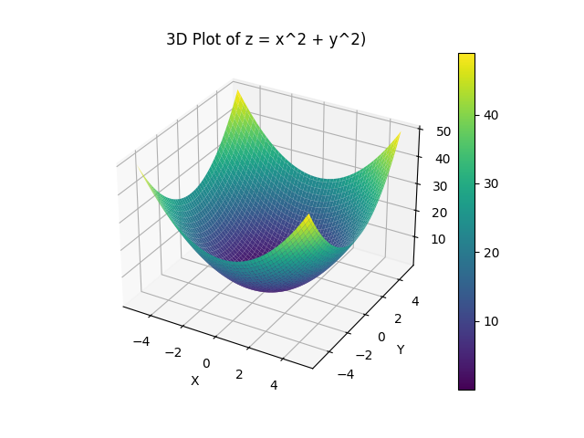  
偏导数  
$\frac{\partial z}{\partial x} = 2x$  
$\frac{\partial z}{\partial y} = 2y$

**多元函数**  
$y_1,y_2,y_3,...,y_m =f(x_1,x_2,x_3,...,x_n) \rightarrow \vec{y} = f(\vec{x})$  
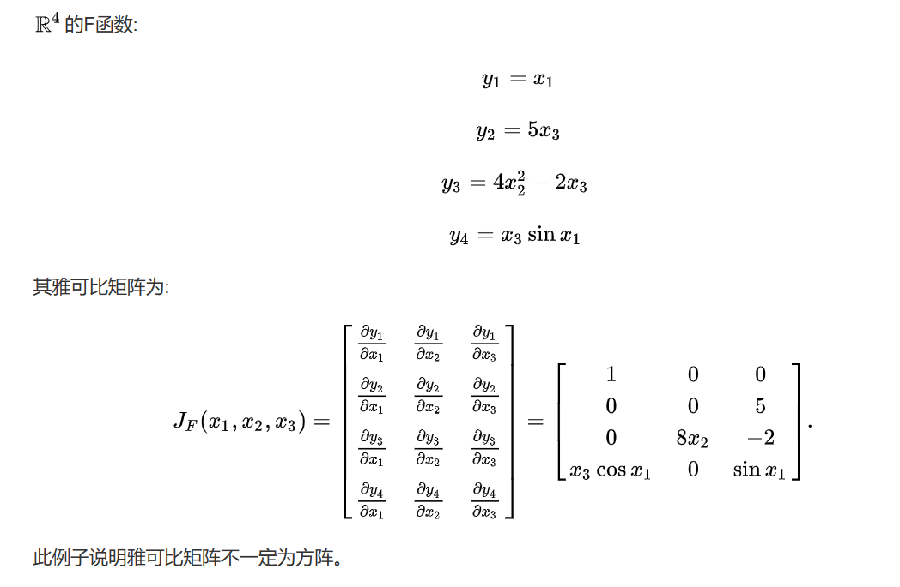

雅可比矩阵其实就是由多元函数的一阶导组成的一个矩阵

### 2.2. 泰勒公式

#### 2.2.1. 一元函数的泰勒公式

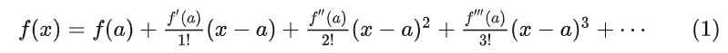  
看个例子,近似的思想  
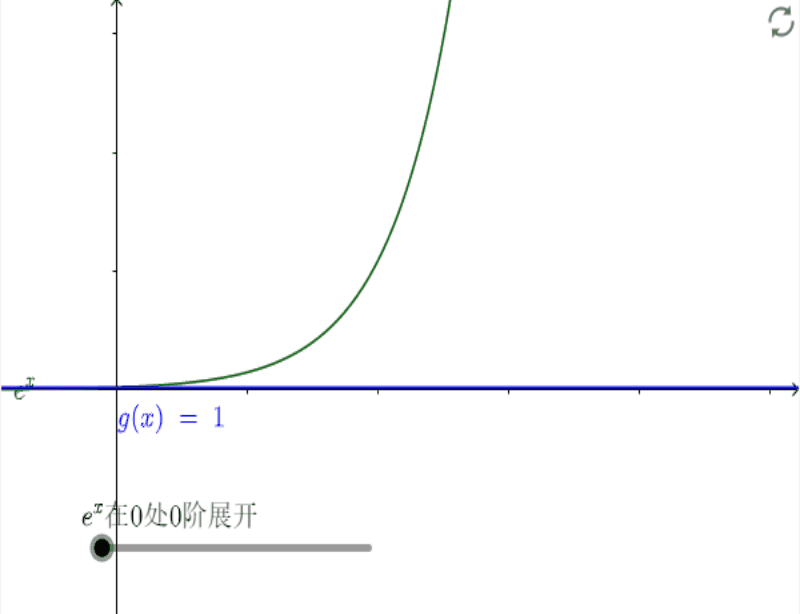

#### 2.2.2. 多元函数的泰勒公式

全部展开过于复杂,只看在$\vec{x} = \vec{a}$时一阶展开式  
$\vec{y(\vec{x})} = \vec{f}(\vec{a}) + \frac{\partial{\vec{y}}}{\partial{\vec{x}}}|_{\vec{x} = \vec{a}}(\vec{x}-\vec{a}) + O(\vec{x})$

- $\frac{\partial{\vec{y}}}{\partial{\vec{x}}}|_{\vec{x} = \vec{a}}$ 就是雅可比矩阵
- $O(\vec{x})$ 是无穷小量

## 3. 概率统计基础

### 3.1. 随机变量

简单看成一个随机事件的抽象化,一般用大写字母 $X,Y,Z$，高中学过的正态分布可记为 $X$~$N(\mu,\sigma^2)$，说明$X$这个随机变量描述的为一个符合正态分布的随机事件

### 3.2. 概率密度函数

举个栗子  
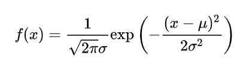  
也就是我们常见的正态分布曲线  
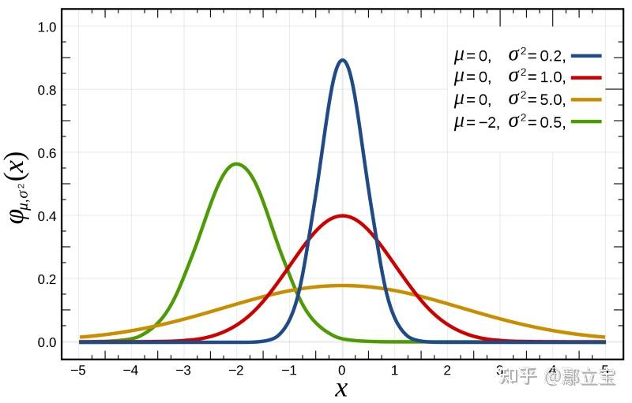

### 3.3. 分布函数 - 概率分布

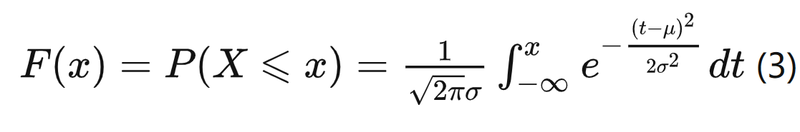  
说白了其实就是随机事件 X 落在$x$左边的概率  
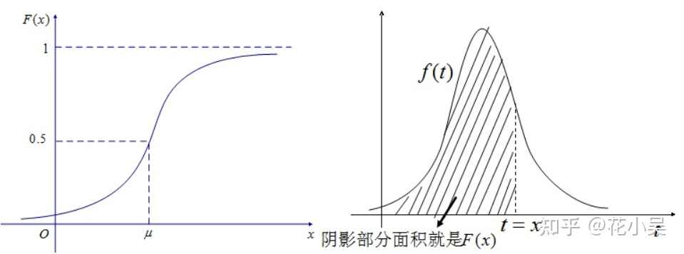

### 3.4. 数据特征

#### 3.4.1. 数学期望 $E(X)$

正态分布  
$E(X) = \int_{-\infin}^{+\infin}xf(x)dx$

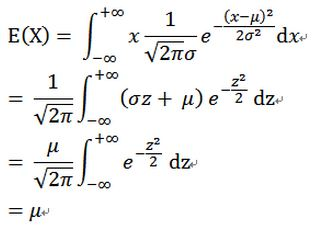

#### 3.4.2. 方差 $D(X)$

$D(X) = E${$[X-E(X)]^2$}

### 3.5. 协方差

协方差是用于衡量两个随机变量之间线性关系的统计量，而高维协方差则是在多维空间中衡量变量之间的关系

#### 3.5.1. 一维随机变量

$COV(X,Y) = E${$[X-E(X)][Y-E(Y)]$} 其中 X,Y 都是一维标量计算

$X=Y$时：$COV(X,Y) = D(X)$

#### 3.5.2. 二维

二维随机变量  

\begin{equation}
X = 
 \begin{bmatrix}
   X_1 \\
   X_2 \\
  \end{bmatrix}
  _{2 \times 1}
\end{equation}

其中每个$X_1,X_2$可看作一维随机变量  
\begin{equation}
P_{\vec{X}} = COV(\vec{X},\vec{X}) = 
 \begin{bmatrix}
   COV(X_1,X_1) & COV(X_1,X_2) \\
   COV(X_2,X_2) & COV(X_2,X_2) \\
  \end{bmatrix}
   = 
 \begin{bmatrix}
   D(X1) & COV(X_1,X_2) \\
   COV(X_2,X_1) & D(X_2) \\
  \end{bmatrix}
\end{equation}

图解二维协方差  
协方差 > 0 正相关  
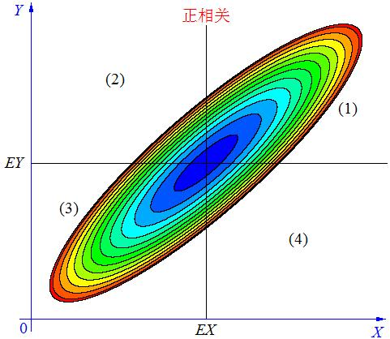  
协方差 > 0 负相关

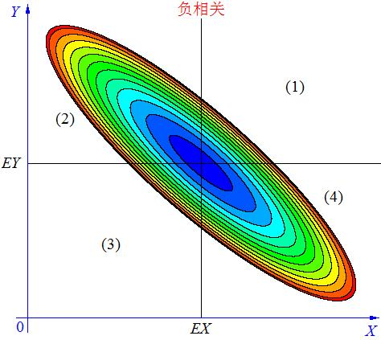  
协方差 = 0 不相关  
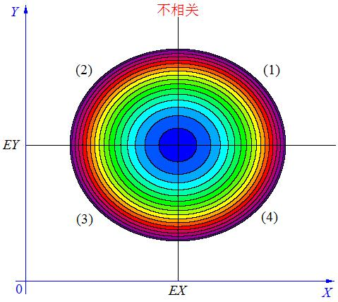

#### 3.5.3. 高维

描述的是随机变量中的两两随机变量之间的彼此偏离程度的关系  
$n$维随机变量  
\begin{equation}
X = 
 \begin{bmatrix}
   X_1 \\
   X_2 \\
   ... \\
   X_n
  \end{bmatrix}
  _{n \times 1}
\end{equation}

高维 : $P_{\vec{X}} = COV(\vec{X},\vec{X}) = E${$[(\vec{X}-\vec{\mu})(\vec{X}-\vec{\mu})^T]$}  
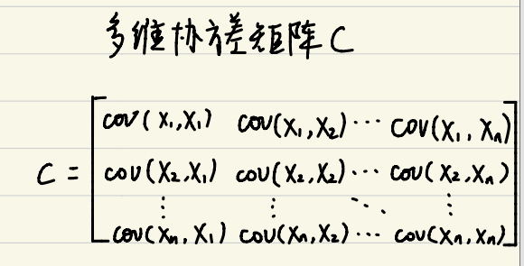

## 4. 状态空间方程法

### 4.1. 基础形式与概念

<font color = "red">!!!我们的应用场景的话采用的是离散形式，连续形式与离散形式有差异</font>  
现代控制理论中-完整形式  
$x_t = Ax_{t-1} + Bu_{t}$  
$z_t = Cx_{t} + Du_{t}$  
状态控制方程法是由现代控制理论中提出的，主要用来做控制算法的，里面的$u_t$就是外界电机输入的力矩(力控情况下)，形成负反馈，保持(机器人)系统稳定。例如我们的小板凳平衡车就是使用的状态空间方程法。$x_t$包括底盘姿态、速度和位置等，$u_t$为两轮输入的扭矩，然后通过陀螺仪和编码器传感器读取姿态、速度和位置信息也就是$z_t$,观测当前状态，进行反馈控制，使其始终保持稳定。  


<br>

用于**卡尔曼滤波**时，无输入$u_t$,因为我们没法给对面的车做输入:  
$x_t = Fx_{t-1} + w_t$ ($w_t$ ~ $N(0,Q)$) 预测方程  
$z_t = Hx_{t} + v_t$ ($v_t$ ~ $N(0,R)$)观测方程

- **状态空间** - $\vec{x_1}$、$\vec{x_2}$、...、$\vec{x_n}$、
- **状态向量** - $\vec{x_t}$
- **观测向量** - $\vec{z_t}$
- **状态转移矩阵** - F (A)
- **状态观测矩阵** - H (B)
- **系统噪声矩阵** - Q
- **观测噪声矩阵** - R
- **协方差矩阵** - $P_t$(随时间变化)

## 5. 卡尔曼滤波器

### 5.1. 理论基础

- 贝叶斯后验
- 高斯分布
- 线性模型
  - 满足叠加原理

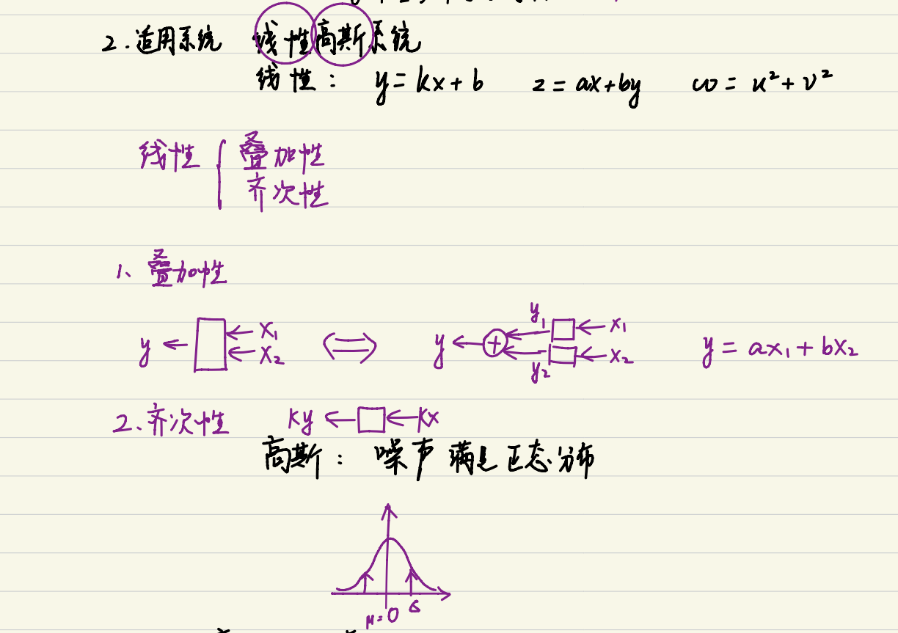

### 5.2. 数据融合

**简而言之**:用两个都不是很靠谱的数据来得到最优估计  
高斯分布满足线性叠加原理模型[详细推导链接](https://zhuanlan.zhihu.com/p/50738318)

- 两个正态分布的叠加依旧是正态分布
- 两个正态分布的乘积依旧是正态分布[详细公式+图解](https://blog.csdn.net/chaosir1991/article/details/106910668)
- 正态分布的线性组合依然为正态分布$Z = w1 * X + w2 * Y$ ~ $N(\mu,\sigma^2)$

正态分布相乘
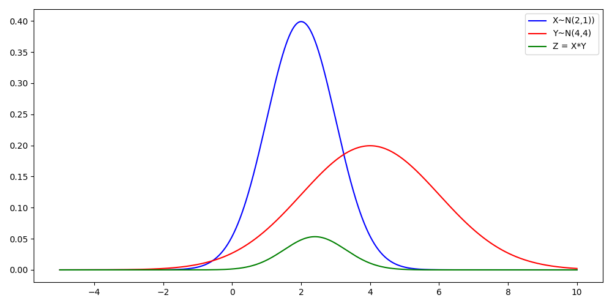

```python
import numpy as np
import matplotlib.pyplot as plt
from scipy.stats import norm
# 高斯分布1 X~N(2,1)
mu1, sigma1 = 2, 1
dist1 = norm(loc=mu1, scale=sigma1)
# 高斯分布1 X~N(4,4)
mu2, sigma2 = 4, 2
dist2 = norm(loc=mu2, scale=sigma2)
# 生成x轴的值
x = np.linspace(-5, 10, 1000)
# 计算两个正态分布相乘的结果
result = dist1.pdf(x) * dist2.pdf(x)
# 绘制前后正态分布的对比图
plt.figure(figsize=(10, 5))
plt.plot(x, dist1.pdf(x), label='X~N(2,1))', color='blue')
plt.plot(x, dist2.pdf(x), label='Y~N(4,4)', color='red')
plt.plot(x, result, label='Z = X*Y', color='green')
plt.legend()
plt.tight_layout()
plt.show()
```

正态分布线性组合
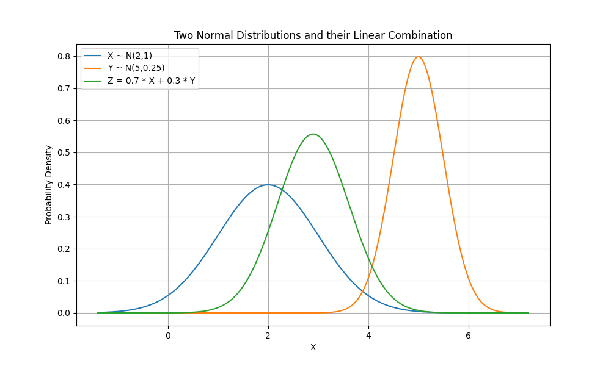
代码，chatgpt 生成

```python
import numpy as np
import matplotlib.pyplot as plt
from scipy.stats import norm

# 定义正态分布的参数
mu1, sigma1 = 2, 1  # 第一个正态分布的均值和标准差
mu2, sigma2 = 5, 0.5  # 第二个正态分布的均值和标准差

# 生成一些随机样本数据
np.random.seed(0)
data1 = np.random.normal(mu1, sigma1, 1000)
data2 = np.random.normal(mu2, sigma2, 1000)

# 计算线性组合
linear_combination = 0.7 * data1 + 0.3 * data2

# 计算叠加后的正态分布参数
mu_combined = 0.7 * mu1 + 0.3 * mu2
sigma_combined = np.sqrt((0.7**2) * (sigma1**2) + (0.3**2) * (sigma2**2))

# 创建一个x轴的范围
x = np.linspace(mu_combined - 6*sigma_combined, mu_combined + 6*sigma_combined, 1000)

# 计算叠加后的正态分布的概率密度函数
pdf_combined = norm.pdf(x, mu_combined, sigma_combined)

# 绘制两个正态分布和叠加后的分布
plt.figure(figsize=(10, 6))
plt.plot(x, norm.pdf(x, mu1, sigma1), label='X ~ N(2,1)')
plt.plot(x, norm.pdf(x, mu2, sigma2), label='Y ~ N(5,0.25)')
plt.plot(x, pdf_combined, label='Z = 0.7 * X + 0.3 * Y')
plt.legend()
plt.title('Two Normal Distributions and their Linear Combination')
plt.xlabel('X')
plt.ylabel('Probability Density')
plt.grid(True)
plt.show()
```

称重例子-引出卡尔曼状态更新方程  
[DR_CAN 的教学视频](https://www.bilibili.com/video/BV12D4y1S7fU/?spm_id_from=333.999.0.0)  
[文档](https://www.kalmanfilter.net/CN/alphabeta_cn.html)

### 5.3. KF-线性高斯模型

#### 5.3.1. 状态空间方程

$x_t = Fx_{t-1} + Bu_t + w_t$ ($Bu_t$在跟踪器一般为 0)  
$z_t = Hx_{t} + v_t$

- $w_t$、$v_t$噪声符合标准正态分布，也就是高斯分布
  - $w_t$ ~ $N(0,Q)$ &ensp;$Q = E[ww^T]$
  - $v_t$ ~ $N(0,R)$ &emsp;$R = E[vv^t]$
    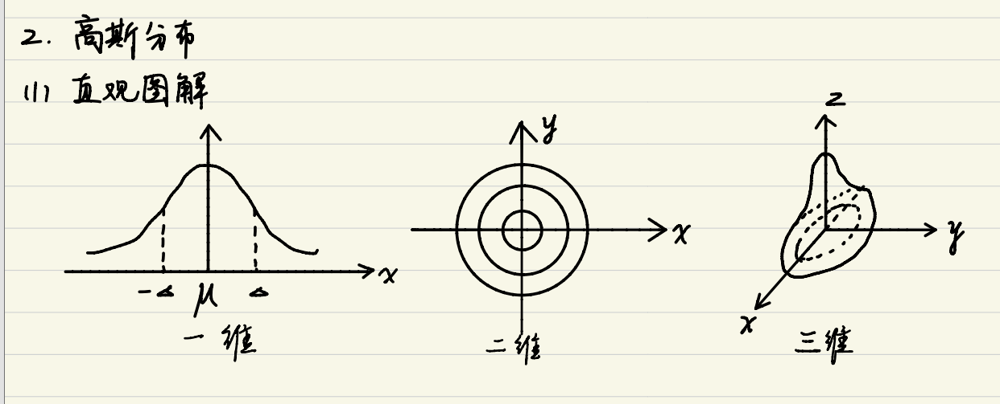
- **最优状态估计器**
- 只适用于线性模型+高斯分布
  - 匀速模型
  - 匀加速模型
  - ...

这里和华南小虎队的状态空间表达式略有不同，详细解释见录播视频吧。~~简介的说就是他那个例子增加了输入$u_t$也就是匀加速模型中的恒定加速度是通过油门来控制的，相当于他是想用卡尔曼滤波的预测-观测模型来保证自己开的车要尽可能地处于一个匀加速直线运动。因为他们三个应该都是电控组的(看下图发的视频都是控制相关的)，所以例子也是偏控制,和视觉的有些许差异,但是底层原理是互通的~~  
  
~~但是我们的实际应用场景的话是要观测对面车的状态(位置和速度)，所以我们没法控制对面车怎么跑，也无从得知对面的车处于什么样的一个运动模型(匀速、匀加速或 others)，因此我们的预测模型一般为假设对面车的运动模型来估计对面的状态，而一般都是使用的匀速直线运动模型(CV 模型)，而这个假设理论基础就是根据电控的控制经验而来的，因为走直线大部分学校都是采用的一个匀加速启动至$V_{max}$然后匀速的策略(梦回高中汽车匀加速启动问题)。~~

#### 5.3.2. 直观图解

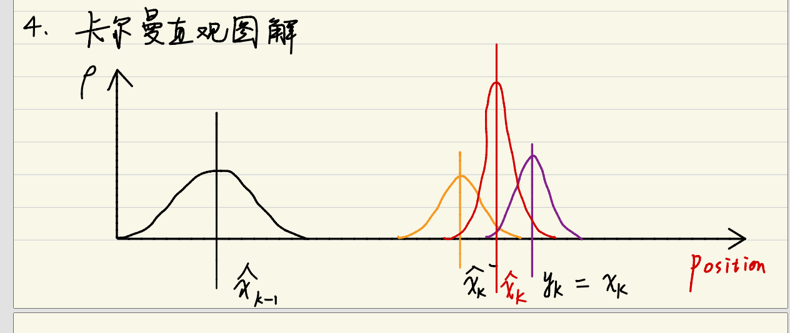  
直观上:最优估计 = weight1 _ 预测 + weight2 _ 观测

卡尔曼中:  
预测 : <font color = "red">$\hat{x}_k^- = A\hat{x}_{k-1}$ 黄金五式第 ① 式</font>  
观测 : $z_k = Hx_k^m$ 可得观测状态$x_k^m$  
但卡尔曼经过他强大的推导出了一种最优的线性叠加融合公式，直接给出公式 <font color = "red">黄金五式第 ④ 式</font>  
 <font color = "red">$\hat{x}_k = \hat{x}_k^{-} + K_k(z_k - H*\hat{x}_k^{-})$</font>  
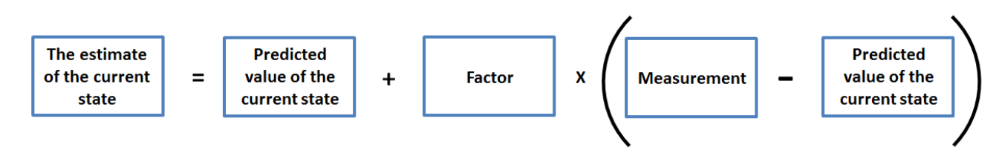

#### 5.3.3. $K_k$的确定<font color = "red">黄金五式第 ③ 式</font>

选择最优的$K_k$，也就是让$x_k$与$\hat{x}_k$尽可能相近，设$e_k = x_k - \hat{x}_k$,这个$e_k$~$N(0,\Sigma)$。$\Sigma$为协方差矩阵。想让$e_k$最小就使$e_k$协方差最小。  
$P_{n \times n} = (e_k - 0)(e_k - 0)^T$，然后就是求导阿巴阿巴阿巴阿巴，最后就推导出了最优的$K_k$,公式如下  
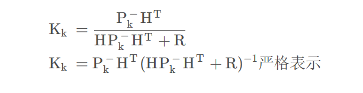

#### 5.3.4. $P_k^-$<font color = "red">黄金五式第 ② 式</font>

先验协方差
  
最后就推导出  
<font color = "red"> $P_k^- = AP_{k-1}A^T + Q$</font>

#### 5.3.5. 最后一舞,舞不动了

<font color = "red">黄金五式第 ⑤ 式</font>  
更新后验协方差

#### 5.3.6. 黄金五式

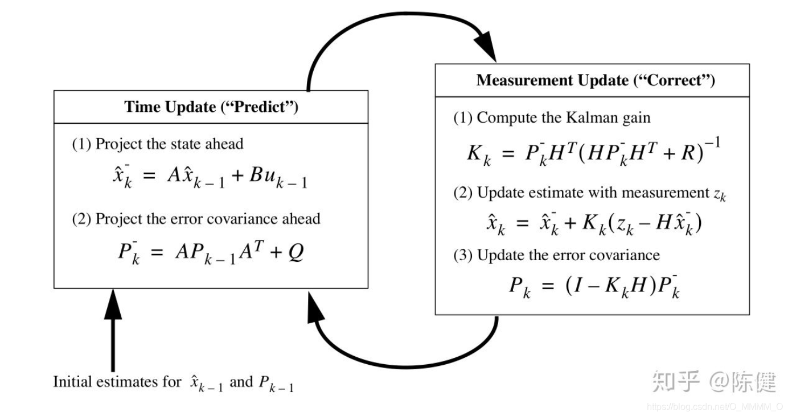

[DR_CAN 详细推导过程推荐视频](https://www.bilibili.com/video/BV1ez4y1X7eR/?spm_id_from=333.337.search-card.all.click&vd_source=4b919749e4033c3016c6c9503d7f3d52)  
[DR_CAN 详细配套推导过程文档](https://zhuanlan.zhihu.com/p/585819291)

#### 5.3.7. 应用步骤

以一个三维空间匀速模型为例子  
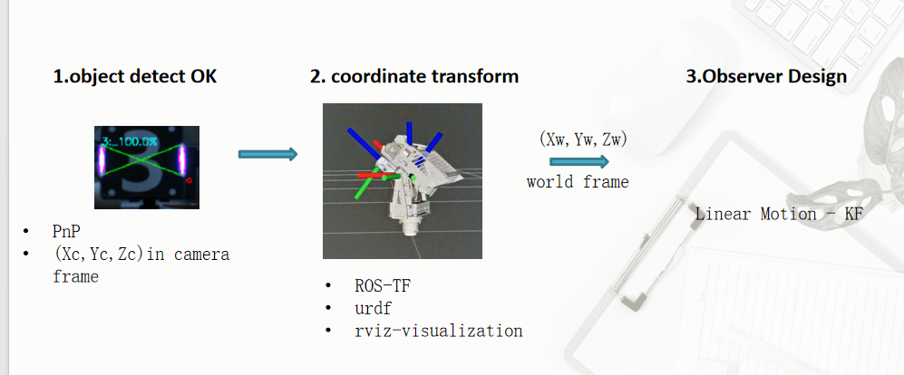

1. KF-class  
   结合黄金 5 式看代码
2. model  
   $x_k = x_{k-1} + v_{x_{k-1}}*\Delta_t$  
   $y_k = y_{k-1} + v_{y_{k-1}}*\Delta_t$  
   $z_k = z_{k-1} + v_{z_{k-1}}*\Delta_t$
3. $\vec{x_t}$ & $\vec{z_t}$  
   $\vec{x_k} = [x,y,z,v_x,v_y,v_z]$  
   $\vec{z_k} = [x,y,z]$
4. F 和 H  
\begin{equation}
F_{6 \times 6} = 
 \begin{bmatrix}
    1 & 0 & 0 & \Delta_t & 0 & 0 \\
    0 & 1 & 0 & 0 & \Delta_t & 0 \\
    0 & 0 & 1 & 0 & 0 & \Delta_t \\
    0 & 0 & 0 & 1 & 0 & 0 \\
    0 & 0 & 0 & 0 & 1 & 0 \\  
    0 & 0 & 0 & 0 & 0 & 1 \\
  \end{bmatrix} \\
H_{3 \times 6} = 
 \begin{bmatrix}
    1 & 0 & 0 & 0 & 0 & 0 \\
    0 & 1 & 0 & 0 & 0 & 0 \\
    0 & 0 & 1 & 0 & 0 & 0 \\
  \end{bmatrix}
\end{equation}
5. Q 和 R  
\begin{equation}
\begin{aligned}
Q_{Diagonal} &= [1,2,3,4,5,6] \\ 
R_{Diagonal} &= [1,2,3,0,0,0]
\end{aligned}
\end{equation}
6. **init**：$\vec{x_t}$  $\vec{y_t}$ & $P_0$ & $K_k$
7. 流转迭代

### 5.4. EKF-非线性高斯模型

和 KF 差不多一样，只需要用一阶泰勒展开方法线性化得雅可比矩阵求$F$和$H$矩阵即可
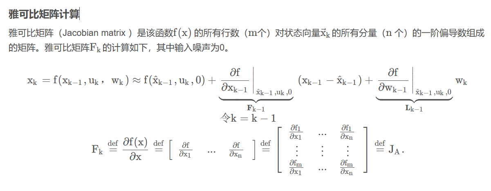

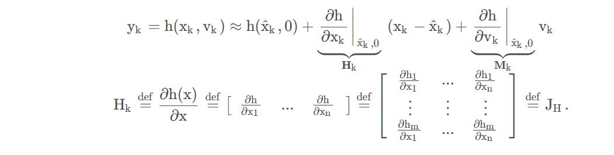

## 8. 参考资料

[华南小虎队 KF 视频-偏电控应用](https://www.bilibili.com/video/BV1Rh41117MT/?spm_id_from=333.999.0.0)  
[DR_CANKF 视频-偏理论推导](https://www.bilibili.com/video/BV1ez4y1X7eR/?spm_id_from=333.337.search-card.all.click)  
[DR-CAN 卡尔曼系列笔记](https://blog.csdn.net/weixin_44702605/article/details/125093141)  
[EKF 模型推导](https://blog.csdn.net/O_MMMM_O/article/details/106078679)  
[卡尔曼官方的教学文档——一切的起源](https://www.kalmanfilter.net/CN/default_cn.aspx)
