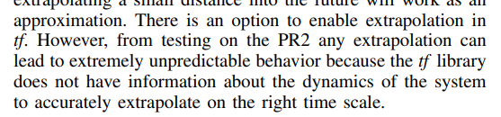
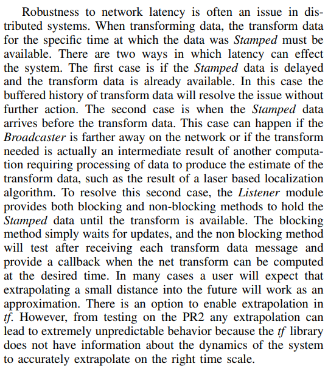

# 和 ROS 相关的错误记录

## TF2 的 lookuptransform 和 buffer->transform 计算结果不一致

1. 造成这个问题的根本原因是 lookuptransform 插值，以前的写法 transform*pitch = tf2_buffer*->lookupTransform("shoot*pitch_link", target_frame*, tf2::TimePointZero);是从队列中立即取出一个 transform，由于此时后一时刻的 transform 未被接收，因此会进行预测（extrapolation），利用预测结果和已知结果进行差值，而 TF2 的插值很不准确，所以就错了



<br>



如果不设定超时时间的话就默认采用非阻塞的预测插值方法进行处理

```cpp
/*
* \param timeout How long to wait for the target frame, Default value is zero (no blocking).
*/
```

2. 为什么 buffer->transform 是对的：详见代码，他的实现就是正确使用了 lookuptransform!

```cpp
template<class T>
T & transform(
    const T & in,T& out,
    const std::string & target frame, tf2::Duration timeout = tf2::durationFromsec(0.0)) const
{
    // do the transform
    tf2::doTransform(
        in, out, lookupTransform(target frame, tf2::getFrameId(in), tf2::getTimestamp(in), timeout));
    return out;
}
```

由于

- 时间戳是相机发布图像的时间戳，这个时刻很早，那么这个时刻的 transform 可能在 lookup 的时候就已经在 listener 的队列里面了，因此从这个角度看的话不会做预测差值
- 使用了 messagefilter，就算这个相机发布图像的这个时刻的 transform 在我们 lookup 时还没有到达队列，那么也会等待其到达队列才会调用回调函数进行坐标变换，因此也不会做预测差值

## Author 

丁利